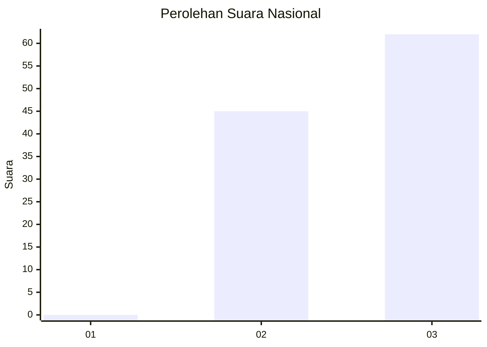
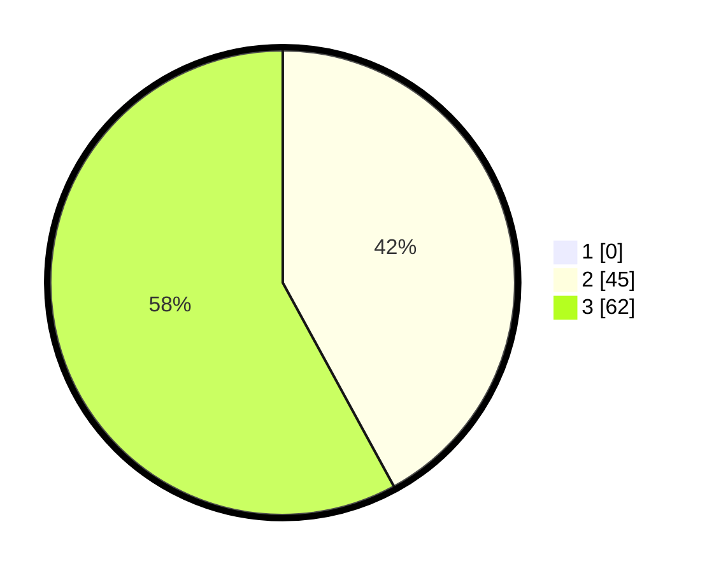

# Hasil

## Grafik

## Tabel

| No. | Nama Paslon    | Suara | Suara (raw) | Persentase |
|:--- |:-------------- | -----:| -----------:| ----------:|
| 1   | ANIES MUHAIMIN | 0     | [0][p-1]    | 0,00       |
| 2   | PRABOWO GIBRAN | 45    | [45][p-2]   | 42,06      |
| 3   | GANJAR MAHFUD  | 62    | [62][p-3]   | 57,94      |

[p-1]: https://github.com/gigit-pemilu/pemilu-2024/blob/main/pilpres/hitung-suara/sub/51-bali/sub/06-bangli/sub/04-kintamani/sub/2021-suter/sub/004-tps/sub/paslon-1.txt
[p-2]: https://github.com/gigit-pemilu/pemilu-2024/blob/main/pilpres/hitung-suara/sub/51-bali/sub/06-bangli/sub/04-kintamani/sub/2021-suter/sub/004-tps/sub/paslon-2.txt
[p-3]: https://github.com/gigit-pemilu/pemilu-2024/blob/main/pilpres/hitung-suara/sub/51-bali/sub/06-bangli/sub/04-kintamani/sub/2021-suter/sub/004-tps/sub/paslon-3.txt

## Foto C Plano

https://sirekap-obj-formc.kpu.go.id/0f69/pemilu/ppwp/51/06/04/20/21/5106042021004-20240216-150949--2d9bd8cf-461d-4b94-ab35-9cb8689ed3f3.jpg

https://sirekap-obj-formc.kpu.go.id/0f69/pemilu/ppwp/51/06/04/20/21/5106042021004-20240216-150950--b2bde29a-58e5-4b93-86fb-b6264a0b51cb.jpg

https://sirekap-obj-formc.kpu.go.id/0f69/pemilu/ppwp/51/06/04/20/21/5106042021004-20240216-150949--fd5a9fc8-c036-4367-86c4-14c9858b61e1.jpg

## Metadata

| Key        | Value               |
| ---------- | ------------------- |
| Time Stamp | 2024-02-24 22:31:28 |

## DATA PEMILIH TETAP

Jumlah pemilih dalam DPT: **122**.
 * L: **67**.
 * P: **55**.

## DATA PENGGUNA HAK PILIH

Jumlah pengguna hak pilih dalam DPT: **108**.
 * L: **55**.
 * P: **53**.

Jumlah pengguna hak pilih dalam DPTb: **1**.
 * L: **1**.
 * P: **0**.

Jumlah pengguna hak pilih dalam DPK: **1**.
 * L: **1**.
 * P: **0**.

Jumlah pengguna hak pilih: **110**.
 * L: **57**.
 * P: **53**.

## JUMLAH SUARA SAH DAN TIDAK SAH

JUMLAH SELURUH SUARA SAH: **108**.

JUMLAH SUARA TIDAK SAH: **2**.

JUMLAH SELURUH SUARA SAH DAN SUARA TIDAK SAH: **110**.

