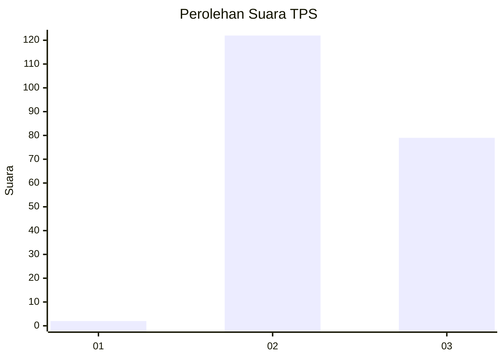
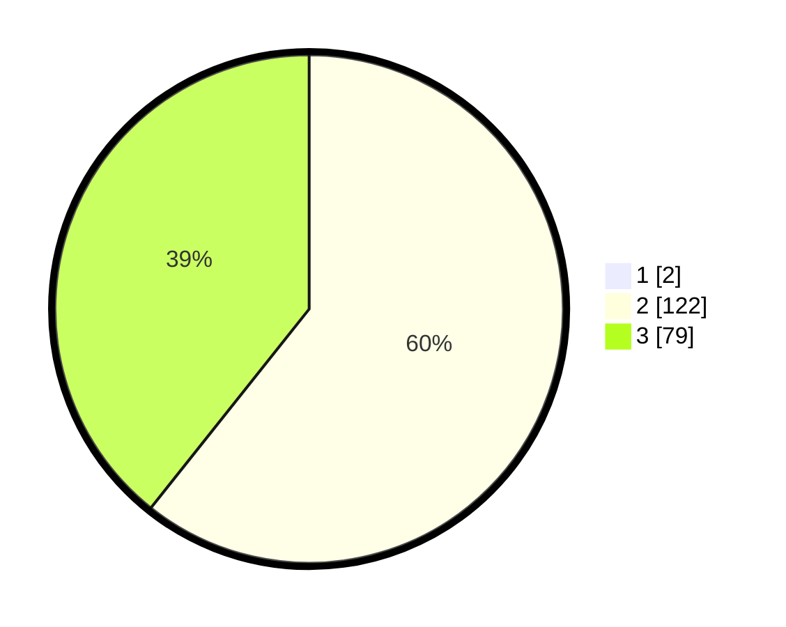

# Hasil

## Grafik

## Tabel

| No. | Nama Paslon    | Suara | Suara (raw) | Persentase |
|:--- |:-------------- | -----:| -----------:| ----------:|
| 1   | ANIES MUHAIMIN | 2     | [2][p-1]    | 0,99       |
| 2   | PRABOWO GIBRAN | 122   | [122][p-2]  | 60,10      |
| 3   | GANJAR MAHFUD  | 79    | [79][p-3]   | 38,92      |

[p-1]: https://github.com/gigit-pemilu/pemilu-2024-51-bali/blob/main/pilpres/hitung-suara/sub/51-bali/sub/06-bangli/sub/04-kintamani/sub/2021-suter/sub/007-tps/sub/paslon-1.txt
[p-2]: https://github.com/gigit-pemilu/pemilu-2024-51-bali/blob/main/pilpres/hitung-suara/sub/51-bali/sub/06-bangli/sub/04-kintamani/sub/2021-suter/sub/007-tps/sub/paslon-2.txt
[p-3]: https://github.com/gigit-pemilu/pemilu-2024-51-bali/blob/main/pilpres/hitung-suara/sub/51-bali/sub/06-bangli/sub/04-kintamani/sub/2021-suter/sub/007-tps/sub/paslon-3.txt

## Foto C Plano

https://sirekap-obj-formc.kpu.go.id/9b51/pemilu/ppwp/51/06/04/20/21/5106042021007-20240215-022144--ca5ef3e3-1502-4634-817d-8165cd51a166.jpg

https://sirekap-obj-formc.kpu.go.id/9b51/pemilu/ppwp/51/06/04/20/21/5106042021007-20240215-022427--dfff1ec7-3e90-4208-9f11-57428f93be98.jpg

https://sirekap-obj-formc.kpu.go.id/9b51/pemilu/ppwp/51/06/04/20/21/5106042021007-20240215-022613--663b96ed-0cc7-400c-9511-bf73258a2297.jpg

## Metadata

| Key        | Value               |
| ---------- | ------------------- |
| Time Stamp | 2024-02-25 11:00:00 |

