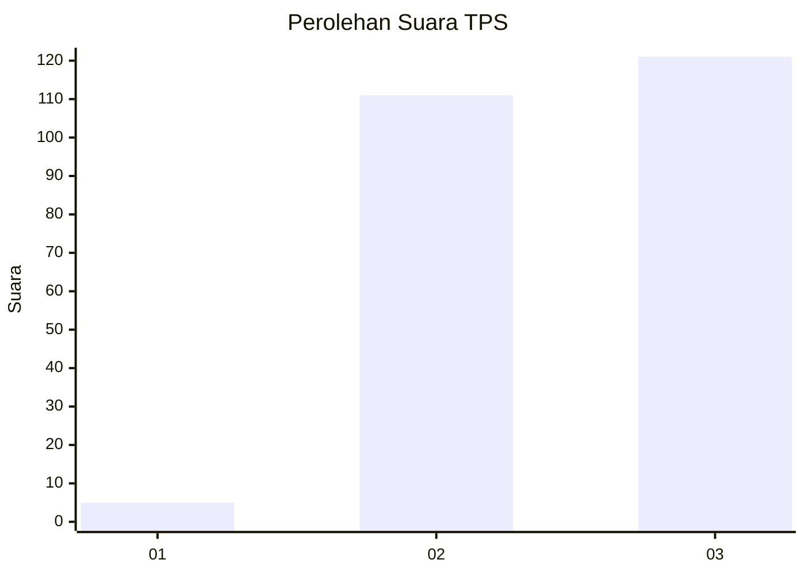
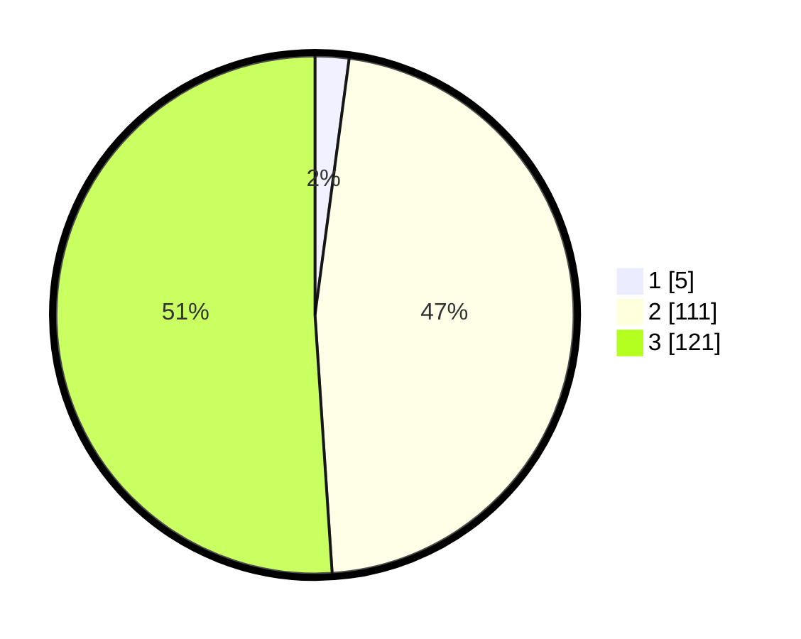

# Hasil

## Grafik

## Tabel

| No. | Nama Paslon    | Suara | Suara (raw) | Persentase |
|:--- |:-------------- | -----:| -----------:| ----------:|
| 1   | ANIES MUHAIMIN | 5     | [5][p-1]    | 2,11       |
| 2   | PRABOWO GIBRAN | 111   | [111][p-2]  | 46,84      |
| 3   | GANJAR MAHFUD  | 121   | [121][p-3]  | 51,05      |

[p-1]: https://github.com/gigit-pemilu/pemilu-2024-51-bali/blob/main/pilpres/hitung-suara/sub/51-bali/sub/06-bangli/sub/04-kintamani/sub/2022-abang-batudinding/sub/001-tps/sub/paslon-1.txt
[p-2]: https://github.com/gigit-pemilu/pemilu-2024-51-bali/blob/main/pilpres/hitung-suara/sub/51-bali/sub/06-bangli/sub/04-kintamani/sub/2022-abang-batudinding/sub/001-tps/sub/paslon-2.txt
[p-3]: https://github.com/gigit-pemilu/pemilu-2024-51-bali/blob/main/pilpres/hitung-suara/sub/51-bali/sub/06-bangli/sub/04-kintamani/sub/2022-abang-batudinding/sub/001-tps/sub/paslon-3.txt

## Foto C Plano

https://sirekap-obj-formc.kpu.go.id/4905/pemilu/ppwp/51/06/04/20/22/5106042022001-20240214-193133--cfaff519-2a2c-4b27-a505-1325ca1cba02.jpg

https://sirekap-obj-formc.kpu.go.id/4905/pemilu/ppwp/51/06/04/20/22/5106042022001-20240214-193137--9c0cc757-a6db-4f1c-9fe4-22aa794203aa.jpg

## Metadata

| Key        | Value               |
| ---------- | ------------------- |
| Time Stamp | 2024-02-15 07:00:44 |

