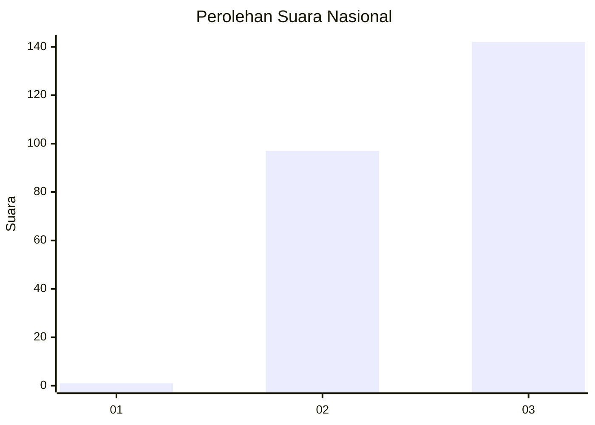
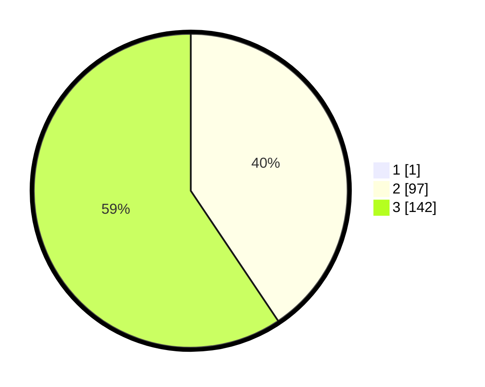

# Hasil

## Grafik

## Tabel

| No. | Nama Paslon    | Suara | Suara (raw) | Persentase |
|:--- |:-------------- | -----:| -----------:| ----------:|
| 1   | ANIES MUHAIMIN | 1     | [1][p-1]    | 0,42       |
| 2   | PRABOWO GIBRAN | 97    | [97][p-2]   | 40,42      |
| 3   | GANJAR MAHFUD  | 142   | [142][p-3]  | 59,17      |

[p-1]: https://github.com/gigit-pemilu/pemilu-2024/blob/main/pilpres/hitung-suara/sub/51-bali/sub/06-bangli/sub/04-kintamani/sub/2022-abang-batudinding/sub/002-tps/sub/paslon-1.txt
[p-2]: https://github.com/gigit-pemilu/pemilu-2024/blob/main/pilpres/hitung-suara/sub/51-bali/sub/06-bangli/sub/04-kintamani/sub/2022-abang-batudinding/sub/002-tps/sub/paslon-2.txt
[p-3]: https://github.com/gigit-pemilu/pemilu-2024/blob/main/pilpres/hitung-suara/sub/51-bali/sub/06-bangli/sub/04-kintamani/sub/2022-abang-batudinding/sub/002-tps/sub/paslon-3.txt

## Foto C Plano

https://sirekap-obj-formc.kpu.go.id/930b/pemilu/ppwp/51/06/04/20/22/5106042022002-20240215-034734--1762ff97-73d6-4078-b49b-33fb7bccd872.jpg

https://sirekap-obj-formc.kpu.go.id/930b/pemilu/ppwp/51/06/04/20/22/5106042022002-20240215-034907--21fce124-bdcb-4597-b770-152d47e3fd5c.jpg

https://sirekap-obj-formc.kpu.go.id/930b/pemilu/ppwp/51/06/04/20/22/5106042022002-20240215-035108--958a626a-b196-4943-9d0d-1ba9d1da084b.jpg

## Metadata

| Key        | Value               |
| ---------- | ------------------- |
| Time Stamp | 2024-02-24 22:31:28 |

