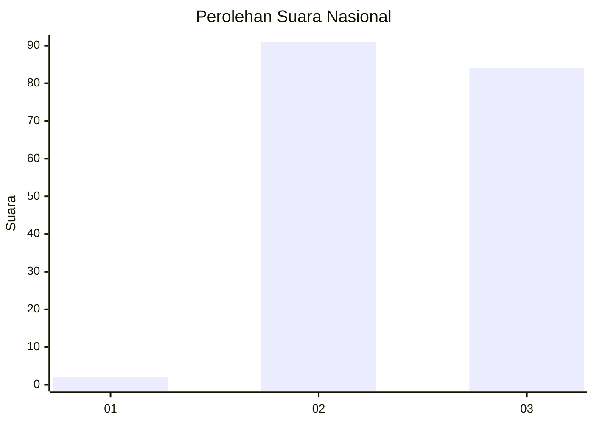
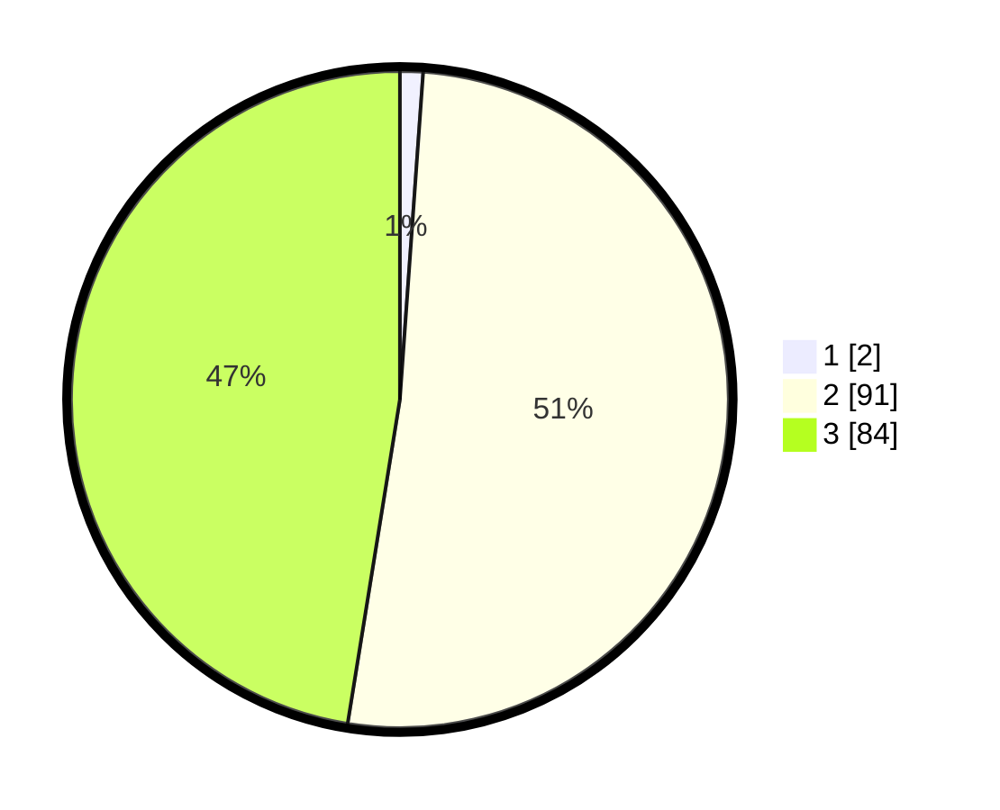

# Hasil

## Grafik

## Tabel

| No. | Nama Paslon    | Suara | Suara (raw) | Persentase |
|:--- |:-------------- | -----:| -----------:| ----------:|
| 1   | ANIES MUHAIMIN | 2     | [2][p-1]    | 1,13       |
| 2   | PRABOWO GIBRAN | 91    | [91][p-2]   | 51,41      |
| 3   | GANJAR MAHFUD  | 84    | [84][p-3]   | 47,46      |

[p-1]: https://github.com/gigit-pemilu/pemilu-2024/blob/main/pilpres/hitung-suara/sub/51-bali/sub/06-bangli/sub/04-kintamani/sub/2022-abang-batudinding/sub/003-tps/sub/paslon-1.txt
[p-2]: https://github.com/gigit-pemilu/pemilu-2024/blob/main/pilpres/hitung-suara/sub/51-bali/sub/06-bangli/sub/04-kintamani/sub/2022-abang-batudinding/sub/003-tps/sub/paslon-2.txt
[p-3]: https://github.com/gigit-pemilu/pemilu-2024/blob/main/pilpres/hitung-suara/sub/51-bali/sub/06-bangli/sub/04-kintamani/sub/2022-abang-batudinding/sub/003-tps/sub/paslon-3.txt

## Foto C Plano

https://sirekap-obj-formc.kpu.go.id/013e/pemilu/ppwp/51/06/04/20/22/5106042022003-20240214-235940--76b74e2f-33bb-4d5e-8759-ad57cd134dc1.jpg

https://sirekap-obj-formc.kpu.go.id/013e/pemilu/ppwp/51/06/04/20/22/5106042022003-20240215-000001--594ab250-8377-4eb1-94d9-508f2f1ef124.jpg

https://sirekap-obj-formc.kpu.go.id/013e/pemilu/ppwp/51/06/04/20/22/5106042022003-20240215-000036--f9189119-8992-4358-b211-1888ce307a54.jpg

## Metadata

| Key        | Value               |
| ---------- | ------------------- |
| Time Stamp | 2024-02-24 22:31:28 |

