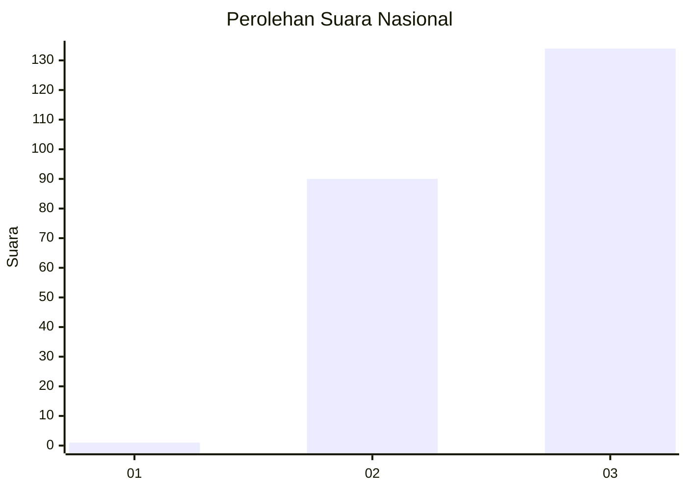
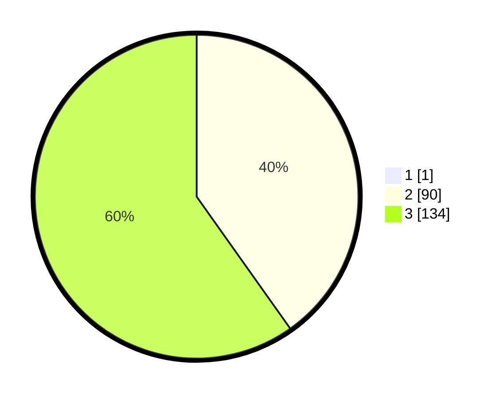

# Hasil

## Grafik

## Tabel

| No. | Nama Paslon    | Suara | Suara (raw) | Persentase |
|:--- |:-------------- | -----:| -----------:| ----------:|
| 1   | ANIES MUHAIMIN | 1     | [1][p-1]    | 0,44       |
| 2   | PRABOWO GIBRAN | 90    | [90][p-2]   | 40,00      |
| 3   | GANJAR MAHFUD  | 134   | [134][p-3]  | 59,56      |

[p-1]: https://github.com/gigit-pemilu/pemilu-2024/blob/main/pilpres/hitung-suara/sub/51-bali/sub/06-bangli/sub/04-kintamani/sub/2022-abang-batudinding/sub/007-tps/sub/paslon-1.txt
[p-2]: https://github.com/gigit-pemilu/pemilu-2024/blob/main/pilpres/hitung-suara/sub/51-bali/sub/06-bangli/sub/04-kintamani/sub/2022-abang-batudinding/sub/007-tps/sub/paslon-2.txt
[p-3]: https://github.com/gigit-pemilu/pemilu-2024/blob/main/pilpres/hitung-suara/sub/51-bali/sub/06-bangli/sub/04-kintamani/sub/2022-abang-batudinding/sub/007-tps/sub/paslon-3.txt

## Foto C Plano

https://sirekap-obj-formc.kpu.go.id/ade4/pemilu/ppwp/51/06/04/20/22/5106042022007-20240214-232553--f9e8425c-cfcc-4c3c-9b0a-544a74826ebc.jpg

https://sirekap-obj-formc.kpu.go.id/ade4/pemilu/ppwp/51/06/04/20/22/5106042022007-20240217-125327--f4ad73a8-3ed7-4a5f-afb2-b01cd8954fa3.jpg

https://sirekap-obj-formc.kpu.go.id/ade4/pemilu/ppwp/51/06/04/20/22/5106042022007-20240214-233157--77ce7db3-1a8d-4f16-9a61-2e5f8811c551.jpg

## Metadata

| Key        | Value               |
| ---------- | ------------------- |
| Time Stamp | 2024-02-21 17:00:00 |

