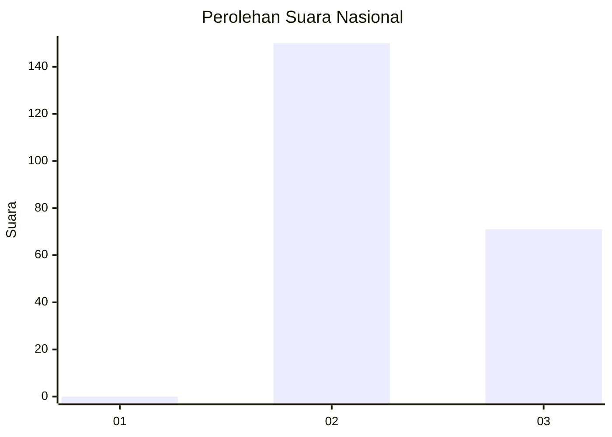
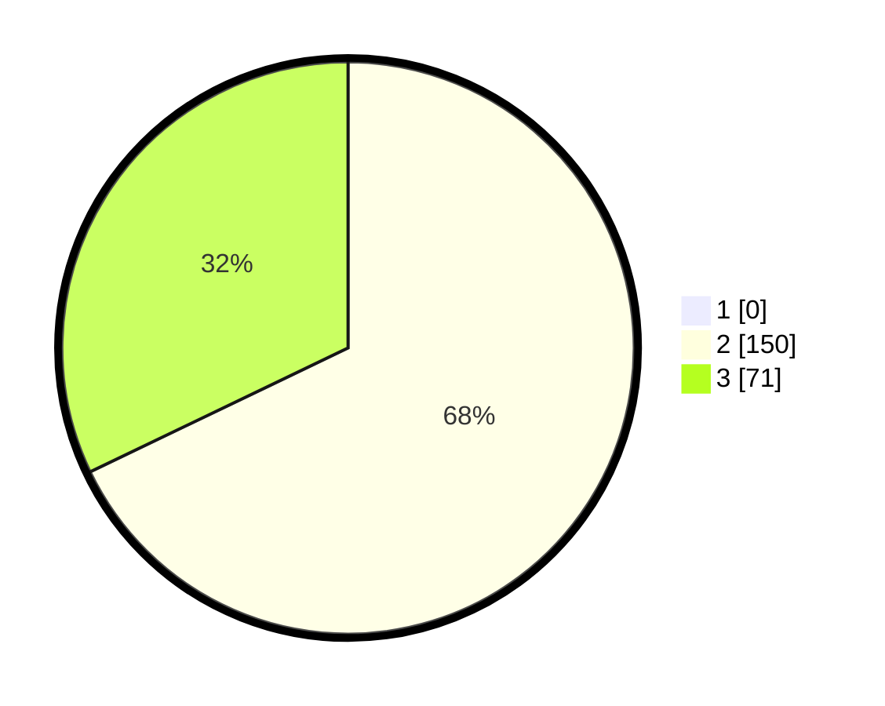

# Hasil

## Grafik

## Tabel

| No. | Nama Paslon    | Suara | Suara (raw) | Persentase |
|:--- |:-------------- | -----:| -----------:| ----------:|
| 1   | ANIES MUHAIMIN | 0     | [0][p-1]    | 0,00       |
| 2   | PRABOWO GIBRAN | 150   | [150][p-2]  | 67,87      |
| 3   | GANJAR MAHFUD  | 71    | [71][p-3]   | 32,13      |

[p-1]: https://github.com/gigit-pemilu/pemilu-2024/blob/main/pilpres/hitung-suara/sub/51-bali/sub/06-bangli/sub/04-kintamani/sub/2023-terunyan/sub/005-tps/sub/paslon-1.txt
[p-2]: https://github.com/gigit-pemilu/pemilu-2024/blob/main/pilpres/hitung-suara/sub/51-bali/sub/06-bangli/sub/04-kintamani/sub/2023-terunyan/sub/005-tps/sub/paslon-2.txt
[p-3]: https://github.com/gigit-pemilu/pemilu-2024/blob/main/pilpres/hitung-suara/sub/51-bali/sub/06-bangli/sub/04-kintamani/sub/2023-terunyan/sub/005-tps/sub/paslon-3.txt

## Foto C Plano

https://sirekap-obj-formc.kpu.go.id/1875/pemilu/ppwp/51/06/04/20/23/5106042023005-20240215-102120--ff977a2e-8988-4609-92e6-d5e00f5ca652.jpg

https://sirekap-obj-formc.kpu.go.id/1875/pemilu/ppwp/51/06/04/20/23/5106042023005-20240215-102404--740f76a4-0097-4b25-9c35-687d7cb165bb.jpg

https://sirekap-obj-formc.kpu.go.id/1875/pemilu/ppwp/51/06/04/20/23/5106042023005-20240215-102527--803d7822-de1f-4802-a214-b2470b5f56e9.jpg

## Metadata

| Key        | Value               |
| ---------- | ------------------- |
| Time Stamp | 2024-02-24 22:31:28 |

