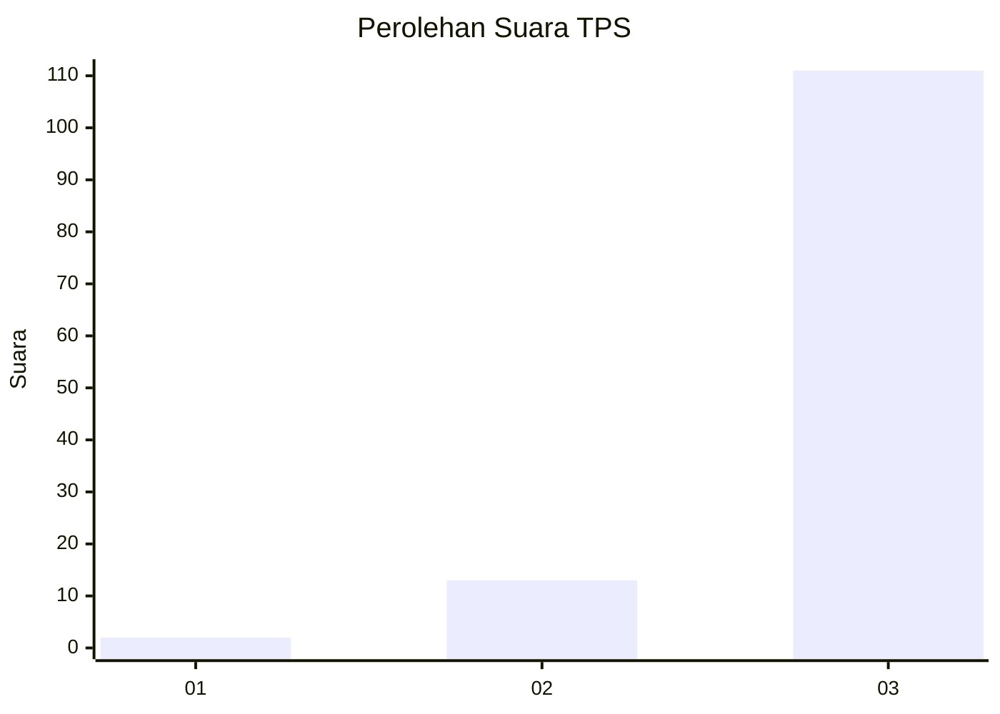
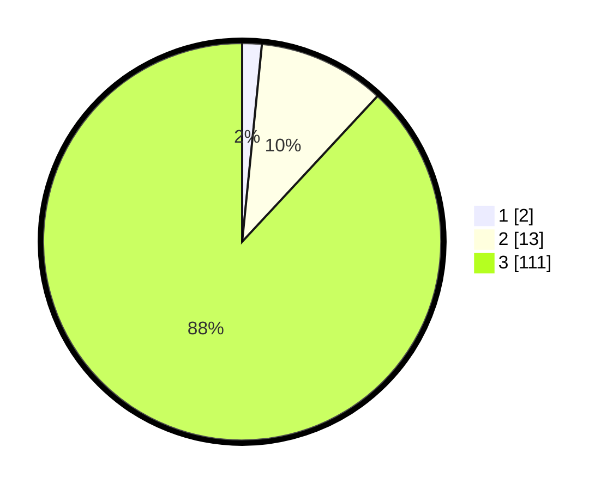

# Hasil

## Grafik

## Tabel

| No. | Nama Paslon    | Suara | Suara (raw) | Persentase |
|:--- |:-------------- | -----:| -----------:| ----------:|
| 1   | ANIES MUHAIMIN | 2     | [2][p-1]    | 1,59       |
| 2   | PRABOWO GIBRAN | 13    | [13][p-2]   | 10,32      |
| 3   | GANJAR MAHFUD  | 111   | [111][p-3]  | 88,10      |

[p-1]: https://github.com/gigit-pemilu/pemilu-2024-51-bali/blob/main/pilpres/hitung-suara/sub/51-bali/sub/06-bangli/sub/04-kintamani/sub/2023-terunyan/sub/009-tps/sub/paslon-1.txt
[p-2]: https://github.com/gigit-pemilu/pemilu-2024-51-bali/blob/main/pilpres/hitung-suara/sub/51-bali/sub/06-bangli/sub/04-kintamani/sub/2023-terunyan/sub/009-tps/sub/paslon-2.txt
[p-3]: https://github.com/gigit-pemilu/pemilu-2024-51-bali/blob/main/pilpres/hitung-suara/sub/51-bali/sub/06-bangli/sub/04-kintamani/sub/2023-terunyan/sub/009-tps/sub/paslon-3.txt

## Foto C Plano

https://sirekap-obj-formc.kpu.go.id/0bdf/pemilu/ppwp/51/06/04/20/23/5106042023009-20240214-185322--81dd1216-7f58-42dd-b431-4d6420915d57.jpg

https://sirekap-obj-formc.kpu.go.id/0bdf/pemilu/ppwp/51/06/04/20/23/5106042023009-20240214-185913--6ad9f1b2-a543-41fc-9480-917b7fd34477.jpg

https://sirekap-obj-formc.kpu.go.id/0bdf/pemilu/ppwp/51/06/04/20/23/5106042023009-20240214-190457--9dc26e6e-68a4-46e6-b776-720dd789a556.jpg

## Metadata

| Key        | Value               |
| ---------- | ------------------- |
| Time Stamp | 2024-02-14 21:46:01 |

## DATA PEMILIH TETAP

Jumlah pemilih dalam DPT: **158**.
 * L: **77**.
 * P: **81**.

## DATA PENGGUNA HAK PILIH

Jumlah pengguna hak pilih dalam DPT: **126**.
 * L: **58**.
 * P: **68**.

Jumlah pengguna hak pilih dalam DPTb: **0**.
 * L: **0**.
 * P: **0**.

Jumlah pengguna hak pilih dalam DPK: **1**.
 * L: **0**.
 * P: **1**.

Jumlah pengguna hak pilih: **127**.
 * L: **58**.
 * P: **69**.

## JUMLAH SUARA SAH DAN TIDAK SAH

JUMLAH SELURUH SUARA SAH: **126**.

JUMLAH SUARA TIDAK SAH: **1**.

JUMLAH SELURUH SUARA SAH DAN SUARA TIDAK SAH: **127**.

