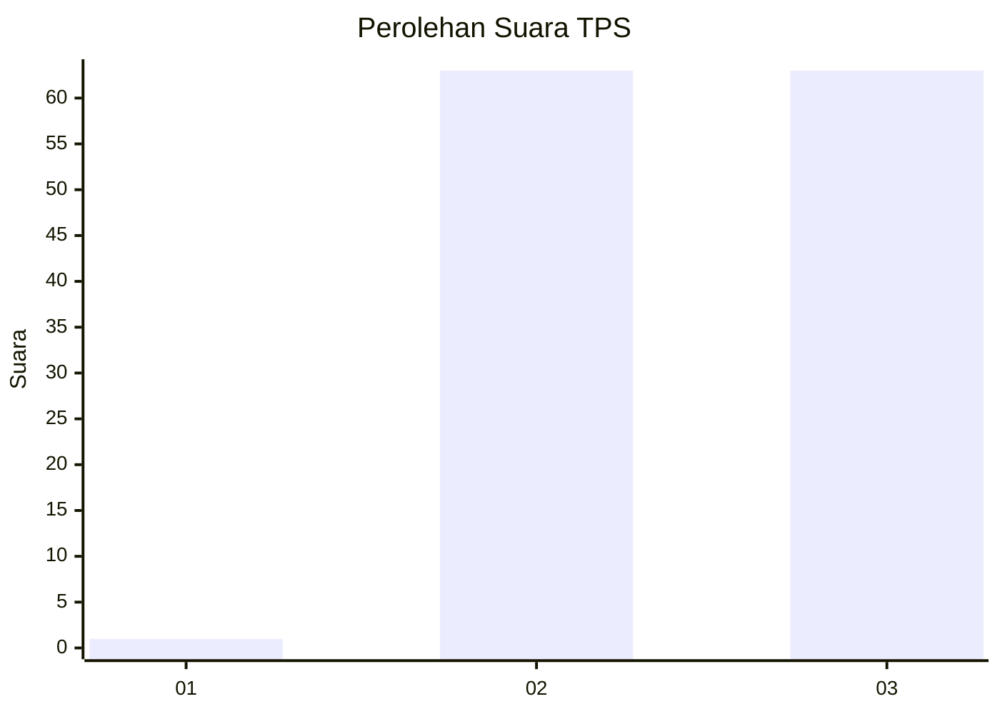
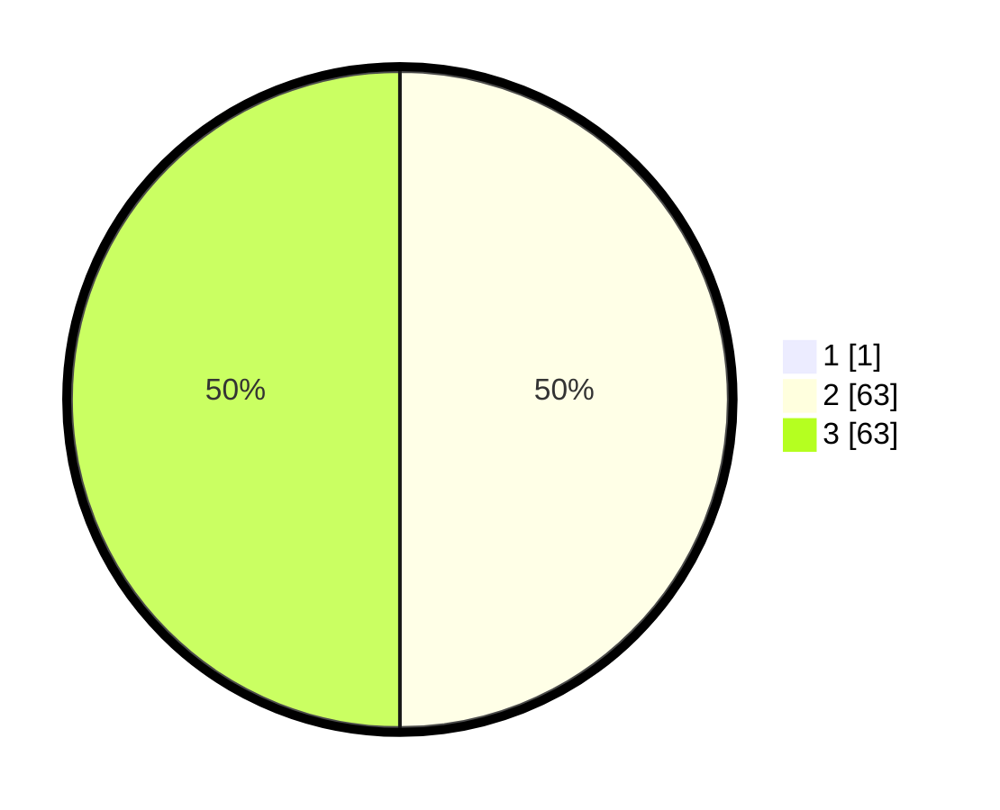

# Hasil

## Grafik

## Tabel

| No. | Nama Paslon    | Suara | Suara (raw) | Persentase |
|:--- |:-------------- | -----:| -----------:| ----------:|
| 1   | ANIES MUHAIMIN | 1     | [1][p-1]    | 0,79       |
| 2   | PRABOWO GIBRAN | 63    | [63][p-2]   | 49,61      |
| 3   | GANJAR MAHFUD  | 63    | [63][p-3]   | 49,61      |

[p-1]: https://github.com/gigit-pemilu/pemilu-2024-51-bali/blob/main/pilpres/hitung-suara/sub/51-bali/sub/06-bangli/sub/04-kintamani/sub/2023-terunyan/sub/011-tps/sub/paslon-1.txt
[p-2]: https://github.com/gigit-pemilu/pemilu-2024-51-bali/blob/main/pilpres/hitung-suara/sub/51-bali/sub/06-bangli/sub/04-kintamani/sub/2023-terunyan/sub/011-tps/sub/paslon-2.txt
[p-3]: https://github.com/gigit-pemilu/pemilu-2024-51-bali/blob/main/pilpres/hitung-suara/sub/51-bali/sub/06-bangli/sub/04-kintamani/sub/2023-terunyan/sub/011-tps/sub/paslon-3.txt

## Foto C Plano

https://sirekap-obj-formc.kpu.go.id/792c/pemilu/ppwp/51/06/04/20/23/5106042023011-20240214-125827--21924dc7-9a94-4c7b-abed-39f2ac4143be.jpg

https://sirekap-obj-formc.kpu.go.id/792c/pemilu/ppwp/51/06/04/20/23/5106042023011-20240214-131630--e03f9c67-13d0-45c5-bebc-e6937375114a.jpg

https://sirekap-obj-formc.kpu.go.id/792c/pemilu/ppwp/51/06/04/20/23/5106042023011-20240214-131446--0026672a-ddf8-4b7b-879e-73a1a667b256.jpg

## Metadata

| Key        | Value               |
| ---------- | ------------------- |
| Time Stamp | 2024-02-14 21:46:01 |

## DATA PEMILIH TETAP

Jumlah pemilih dalam DPT: **168**.
 * L: **92**.
 * P: **76**.

## DATA PENGGUNA HAK PILIH

Jumlah pengguna hak pilih dalam DPT: **146**.
 * L: **80**.
 * P: **66**.

Jumlah pengguna hak pilih dalam DPTb: **1**.
 * L: **1**.
 * P: **0**.

Jumlah pengguna hak pilih dalam DPK: **3**.
 * L: **2**.
 * P: **1**.

Jumlah pengguna hak pilih: **150**.
 * L: **83**.
 * P: **67**.

## JUMLAH SUARA SAH DAN TIDAK SAH

JUMLAH SELURUH SUARA SAH: **127**.

JUMLAH SUARA TIDAK SAH: **23**.

JUMLAH SELURUH SUARA SAH DAN SUARA TIDAK SAH: **150**.

