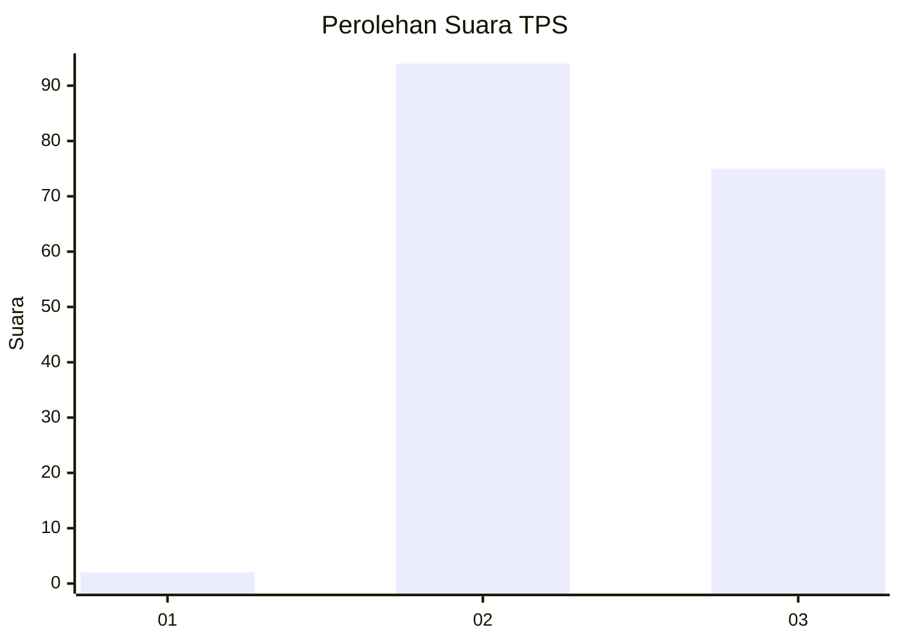
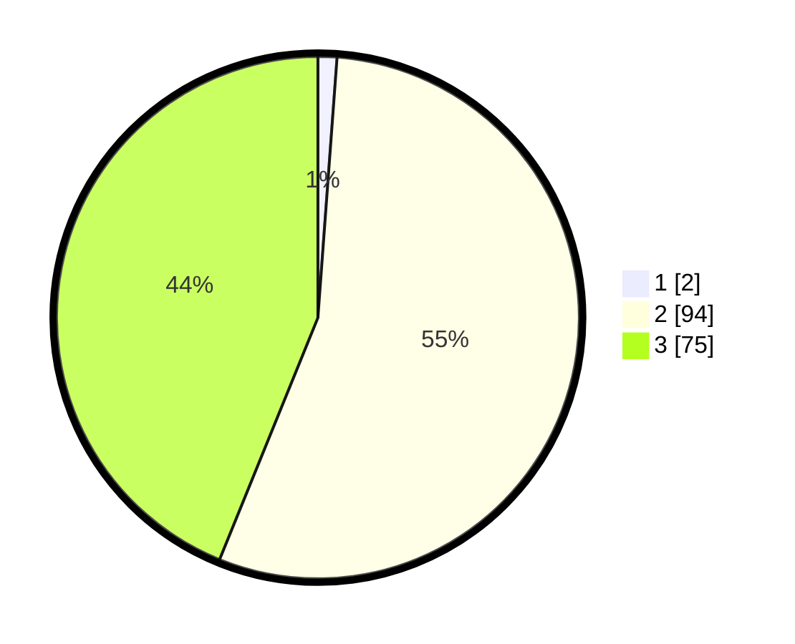

# Hasil

## Grafik

## Tabel

| No. | Nama Paslon    | Suara | Suara (raw) | Persentase |
|:--- |:-------------- | -----:| -----------:| ----------:|
| 1   | ANIES MUHAIMIN | 2     | [2][p-1]    | 1,17       |
| 2   | PRABOWO GIBRAN | 94    | [94][p-2]   | 54,97      |
| 3   | GANJAR MAHFUD  | 75    | [75][p-3]   | 43,86      |

[p-1]: https://github.com/gigit-pemilu/pemilu-2024-51-bali/blob/main/pilpres/hitung-suara/sub/51-bali/sub/06-bangli/sub/04-kintamani/sub/2024-songan-a/sub/005-tps/sub/paslon-1.txt
[p-2]: https://github.com/gigit-pemilu/pemilu-2024-51-bali/blob/main/pilpres/hitung-suara/sub/51-bali/sub/06-bangli/sub/04-kintamani/sub/2024-songan-a/sub/005-tps/sub/paslon-2.txt
[p-3]: https://github.com/gigit-pemilu/pemilu-2024-51-bali/blob/main/pilpres/hitung-suara/sub/51-bali/sub/06-bangli/sub/04-kintamani/sub/2024-songan-a/sub/005-tps/sub/paslon-3.txt

## Foto C Plano

https://sirekap-obj-formc.kpu.go.id/66e3/pemilu/ppwp/51/06/04/20/24/5106042024005-20240214-213637--67de2096-8f5f-47d0-8801-8520ecfa62a1.jpg

https://sirekap-obj-formc.kpu.go.id/66e3/pemilu/ppwp/51/06/04/20/24/5106042024005-20240214-214017--ffded832-455c-4e2f-80df-ad9c55e44f74.jpg

https://sirekap-obj-formc.kpu.go.id/66e3/pemilu/ppwp/51/06/04/20/24/5106042024005-20240214-214423--da3aa4b1-1620-407c-b52d-42e4e09f608a.jpg

## Metadata

| Key        | Value               |
| ---------- | ------------------- |
| Time Stamp | 2024-02-24 22:31:28 |

