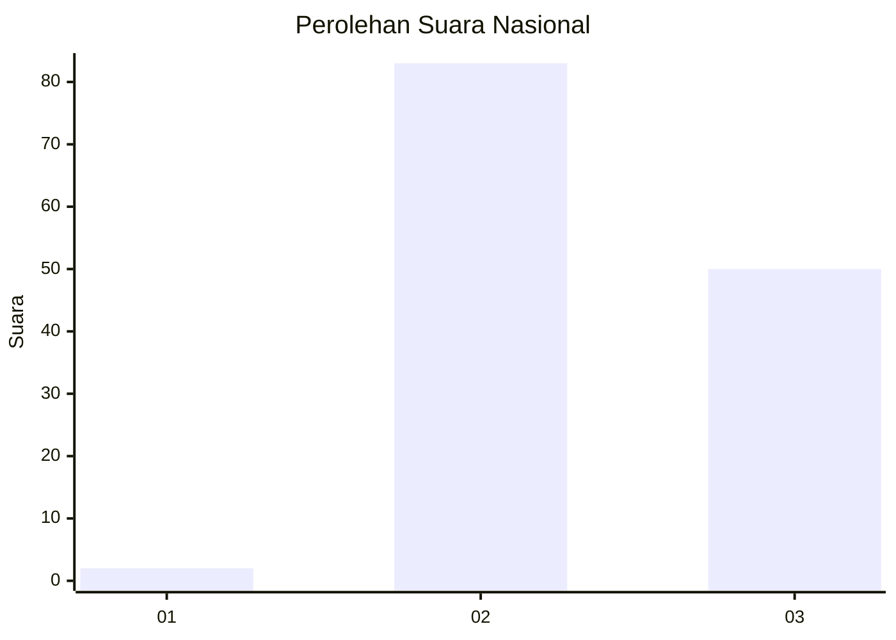
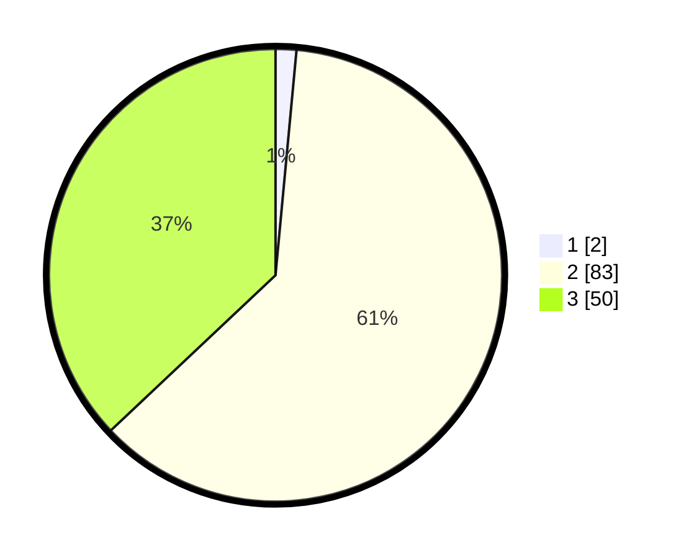

# Hasil

## Grafik

## Tabel

| No. | Nama Paslon    | Suara | Suara (raw) | Persentase |
|:--- |:-------------- | -----:| -----------:| ----------:|
| 1   | ANIES MUHAIMIN | 2     | [2][p-1]    | 1,48       |
| 2   | PRABOWO GIBRAN | 83    | [83][p-2]   | 61,48      |
| 3   | GANJAR MAHFUD  | 50    | [50][p-3]   | 37,04      |

[p-1]: https://github.com/gigit-pemilu/pemilu-2024/blob/main/pilpres/hitung-suara/sub/51-bali/sub/06-bangli/sub/04-kintamani/sub/2024-songan-a/sub/011-tps/sub/paslon-1.txt
[p-2]: https://github.com/gigit-pemilu/pemilu-2024/blob/main/pilpres/hitung-suara/sub/51-bali/sub/06-bangli/sub/04-kintamani/sub/2024-songan-a/sub/011-tps/sub/paslon-2.txt
[p-3]: https://github.com/gigit-pemilu/pemilu-2024/blob/main/pilpres/hitung-suara/sub/51-bali/sub/06-bangli/sub/04-kintamani/sub/2024-songan-a/sub/011-tps/sub/paslon-3.txt

## Foto C Plano

https://sirekap-obj-formc.kpu.go.id/1fc3/pemilu/ppwp/51/06/04/20/24/5106042024011-20240214-192435--0660c517-5223-4f00-8de3-c5230672c8ea.jpg

https://sirekap-obj-formc.kpu.go.id/1fc3/pemilu/ppwp/51/06/04/20/24/5106042024011-20240214-192132--2e0ad59e-9157-45fa-aa09-a2aeb314d0fb.jpg

https://sirekap-obj-formc.kpu.go.id/1fc3/pemilu/ppwp/51/06/04/20/24/5106042024011-20240217-163944--7c1684d0-c0fc-49ca-8917-c20ef4a4b712.jpg

## Metadata

| Key        | Value               |
| ---------- | ------------------- |
| Time Stamp | 2024-02-17 16:52:47 |

## DATA PEMILIH TETAP

Jumlah pemilih dalam DPT: **150**.
 * L: **74**.
 * P: **76**.

## DATA PENGGUNA HAK PILIH

Jumlah pengguna hak pilih dalam DPT: **136**.
 * L: **68**.
 * P: **68**.

Jumlah pengguna hak pilih dalam DPTb: **2**.
 * L: **0**.
 * P: **2**.

Jumlah pengguna hak pilih dalam DPK: **0**.
 * L: **0**.
 * P: **0**.

Jumlah pengguna hak pilih: **138**.
 * L: **68**.
 * P: **70**.

## JUMLAH SUARA SAH DAN TIDAK SAH

JUMLAH SELURUH SUARA SAH: **135**.

JUMLAH SUARA TIDAK SAH: **3**.

JUMLAH SELURUH SUARA SAH DAN SUARA TIDAK SAH: **138**.

