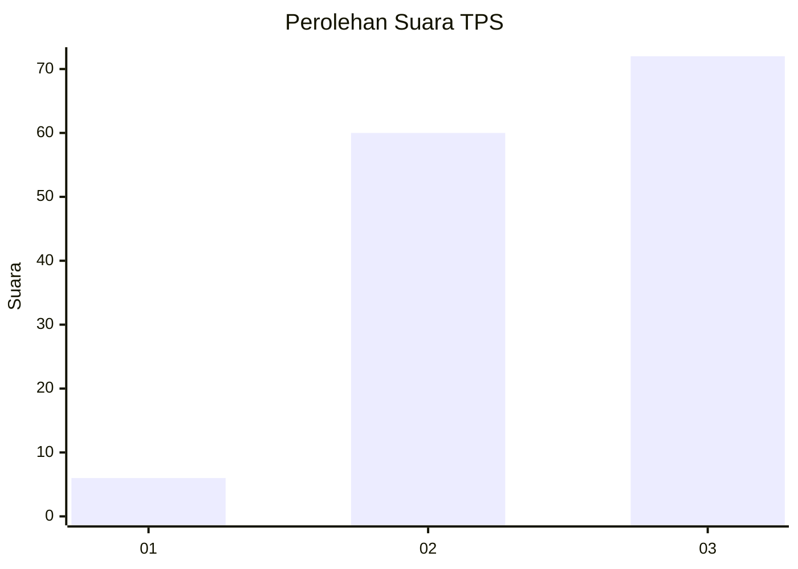
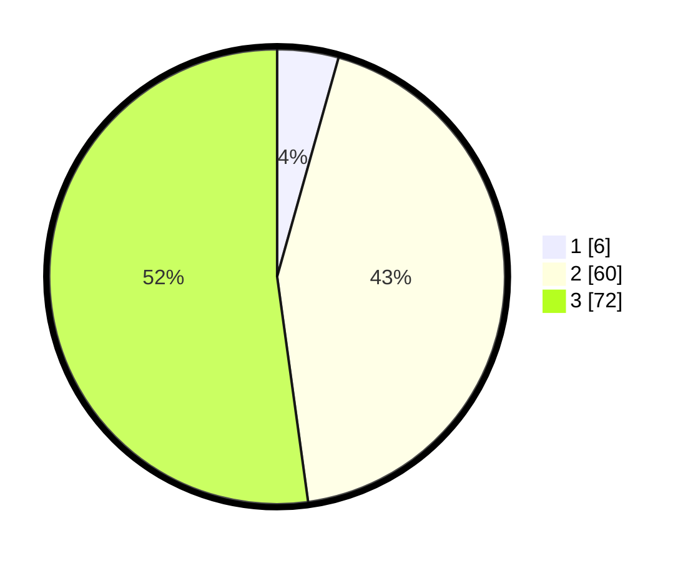

# Hasil

## Grafik

## Tabel

| No. | Nama Paslon    | Suara | Suara (raw) | Persentase |
|:--- |:-------------- | -----:| -----------:| ----------:|
| 1   | ANIES MUHAIMIN | 6     | [6][p-1]    | 4,35       |
| 2   | PRABOWO GIBRAN | 60    | [60][p-2]   | 43,48      |
| 3   | GANJAR MAHFUD  | 72    | [72][p-3]   | 52,17      |

[p-1]: https://github.com/gigit-pemilu/pemilu-2024-51-bali/blob/main/pilpres/hitung-suara/sub/51-bali/sub/06-bangli/sub/04-kintamani/sub/2024-songan-a/sub/021-tps/sub/paslon-1.txt
[p-2]: https://github.com/gigit-pemilu/pemilu-2024-51-bali/blob/main/pilpres/hitung-suara/sub/51-bali/sub/06-bangli/sub/04-kintamani/sub/2024-songan-a/sub/021-tps/sub/paslon-2.txt
[p-3]: https://github.com/gigit-pemilu/pemilu-2024-51-bali/blob/main/pilpres/hitung-suara/sub/51-bali/sub/06-bangli/sub/04-kintamani/sub/2024-songan-a/sub/021-tps/sub/paslon-3.txt

## Foto C Plano

https://sirekap-obj-formc.kpu.go.id/6b1a/pemilu/ppwp/51/06/04/20/24/5106042024021-20240318-113134--a15b8a5b-2cab-4c0d-a74f-329b1d3b34fa.jpg

https://sirekap-obj-formc.kpu.go.id/6b1a/pemilu/ppwp/51/06/04/20/24/5106042024021-20240214-230715--8719e736-6e48-4d72-b14c-89d21a0107e6.jpg

https://sirekap-obj-formc.kpu.go.id/6b1a/pemilu/ppwp/51/06/04/20/24/5106042024021-20240214-231244--4f54de8f-1e96-4922-928c-e2ba5b86f42d.jpg

## Metadata

| Key        | Value               |
| ---------- | ------------------- |
| Time Stamp | 2024-03-18 12:00:00 |

