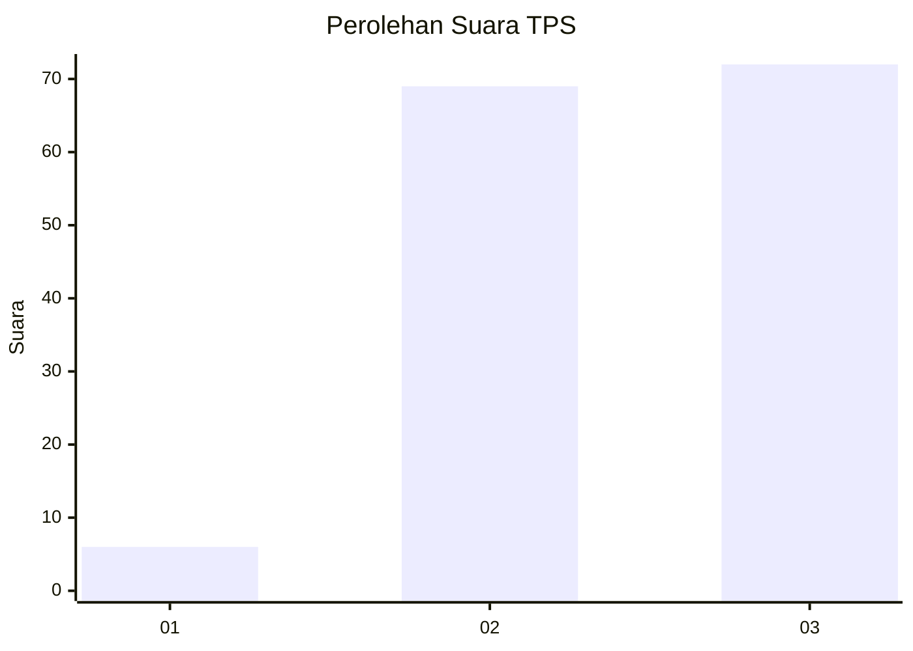
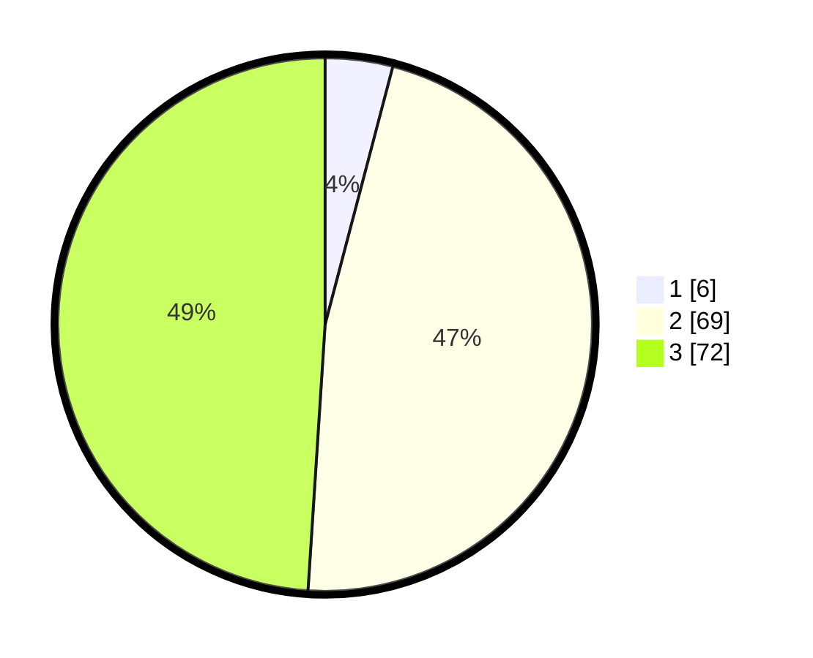

# Hasil

## Grafik

## Tabel

| No. | Nama Paslon    | Suara | Suara (raw) | Persentase |
|:--- |:-------------- | -----:| -----------:| ----------:|
| 1   | ANIES MUHAIMIN | 6     | [6][p-1]    | 4,08       |
| 2   | PRABOWO GIBRAN | 69    | [69][p-2]   | 46,94      |
| 3   | GANJAR MAHFUD  | 72    | [72][p-3]   | 48,98      |

[p-1]: https://github.com/gigit-pemilu/pemilu-2024-51-bali/blob/main/pilpres/hitung-suara/sub/51-bali/sub/06-bangli/sub/04-kintamani/sub/2024-songan-a/sub/022-tps/sub/paslon-1.txt
[p-2]: https://github.com/gigit-pemilu/pemilu-2024-51-bali/blob/main/pilpres/hitung-suara/sub/51-bali/sub/06-bangli/sub/04-kintamani/sub/2024-songan-a/sub/022-tps/sub/paslon-2.txt
[p-3]: https://github.com/gigit-pemilu/pemilu-2024-51-bali/blob/main/pilpres/hitung-suara/sub/51-bali/sub/06-bangli/sub/04-kintamani/sub/2024-songan-a/sub/022-tps/sub/paslon-3.txt

## Foto C Plano

https://sirekap-obj-formc.kpu.go.id/7bcf/pemilu/ppwp/51/06/04/20/24/5106042024022-20240214-223856--70168cb4-2f4a-4ac4-a93a-587512523097.jpg

https://sirekap-obj-formc.kpu.go.id/7bcf/pemilu/ppwp/51/06/04/20/24/5106042024022-20240214-223922--88fe961d-3bfe-4cdd-920d-5a17793daef2.jpg

https://sirekap-obj-formc.kpu.go.id/7bcf/pemilu/ppwp/51/06/04/20/24/5106042024022-20240214-223947--9fef30cc-83b0-4398-89dd-59b02cdfe2da.jpg

## Metadata

| Key        | Value               |
| ---------- | ------------------- |
| Time Stamp | 2024-02-24 22:31:28 |

