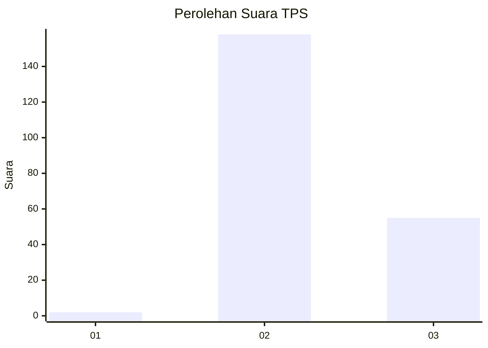
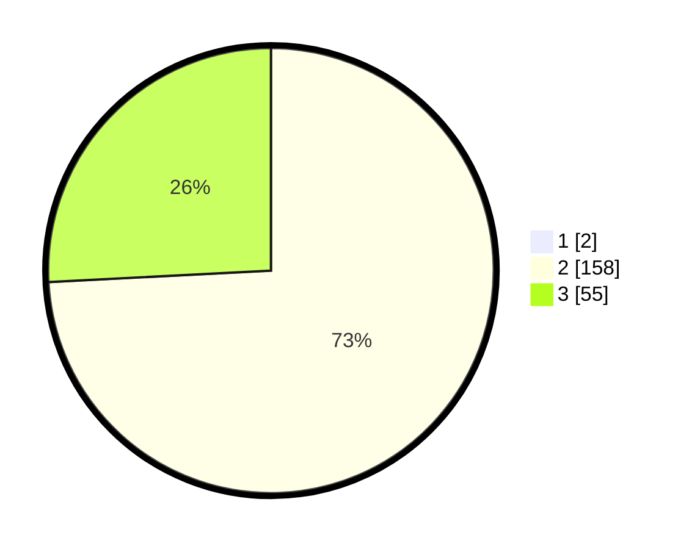

# Hasil

## Grafik

## Tabel

| No. | Nama Paslon    | Suara | Suara (raw) | Persentase |
|:--- |:-------------- | -----:| -----------:| ----------:|
| 1   | ANIES MUHAIMIN | 2     | [2][p-1]    | 0,93       |
| 2   | PRABOWO GIBRAN | 158   | [158][p-2]  | 73,49      |
| 3   | GANJAR MAHFUD  | 55    | [55][p-3]   | 25,58      |

[p-1]: https://github.com/gigit-pemilu/pemilu-2024-51-bali/blob/main/pilpres/hitung-suara/sub/51-bali/sub/06-bangli/sub/04-kintamani/sub/2025-songan-b/sub/002-tps/sub/paslon-1.txt
[p-2]: https://github.com/gigit-pemilu/pemilu-2024-51-bali/blob/main/pilpres/hitung-suara/sub/51-bali/sub/06-bangli/sub/04-kintamani/sub/2025-songan-b/sub/002-tps/sub/paslon-2.txt
[p-3]: https://github.com/gigit-pemilu/pemilu-2024-51-bali/blob/main/pilpres/hitung-suara/sub/51-bali/sub/06-bangli/sub/04-kintamani/sub/2025-songan-b/sub/002-tps/sub/paslon-3.txt

## Foto C Plano

https://sirekap-obj-formc.kpu.go.id/3a20/pemilu/ppwp/51/06/04/20/25/5106042025002-20240214-202341--36069cc8-9e78-421d-8a6e-7093e49e022c.jpg

https://sirekap-obj-formc.kpu.go.id/3a20/pemilu/ppwp/51/06/04/20/25/5106042025002-20240214-202419--20c53a93-eaf0-4bc3-8fa9-95431a6f766b.jpg

https://sirekap-obj-formc.kpu.go.id/3a20/pemilu/ppwp/51/06/04/20/25/5106042025002-20240214-202454--185fa0da-02b8-41da-bb98-85a96682bf21.jpg

## Metadata

| Key        | Value               |
| ---------- | ------------------- |
| Time Stamp | 2024-02-24 22:31:28 |

