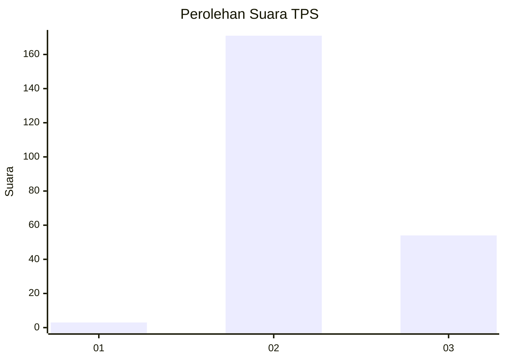
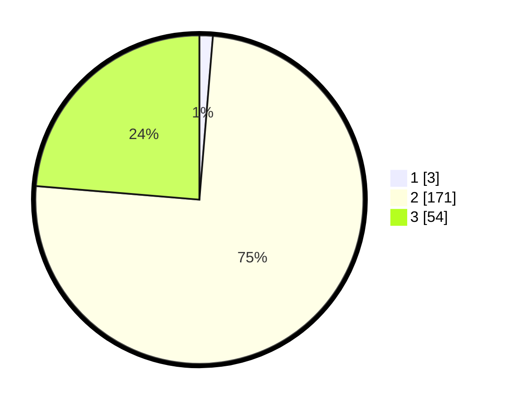

# Hasil

## Grafik

## Tabel

| No. | Nama Paslon    | Suara | Suara (raw) | Persentase |
|:--- |:-------------- | -----:| -----------:| ----------:|
| 1   | ANIES MUHAIMIN | 3     | [3][p-1]    | 1,32       |
| 2   | PRABOWO GIBRAN | 171   | [171][p-2]  | 75,00      |
| 3   | GANJAR MAHFUD  | 54    | [54][p-3]   | 23,68      |

[p-1]: https://github.com/gigit-pemilu/pemilu-2024-51-bali/blob/main/pilpres/hitung-suara/sub/51-bali/sub/06-bangli/sub/04-kintamani/sub/2025-songan-b/sub/003-tps/sub/paslon-1.txt
[p-2]: https://github.com/gigit-pemilu/pemilu-2024-51-bali/blob/main/pilpres/hitung-suara/sub/51-bali/sub/06-bangli/sub/04-kintamani/sub/2025-songan-b/sub/003-tps/sub/paslon-2.txt
[p-3]: https://github.com/gigit-pemilu/pemilu-2024-51-bali/blob/main/pilpres/hitung-suara/sub/51-bali/sub/06-bangli/sub/04-kintamani/sub/2025-songan-b/sub/003-tps/sub/paslon-3.txt

## Foto C Plano

https://sirekap-obj-formc.kpu.go.id/dddd/pemilu/ppwp/51/06/04/20/25/5106042025003-20240214-160100--75956d64-4c78-4354-b155-ecff2c92d891.jpg

https://sirekap-obj-formc.kpu.go.id/dddd/pemilu/ppwp/51/06/04/20/25/5106042025003-20240214-155723--f6d7ef37-a4b7-40c0-99e7-63bb16f50db2.jpg

https://sirekap-obj-formc.kpu.go.id/dddd/pemilu/ppwp/51/06/04/20/25/5106042025003-20240214-175304--b26e6219-c3ca-488c-99bf-e546f7895921.jpg

## Metadata

| Key        | Value               |
| ---------- | ------------------- |
| Time Stamp | 2024-02-24 22:31:28 |

