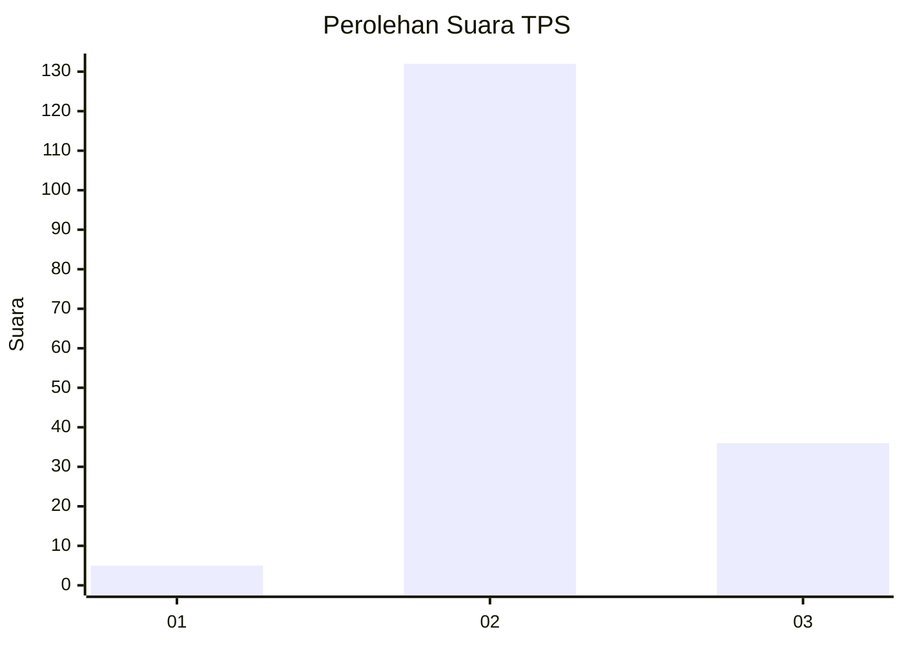

# Hasil

## Grafik

## Tabel

| No. | Nama Paslon    | Suara | Suara (raw) | Persentase |
|:--- |:-------------- | -----:| -----------:| ----------:|
| 1   | ANIES MUHAIMIN | 5     | [5][p-1]    | 2,89       |
| 2   | PRABOWO GIBRAN | 132   | [132][p-2]  | 76,30      |
| 3   | GANJAR MAHFUD  | 36    | [36][p-3]   | 20,81      |

[p-1]: https://github.com/gigit-pemilu/pemilu-2024-51-bali/blob/main/pilpres/hitung-suara/sub/51-bali/sub/06-bangli/sub/04-kintamani/sub/2025-songan-b/sub/008-tps/sub/paslon-1.txt
[p-2]: https://github.com/gigit-pemilu/pemilu-2024-51-bali/blob/main/pilpres/hitung-suara/sub/51-bali/sub/06-bangli/sub/04-kintamani/sub/2025-songan-b/sub/008-tps/sub/paslon-2.txt
[p-3]: https://github.com/gigit-pemilu/pemilu-2024-51-bali/blob/main/pilpres/hitung-suara/sub/51-bali/sub/06-bangli/sub/04-kintamani/sub/2025-songan-b/sub/008-tps/sub/paslon-3.txt

## Foto C Plano

https://sirekap-obj-formc.kpu.go.id/c1de/pemilu/ppwp/51/06/04/20/25/5106042025008-20240214-225036--8b9438c8-3de7-4cc6-9410-72b948453d4a.jpg

https://sirekap-obj-formc.kpu.go.id/c1de/pemilu/ppwp/51/06/04/20/25/5106042025008-20240214-225235--6a2c013c-e976-4b79-b279-c89dce28fab2.jpg

https://sirekap-obj-formc.kpu.go.id/c1de/pemilu/ppwp/51/06/04/20/25/5106042025008-20240214-225857--6c0a4cfa-1336-4c98-9a29-9f97937df7f4.jpg

## Metadata

| Key        | Value               |
| ---------- | ------------------- |
| Time Stamp | 2024-02-25 12:00:00 |

