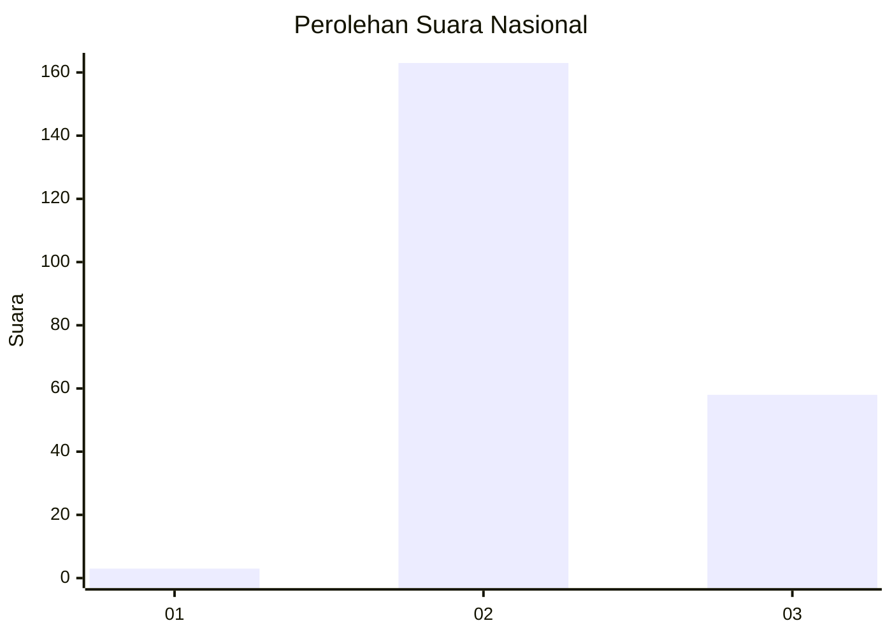
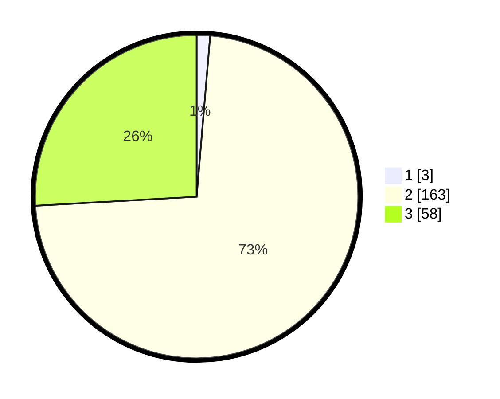

# Hasil

## Grafik

## Tabel

| No. | Nama Paslon    | Suara | Suara (raw) | Persentase |
|:--- |:-------------- | -----:| -----------:| ----------:|
| 1   | ANIES MUHAIMIN | 3     | [3][p-1]    | 1,34       |
| 2   | PRABOWO GIBRAN | 163   | [163][p-2]  | 72,77      |
| 3   | GANJAR MAHFUD  | 58    | [58][p-3]   | 25,89      |

[p-1]: https://github.com/gigit-pemilu/pemilu-2024/blob/main/pilpres/hitung-suara/sub/51-bali/sub/06-bangli/sub/04-kintamani/sub/2025-songan-b/sub/010-tps/sub/paslon-1.txt
[p-2]: https://github.com/gigit-pemilu/pemilu-2024/blob/main/pilpres/hitung-suara/sub/51-bali/sub/06-bangli/sub/04-kintamani/sub/2025-songan-b/sub/010-tps/sub/paslon-2.txt
[p-3]: https://github.com/gigit-pemilu/pemilu-2024/blob/main/pilpres/hitung-suara/sub/51-bali/sub/06-bangli/sub/04-kintamani/sub/2025-songan-b/sub/010-tps/sub/paslon-3.txt

## Foto C Plano

https://sirekap-obj-formc.kpu.go.id/26e5/pemilu/ppwp/51/06/04/20/25/5106042025010-20240214-194829--41f45ee5-40af-4e80-b734-9e82fbf12ce1.jpg

https://sirekap-obj-formc.kpu.go.id/26e5/pemilu/ppwp/51/06/04/20/25/5106042025010-20240214-194845--e7c1e7d5-3ee2-4075-8484-0d78c584020e.jpg

https://sirekap-obj-formc.kpu.go.id/26e5/pemilu/ppwp/51/06/04/20/25/5106042025010-20240214-195027--d9591804-0336-4456-9ab1-76c3ba4076ed.jpg

## Metadata

| Key        | Value               |
| ---------- | ------------------- |
| Time Stamp | 2024-02-24 22:31:28 |

