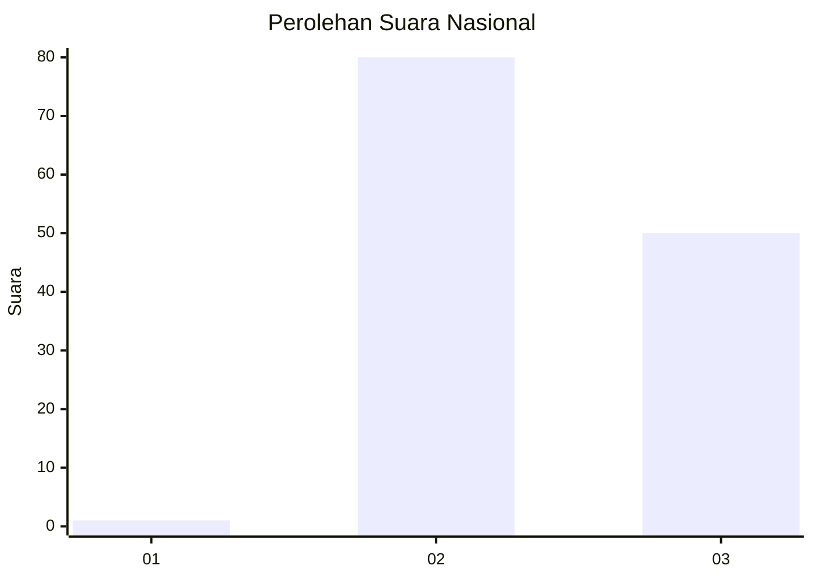
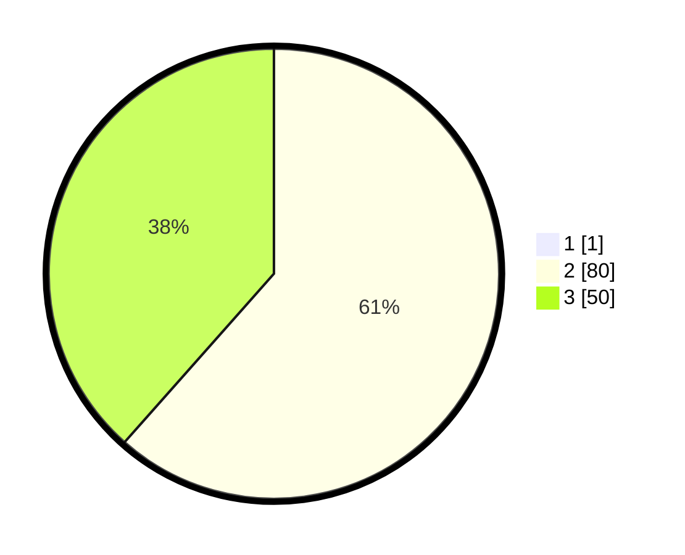

# Hasil

## Grafik

## Tabel

| No. | Nama Paslon    | Suara | Suara (raw) | Persentase |
|:--- |:-------------- | -----:| -----------:| ----------:|
| 1   | ANIES MUHAIMIN | 1     | [1][p-1]    | 0,76       |
| 2   | PRABOWO GIBRAN | 80    | [80][p-2]   | 61,07      |
| 3   | GANJAR MAHFUD  | 50    | [50][p-3]   | 38,17      |

[p-1]: https://github.com/gigit-pemilu/pemilu-2024/blob/main/pilpres/hitung-suara/sub/51-bali/sub/06-bangli/sub/04-kintamani/sub/2025-songan-b/sub/012-tps/sub/paslon-1.txt
[p-2]: https://github.com/gigit-pemilu/pemilu-2024/blob/main/pilpres/hitung-suara/sub/51-bali/sub/06-bangli/sub/04-kintamani/sub/2025-songan-b/sub/012-tps/sub/paslon-2.txt
[p-3]: https://github.com/gigit-pemilu/pemilu-2024/blob/main/pilpres/hitung-suara/sub/51-bali/sub/06-bangli/sub/04-kintamani/sub/2025-songan-b/sub/012-tps/sub/paslon-3.txt

## Foto C Plano

https://sirekap-obj-formc.kpu.go.id/807c/pemilu/ppwp/51/06/04/20/25/5106042025012-20240214-234731--af4445b3-7949-4f03-9715-ba6cdad49999.jpg

https://sirekap-obj-formc.kpu.go.id/807c/pemilu/ppwp/51/06/04/20/25/5106042025012-20240214-234934--6364188a-fef3-49db-b218-03181a4f91da.jpg

https://sirekap-obj-formc.kpu.go.id/807c/pemilu/ppwp/51/06/04/20/25/5106042025012-20240214-234911--1f9c17b6-62fd-47ed-8f3e-d527b4623f74.jpg

## Metadata

| Key        | Value               |
| ---------- | ------------------- |
| Time Stamp | 2024-03-01 14:00:00 |

