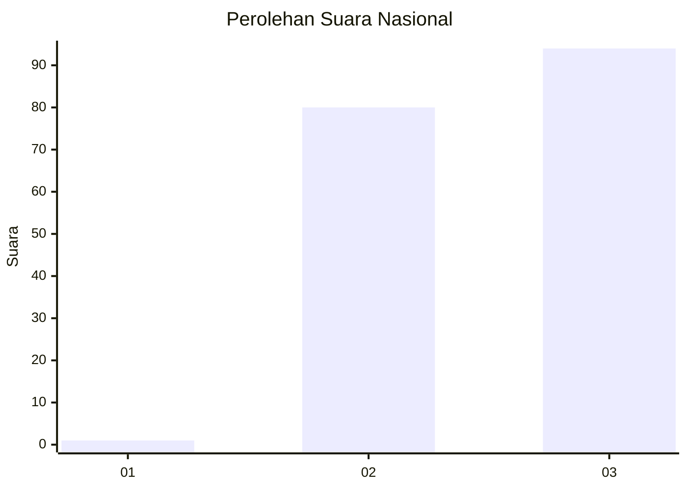
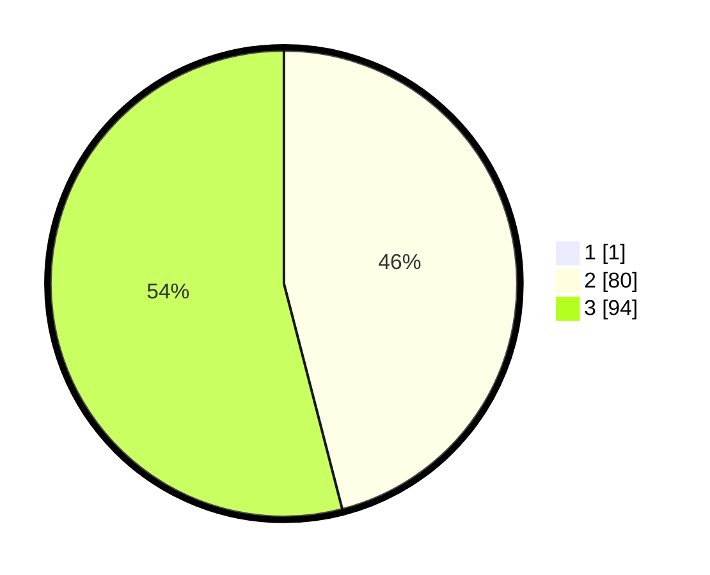

# Hasil

## Grafik

## Tabel

| No. | Nama Paslon    | Suara | Suara (raw) | Persentase |
|:--- |:-------------- | -----:| -----------:| ----------:|
| 1   | ANIES MUHAIMIN | 1     | [1][p-1]    | 0,57       |
| 2   | PRABOWO GIBRAN | 80    | [80][p-2]   | 45,71      |
| 3   | GANJAR MAHFUD  | 94    | [94][p-3]   | 53,71      |

[p-1]: https://github.com/gigit-pemilu/pemilu-2024/blob/main/pilpres/hitung-suara/sub/51-bali/sub/06-bangli/sub/04-kintamani/sub/2025-songan-b/sub/014-tps/sub/paslon-1.txt
[p-2]: https://github.com/gigit-pemilu/pemilu-2024/blob/main/pilpres/hitung-suara/sub/51-bali/sub/06-bangli/sub/04-kintamani/sub/2025-songan-b/sub/014-tps/sub/paslon-2.txt
[p-3]: https://github.com/gigit-pemilu/pemilu-2024/blob/main/pilpres/hitung-suara/sub/51-bali/sub/06-bangli/sub/04-kintamani/sub/2025-songan-b/sub/014-tps/sub/paslon-3.txt

## Foto C Plano

https://sirekap-obj-formc.kpu.go.id/2b42/pemilu/ppwp/51/06/04/20/25/5106042025014-20240215-092131--d4c96d68-7fef-414d-a70b-69552b8c75ea.jpg

https://sirekap-obj-formc.kpu.go.id/2b42/pemilu/ppwp/51/06/04/20/25/5106042025014-20240215-092438--691a53e9-f059-4445-8426-445b71eb88f7.jpg

https://sirekap-obj-formc.kpu.go.id/2b42/pemilu/ppwp/51/06/04/20/25/5106042025014-20240215-092648--8da15aea-eb82-4eec-8063-693bfb3e44cb.jpg

## Metadata

| Key        | Value               |
| ---------- | ------------------- |
| Time Stamp | 2024-02-24 22:31:28 |

