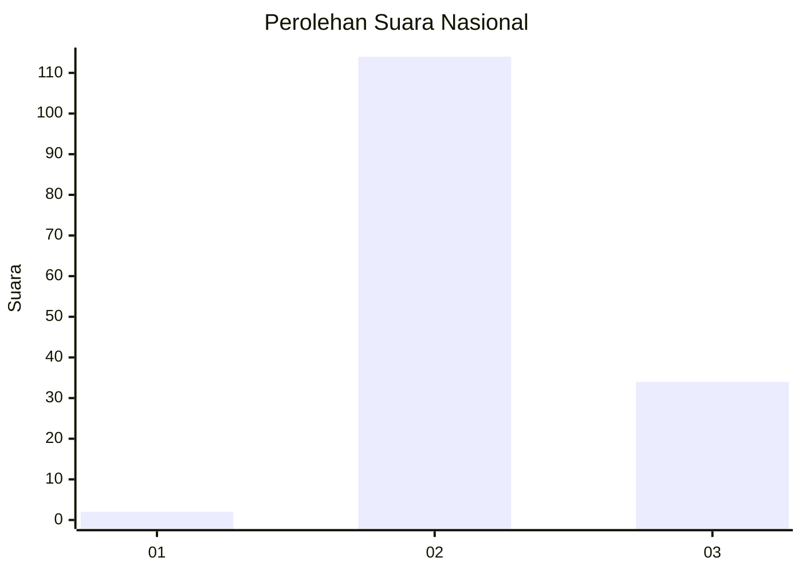
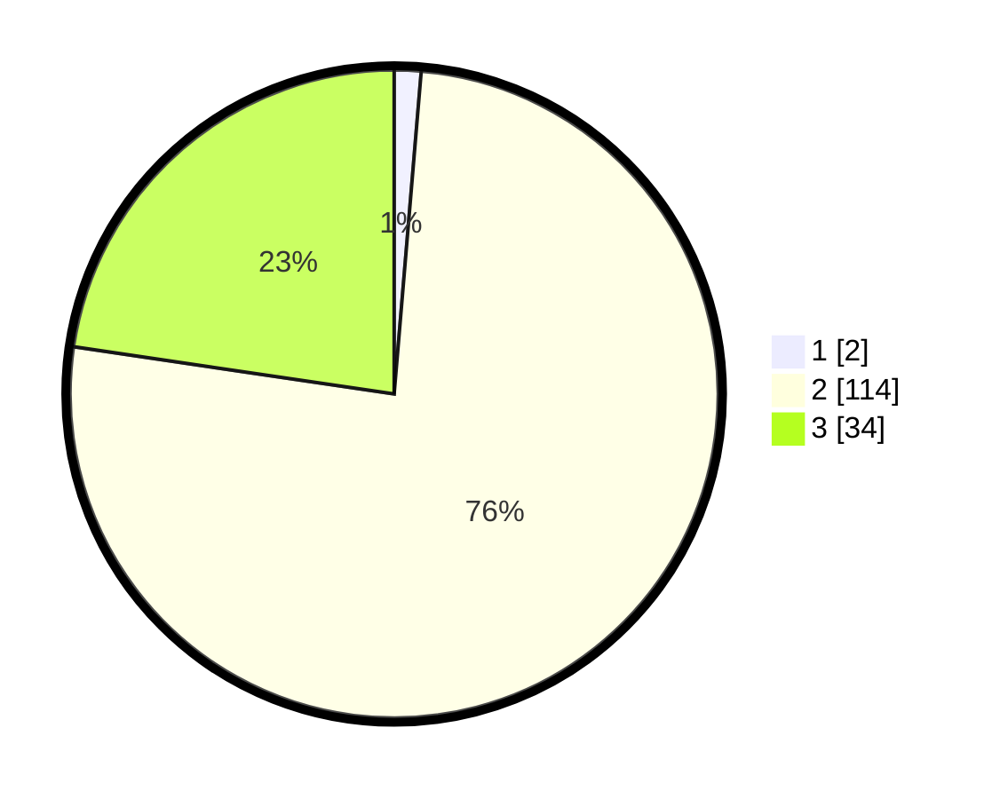

# Hasil

## Grafik

## Tabel

| No. | Nama Paslon    | Suara | Suara (raw) | Persentase |
|:--- |:-------------- | -----:| -----------:| ----------:|
| 1   | ANIES MUHAIMIN | 2     | [2][p-1]    | 1,33       |
| 2   | PRABOWO GIBRAN | 114   | [114][p-2]  | 76,00      |
| 3   | GANJAR MAHFUD  | 34    | [34][p-3]   | 22,67      |

[p-1]: https://github.com/gigit-pemilu/pemilu-2024/blob/main/pilpres/hitung-suara/sub/51-bali/sub/06-bangli/sub/04-kintamani/sub/2025-songan-b/sub/024-tps/sub/paslon-1.txt
[p-2]: https://github.com/gigit-pemilu/pemilu-2024/blob/main/pilpres/hitung-suara/sub/51-bali/sub/06-bangli/sub/04-kintamani/sub/2025-songan-b/sub/024-tps/sub/paslon-2.txt
[p-3]: https://github.com/gigit-pemilu/pemilu-2024/blob/main/pilpres/hitung-suara/sub/51-bali/sub/06-bangli/sub/04-kintamani/sub/2025-songan-b/sub/024-tps/sub/paslon-3.txt

## Foto C Plano

https://sirekap-obj-formc.kpu.go.id/48d1/pemilu/ppwp/51/06/04/20/25/5106042025024-20240215-062950--61d41a2f-3d50-4f9b-ad24-1424d4fb366e.jpg

https://sirekap-obj-formc.kpu.go.id/48d1/pemilu/ppwp/51/06/04/20/25/5106042025024-20240215-063105--e757dfe0-f0ec-4f65-b4c9-461147c5246e.jpg

https://sirekap-obj-formc.kpu.go.id/48d1/pemilu/ppwp/51/06/04/20/25/5106042025024-20240215-063159--a43810c6-cc5e-45e1-91e2-fc08c63df743.jpg

## Metadata

| Key        | Value               |
| ---------- | ------------------- |
| Time Stamp | 2024-02-24 22:31:28 |

