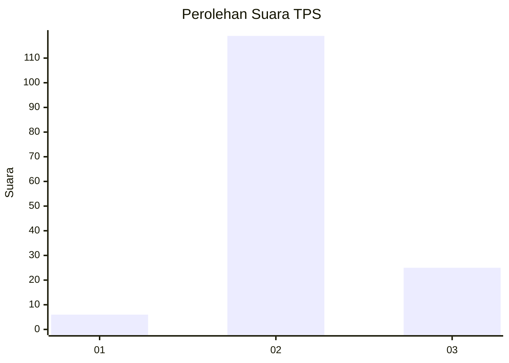
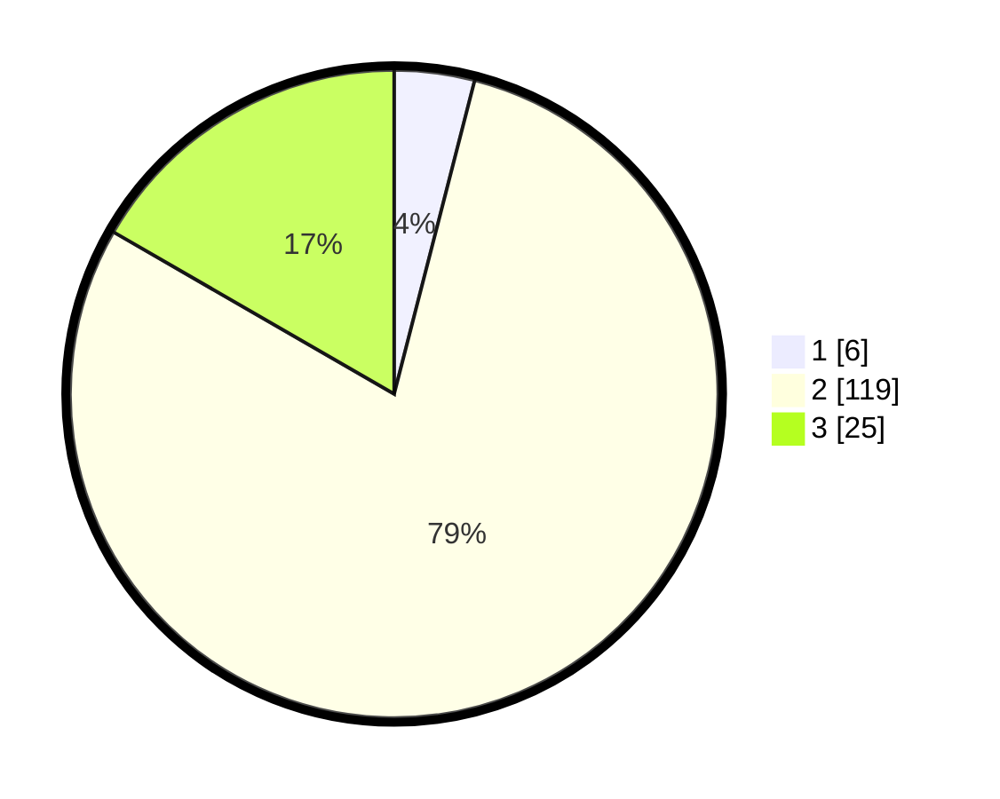

# Hasil

## Grafik

## Tabel

| No. | Nama Paslon    | Suara | Suara (raw) | Persentase |
|:--- |:-------------- | -----:| -----------:| ----------:|
| 1   | ANIES MUHAIMIN | 6     | [6][p-1]    | 4,00       |
| 2   | PRABOWO GIBRAN | 119   | [119][p-2]  | 79,33      |
| 3   | GANJAR MAHFUD  | 25    | [25][p-3]   | 16,67      |

[p-1]: https://github.com/gigit-pemilu/pemilu-2024-51-bali/blob/main/pilpres/hitung-suara/sub/51-bali/sub/06-bangli/sub/04-kintamani/sub/2025-songan-b/sub/029-tps/sub/paslon-1.txt
[p-2]: https://github.com/gigit-pemilu/pemilu-2024-51-bali/blob/main/pilpres/hitung-suara/sub/51-bali/sub/06-bangli/sub/04-kintamani/sub/2025-songan-b/sub/029-tps/sub/paslon-2.txt
[p-3]: https://github.com/gigit-pemilu/pemilu-2024-51-bali/blob/main/pilpres/hitung-suara/sub/51-bali/sub/06-bangli/sub/04-kintamani/sub/2025-songan-b/sub/029-tps/sub/paslon-3.txt

## Foto C Plano

https://sirekap-obj-formc.kpu.go.id/5e04/pemilu/ppwp/51/06/04/20/25/5106042025029-20240215-063221--b0b7531a-bb76-44b2-abe5-3ec1f696574f.jpg

https://sirekap-obj-formc.kpu.go.id/5e04/pemilu/ppwp/51/06/04/20/25/5106042025029-20240215-063255--8f50ff0c-75f3-46e7-b83f-97f26aa26b3a.jpg

https://sirekap-obj-formc.kpu.go.id/5e04/pemilu/ppwp/51/06/04/20/25/5106042025029-20240215-063325--03621e7e-b0f7-4507-8572-3c16e7e77b39.jpg

## Metadata

| Key        | Value               |
| ---------- | ------------------- |
| Time Stamp | 2024-02-24 22:31:28 |

