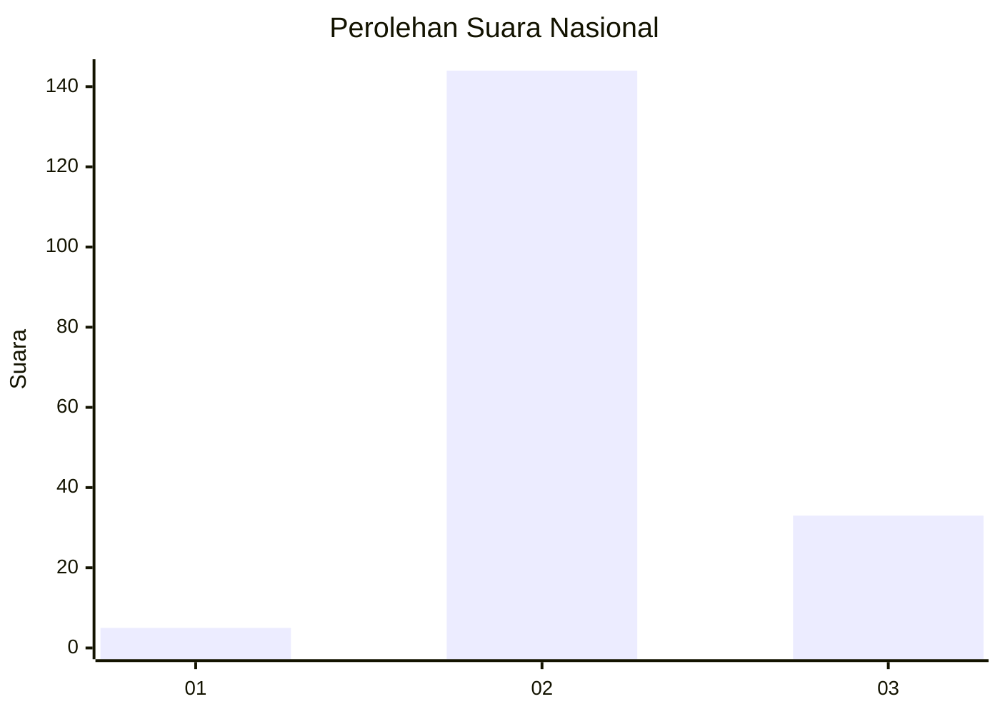

# Hasil

## Grafik

## Tabel

| No. | Nama Paslon    | Suara | Suara (raw) | Persentase |
|:--- |:-------------- | -----:| -----------:| ----------:|
| 1   | ANIES MUHAIMIN | 5     | [5][p-1]    | 2,75       |
| 2   | PRABOWO GIBRAN | 144   | [144][p-2]  | 79,12      |
| 3   | GANJAR MAHFUD  | 33    | [33][p-3]   | 18,13      |

[p-1]: https://github.com/gigit-pemilu/pemilu-2024/blob/main/pilpres/hitung-suara/sub/51-bali/sub/06-bangli/sub/04-kintamani/sub/2025-songan-b/sub/032-tps/sub/paslon-1.txt
[p-2]: https://github.com/gigit-pemilu/pemilu-2024/blob/main/pilpres/hitung-suara/sub/51-bali/sub/06-bangli/sub/04-kintamani/sub/2025-songan-b/sub/032-tps/sub/paslon-2.txt
[p-3]: https://github.com/gigit-pemilu/pemilu-2024/blob/main/pilpres/hitung-suara/sub/51-bali/sub/06-bangli/sub/04-kintamani/sub/2025-songan-b/sub/032-tps/sub/paslon-3.txt

## Foto C Plano

https://sirekap-obj-formc.kpu.go.id/b6e9/pemilu/ppwp/51/06/04/20/25/5106042025032-20240214-230019--587776df-ed11-4f2f-8a81-b11eb4bbee4a.jpg

https://sirekap-obj-formc.kpu.go.id/b6e9/pemilu/ppwp/51/06/04/20/25/5106042025032-20240214-230114--462dbbe2-6ab2-4a83-ab2c-e7a785f88796.jpg

https://sirekap-obj-formc.kpu.go.id/b6e9/pemilu/ppwp/51/06/04/20/25/5106042025032-20240214-230230--2b5e1463-db37-479c-a82c-1b7458bf217b.jpg

## Metadata

| Key        | Value               |
| ---------- | ------------------- |
| Time Stamp | 2024-02-24 22:31:28 |

