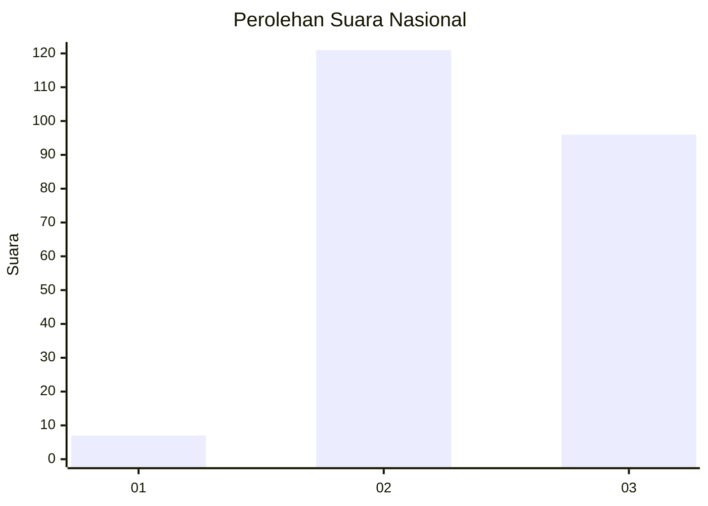
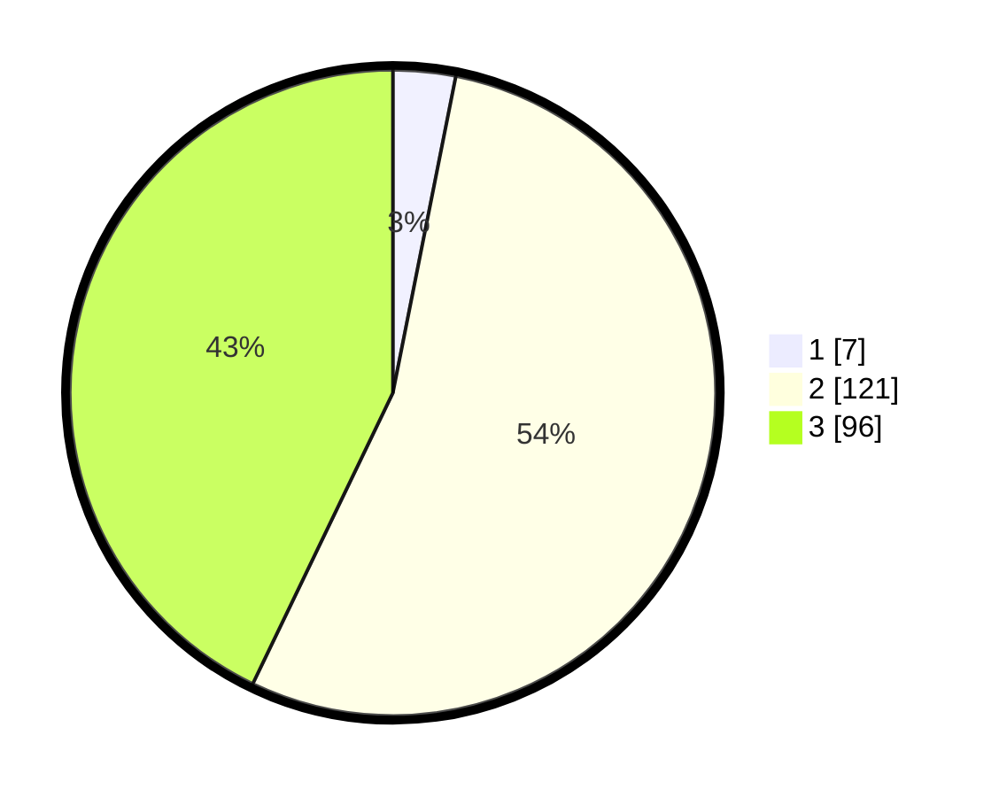

# Hasil

## Grafik

## Tabel

| No. | Nama Paslon    | Suara | Suara (raw) | Persentase |
|:--- |:-------------- | -----:| -----------:| ----------:|
| 1   | ANIES MUHAIMIN | 7     | [7][p-1]    | 3,13       |
| 2   | PRABOWO GIBRAN | 121   | [121][p-2]  | 54,02      |
| 3   | GANJAR MAHFUD  | 96    | [96][p-3]   | 42,86      |

[p-1]: https://github.com/gigit-pemilu/pemilu-2024/blob/main/pilpres/hitung-suara/sub/51-bali/sub/06-bangli/sub/04-kintamani/sub/2025-songan-b/sub/035-tps/sub/paslon-1.txt
[p-2]: https://github.com/gigit-pemilu/pemilu-2024/blob/main/pilpres/hitung-suara/sub/51-bali/sub/06-bangli/sub/04-kintamani/sub/2025-songan-b/sub/035-tps/sub/paslon-2.txt
[p-3]: https://github.com/gigit-pemilu/pemilu-2024/blob/main/pilpres/hitung-suara/sub/51-bali/sub/06-bangli/sub/04-kintamani/sub/2025-songan-b/sub/035-tps/sub/paslon-3.txt

## Foto C Plano

https://sirekap-obj-formc.kpu.go.id/d137/pemilu/ppwp/51/06/04/20/25/5106042025035-20240215-010802--3ae5fa46-4b8f-4883-bc4c-57aaf39d217f.jpg

https://sirekap-obj-formc.kpu.go.id/d137/pemilu/ppwp/51/06/04/20/25/5106042025035-20240215-011118--ec064574-0845-4bb5-8386-c4c604b7b342.jpg

https://sirekap-obj-formc.kpu.go.id/d137/pemilu/ppwp/51/06/04/20/25/5106042025035-20240215-011222--0a65b40f-5039-4a95-98f7-9174b06f84a5.jpg

## Metadata

| Key        | Value               |
| ---------- | ------------------- |
| Time Stamp | 2024-02-25 11:00:00 |

