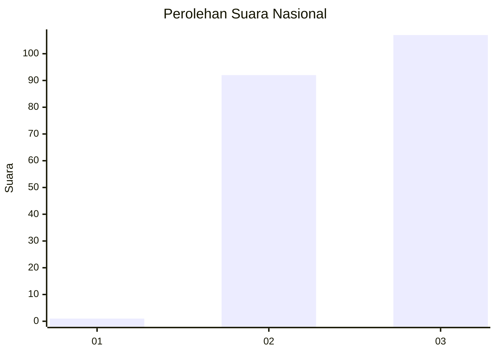
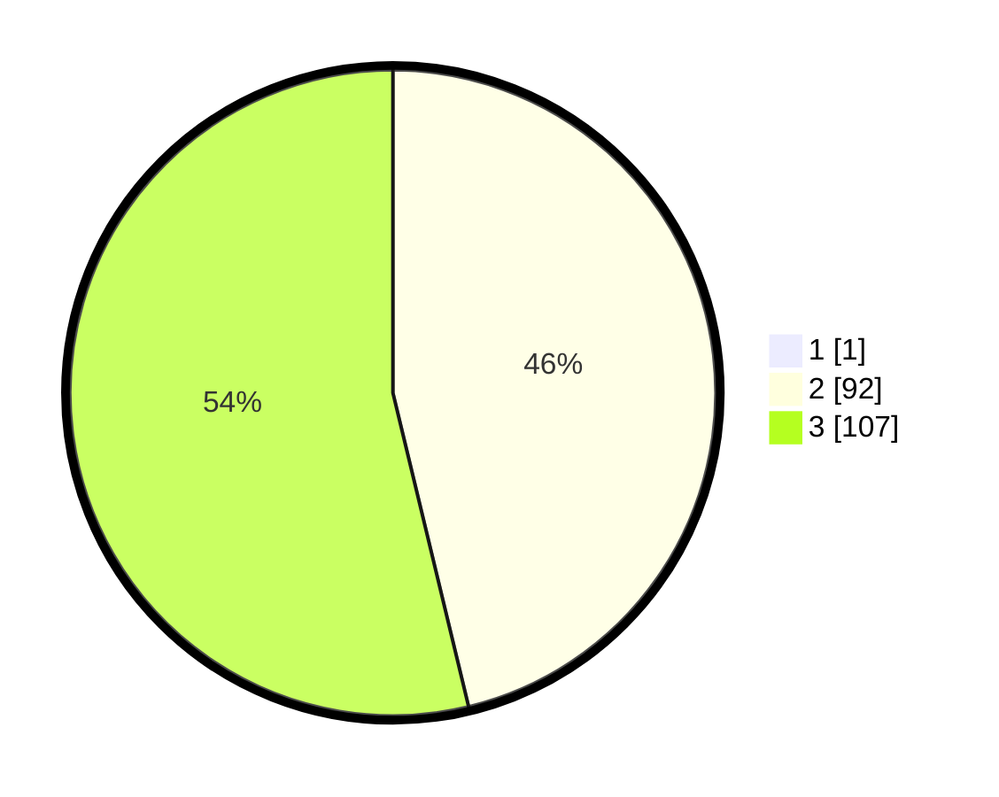

# Hasil

## Grafik

## Tabel

| No. | Nama Paslon    | Suara | Suara (raw) | Persentase |
|:--- |:-------------- | -----:| -----------:| ----------:|
| 1   | ANIES MUHAIMIN | 1     | [1][p-1]    | 0,50       |
| 2   | PRABOWO GIBRAN | 92    | [92][p-2]   | 46,00      |
| 3   | GANJAR MAHFUD  | 107   | [107][p-3]  | 53,50      |

[p-1]: https://github.com/gigit-pemilu/pemilu-2024/blob/main/pilpres/hitung-suara/sub/51-bali/sub/06-bangli/sub/04-kintamani/sub/2026-batur-selatan/sub/005-tps/sub/paslon-1.txt
[p-2]: https://github.com/gigit-pemilu/pemilu-2024/blob/main/pilpres/hitung-suara/sub/51-bali/sub/06-bangli/sub/04-kintamani/sub/2026-batur-selatan/sub/005-tps/sub/paslon-2.txt
[p-3]: https://github.com/gigit-pemilu/pemilu-2024/blob/main/pilpres/hitung-suara/sub/51-bali/sub/06-bangli/sub/04-kintamani/sub/2026-batur-selatan/sub/005-tps/sub/paslon-3.txt

## Foto C Plano

https://sirekap-obj-formc.kpu.go.id/3f9a/pemilu/ppwp/51/06/04/20/26/5106042026005-20240214-215716--81b3815b-0810-4a35-ab27-1b41dd340e44.jpg

https://sirekap-obj-formc.kpu.go.id/3f9a/pemilu/ppwp/51/06/04/20/26/5106042026005-20240214-220415--edde7215-ae7e-45d3-9911-1801463d0890.jpg

https://sirekap-obj-formc.kpu.go.id/3f9a/pemilu/ppwp/51/06/04/20/26/5106042026005-20240214-220735--c746de23-c7b2-406e-9e5a-47d33cc75dd0.jpg

## Metadata

| Key        | Value               |
| ---------- | ------------------- |
| Time Stamp | 2024-02-24 22:31:28 |

