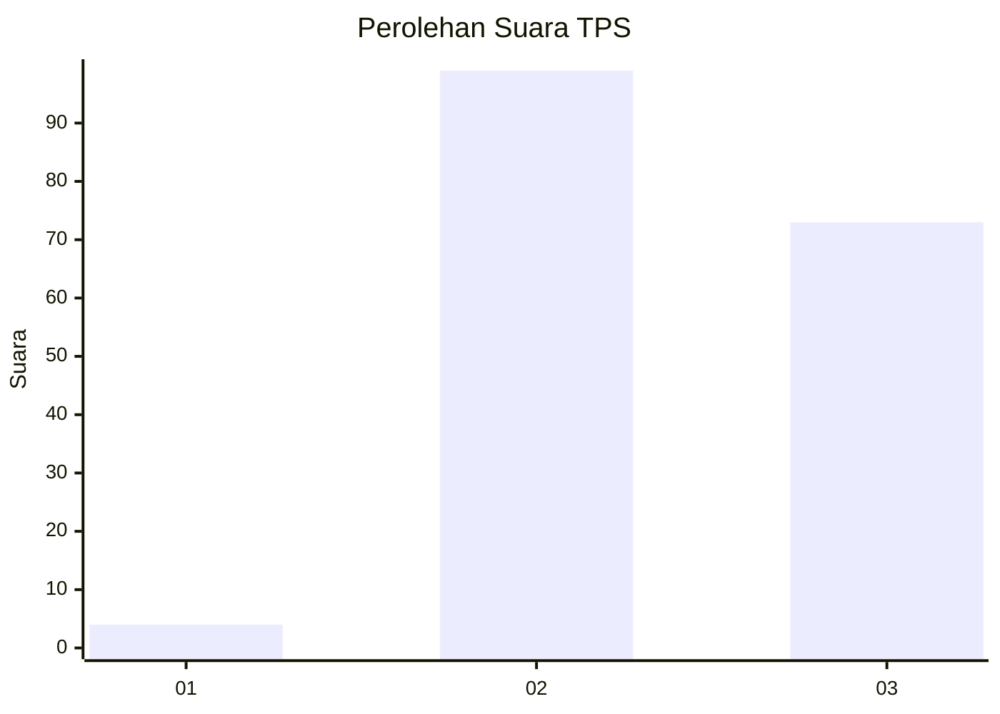
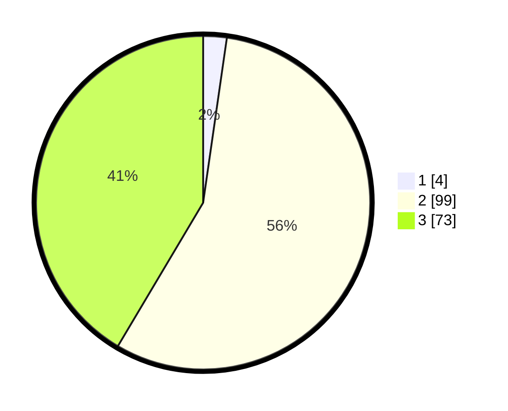

# Hasil

## Grafik

## Tabel

| No. | Nama Paslon    | Suara | Suara (raw) | Persentase |
|:--- |:-------------- | -----:| -----------:| ----------:|
| 1   | ANIES MUHAIMIN | 4     | [4][p-1]    | 2,27       |
| 2   | PRABOWO GIBRAN | 99    | [99][p-2]   | 56,25      |
| 3   | GANJAR MAHFUD  | 73    | [73][p-3]   | 41,48      |

[p-1]: https://github.com/gigit-pemilu/pemilu-2024-51-bali/blob/main/pilpres/hitung-suara/sub/51-bali/sub/06-bangli/sub/04-kintamani/sub/2026-batur-selatan/sub/009-tps/sub/paslon-1.txt
[p-2]: https://github.com/gigit-pemilu/pemilu-2024-51-bali/blob/main/pilpres/hitung-suara/sub/51-bali/sub/06-bangli/sub/04-kintamani/sub/2026-batur-selatan/sub/009-tps/sub/paslon-2.txt
[p-3]: https://github.com/gigit-pemilu/pemilu-2024-51-bali/blob/main/pilpres/hitung-suara/sub/51-bali/sub/06-bangli/sub/04-kintamani/sub/2026-batur-selatan/sub/009-tps/sub/paslon-3.txt

## Foto C Plano

https://sirekap-obj-formc.kpu.go.id/993e/pemilu/ppwp/51/06/04/20/26/5106042026009-20240214-213632--35134ecc-5f97-4d5c-9f50-aea80430845d.jpg

https://sirekap-obj-formc.kpu.go.id/993e/pemilu/ppwp/51/06/04/20/26/5106042026009-20240214-214418--ee127d95-e047-46fa-850c-e04cea03839a.jpg

https://sirekap-obj-formc.kpu.go.id/993e/pemilu/ppwp/51/06/04/20/26/5106042026009-20240214-214549--829146ac-12f0-495d-89f7-a70a69d87ebe.jpg

## Metadata

| Key        | Value               |
| ---------- | ------------------- |
| Time Stamp | 2024-02-24 22:31:28 |

