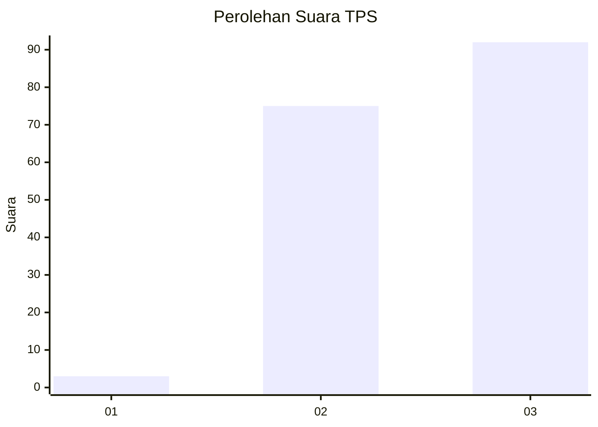
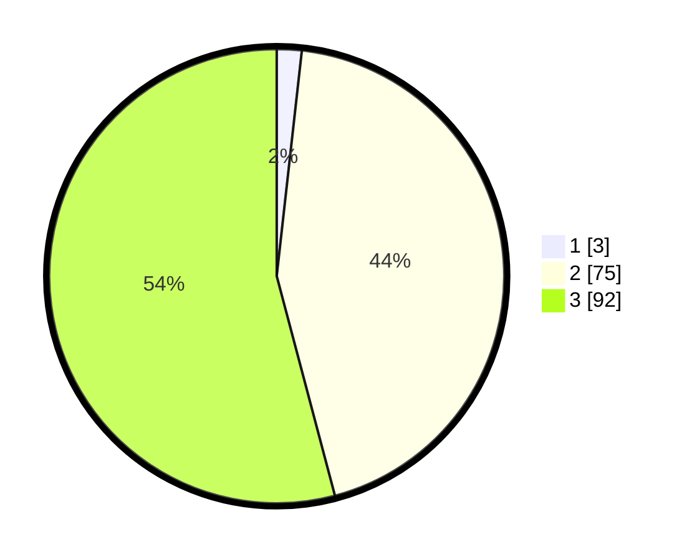

# Hasil

## Grafik

## Tabel

| No. | Nama Paslon    | Suara | Suara (raw) | Persentase |
|:--- |:-------------- | -----:| -----------:| ----------:|
| 1   | ANIES MUHAIMIN | 3     | [3][p-1]    | 1,76       |
| 2   | PRABOWO GIBRAN | 75    | [75][p-2]   | 44,12      |
| 3   | GANJAR MAHFUD  | 92    | [92][p-3]   | 54,12      |

[p-1]: https://github.com/gigit-pemilu/pemilu-2024-51-bali/blob/main/pilpres/hitung-suara/sub/51-bali/sub/06-bangli/sub/04-kintamani/sub/2026-batur-selatan/sub/010-tps/sub/paslon-1.txt
[p-2]: https://github.com/gigit-pemilu/pemilu-2024-51-bali/blob/main/pilpres/hitung-suara/sub/51-bali/sub/06-bangli/sub/04-kintamani/sub/2026-batur-selatan/sub/010-tps/sub/paslon-2.txt
[p-3]: https://github.com/gigit-pemilu/pemilu-2024-51-bali/blob/main/pilpres/hitung-suara/sub/51-bali/sub/06-bangli/sub/04-kintamani/sub/2026-batur-selatan/sub/010-tps/sub/paslon-3.txt

## Foto C Plano

https://sirekap-obj-formc.kpu.go.id/c6cd/pemilu/ppwp/51/06/04/20/26/5106042026010-20240214-221703--87d6baef-b85e-49d2-a6fc-dc7a670fc9b1.jpg

https://sirekap-obj-formc.kpu.go.id/c6cd/pemilu/ppwp/51/06/04/20/26/5106042026010-20240214-202400--35f2de63-3e77-4bcd-9b2e-cfb68bda583e.jpg

https://sirekap-obj-formc.kpu.go.id/c6cd/pemilu/ppwp/51/06/04/20/26/5106042026010-20240214-202449--cc4c74a4-3d20-4f2d-8722-2e19c68e375a.jpg

## Metadata

| Key        | Value               |
| ---------- | ------------------- |
| Time Stamp | 2024-02-15 12:00:28 |

