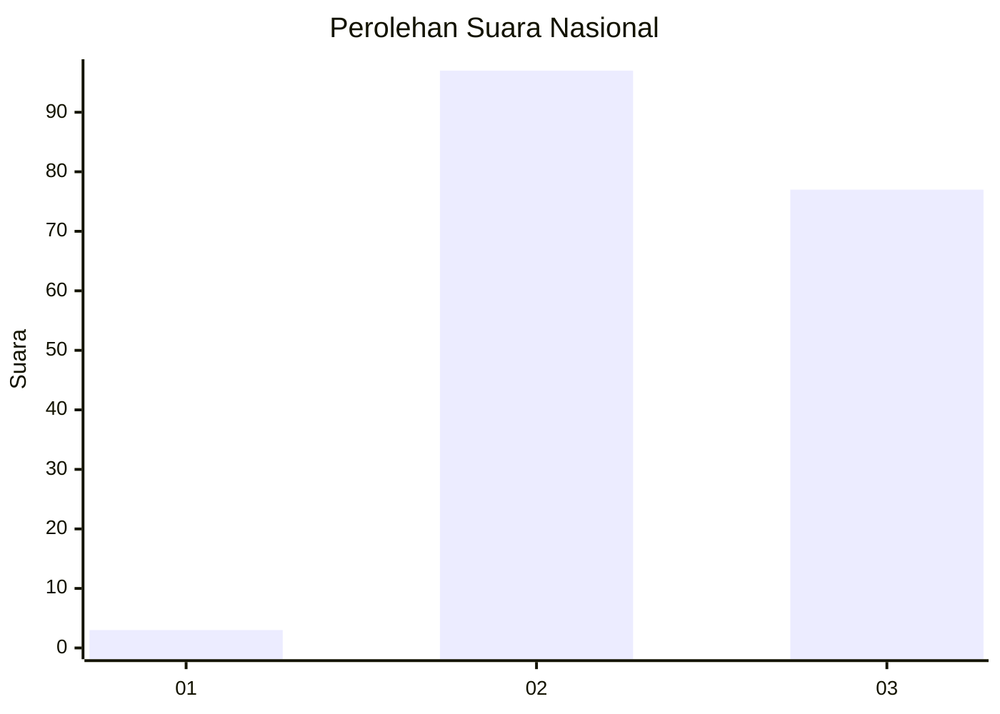
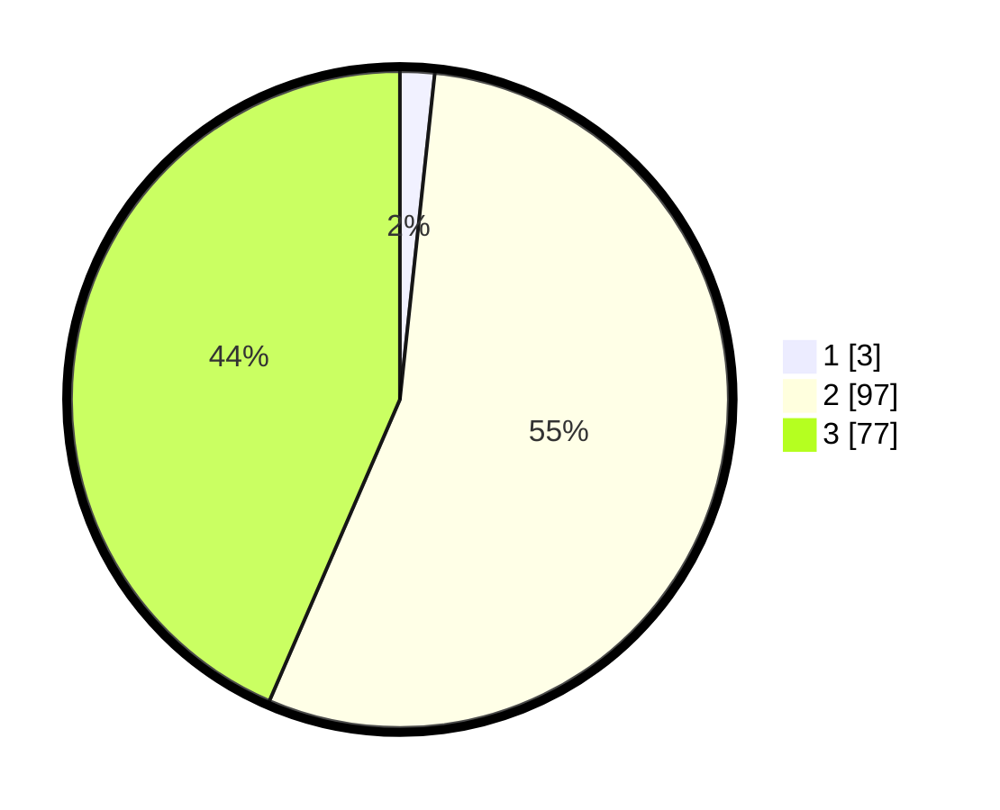

# Hasil

## Grafik

## Tabel

| No. | Nama Paslon    | Suara | Suara (raw) | Persentase |
|:--- |:-------------- | -----:| -----------:| ----------:|
| 1   | ANIES MUHAIMIN | 3     | [3][p-1]    | 1,69       |
| 2   | PRABOWO GIBRAN | 97    | [97][p-2]   | 54,80      |
| 3   | GANJAR MAHFUD  | 77    | [77][p-3]   | 43,50      |

[p-1]: https://github.com/gigit-pemilu/pemilu-2024/blob/main/pilpres/hitung-suara/sub/51-bali/sub/06-bangli/sub/04-kintamani/sub/2026-batur-selatan/sub/011-tps/sub/paslon-1.txt
[p-2]: https://github.com/gigit-pemilu/pemilu-2024/blob/main/pilpres/hitung-suara/sub/51-bali/sub/06-bangli/sub/04-kintamani/sub/2026-batur-selatan/sub/011-tps/sub/paslon-2.txt
[p-3]: https://github.com/gigit-pemilu/pemilu-2024/blob/main/pilpres/hitung-suara/sub/51-bali/sub/06-bangli/sub/04-kintamani/sub/2026-batur-selatan/sub/011-tps/sub/paslon-3.txt

## Foto C Plano

https://sirekap-obj-formc.kpu.go.id/a369/pemilu/ppwp/51/06/04/20/26/5106042026011-20240214-225802--a3f919ae-50aa-41f3-9cd2-6ca1071e20f8.jpg

https://sirekap-obj-formc.kpu.go.id/a369/pemilu/ppwp/51/06/04/20/26/5106042026011-20240214-225833--186e01c1-a0b9-4c3d-93f7-dd223718c5eb.jpg

https://sirekap-obj-formc.kpu.go.id/a369/pemilu/ppwp/51/06/04/20/26/5106042026011-20240214-225853--862be3a6-3aa7-42da-b97d-a0550e71592c.jpg

## Metadata

| Key        | Value               |
| ---------- | ------------------- |
| Time Stamp | 2024-02-24 22:31:28 |

