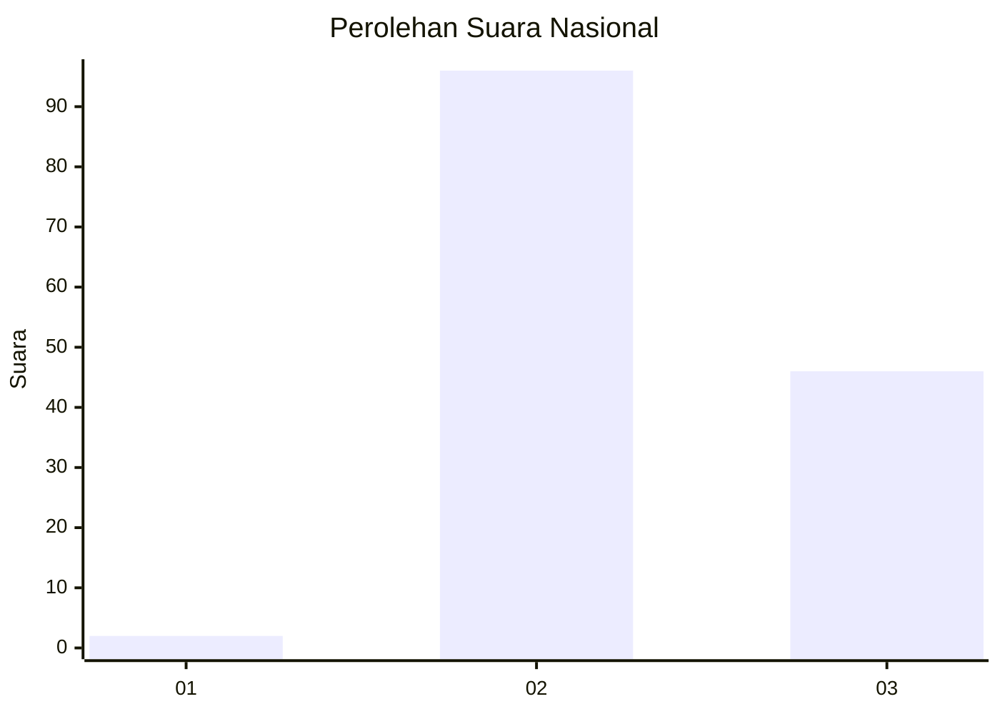
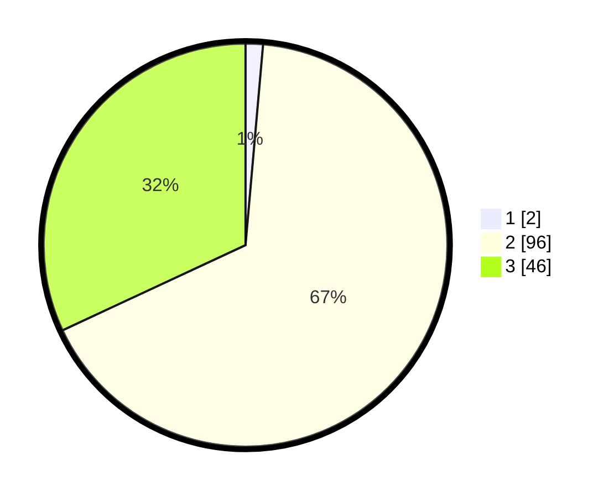

# Hasil

## Grafik

## Tabel

| No. | Nama Paslon    | Suara | Suara (raw) | Persentase |
|:--- |:-------------- | -----:| -----------:| ----------:|
| 1   | ANIES MUHAIMIN | 2     | [2][p-1]    | 1,39       |
| 2   | PRABOWO GIBRAN | 96    | [96][p-2]   | 66,67      |
| 3   | GANJAR MAHFUD  | 46    | [46][p-3]   | 31,94      |

[p-1]: https://github.com/gigit-pemilu/pemilu-2024/blob/main/pilpres/hitung-suara/sub/51-bali/sub/06-bangli/sub/04-kintamani/sub/2026-batur-selatan/sub/016-tps/sub/paslon-1.txt
[p-2]: https://github.com/gigit-pemilu/pemilu-2024/blob/main/pilpres/hitung-suara/sub/51-bali/sub/06-bangli/sub/04-kintamani/sub/2026-batur-selatan/sub/016-tps/sub/paslon-2.txt
[p-3]: https://github.com/gigit-pemilu/pemilu-2024/blob/main/pilpres/hitung-suara/sub/51-bali/sub/06-bangli/sub/04-kintamani/sub/2026-batur-selatan/sub/016-tps/sub/paslon-3.txt

## Foto C Plano

https://sirekap-obj-formc.kpu.go.id/4415/pemilu/ppwp/51/06/04/20/26/5106042026016-20240214-155831--876b9b50-ee69-4f8a-88b4-1b966c5f3c70.jpg

https://sirekap-obj-formc.kpu.go.id/4415/pemilu/ppwp/51/06/04/20/26/5106042026016-20240214-160055--a1bd4f04-3a1a-49a9-a6a1-f066fd666fa0.jpg

## Metadata

| Key        | Value               |
| ---------- | ------------------- |
| Time Stamp | 2024-02-24 22:31:28 |

