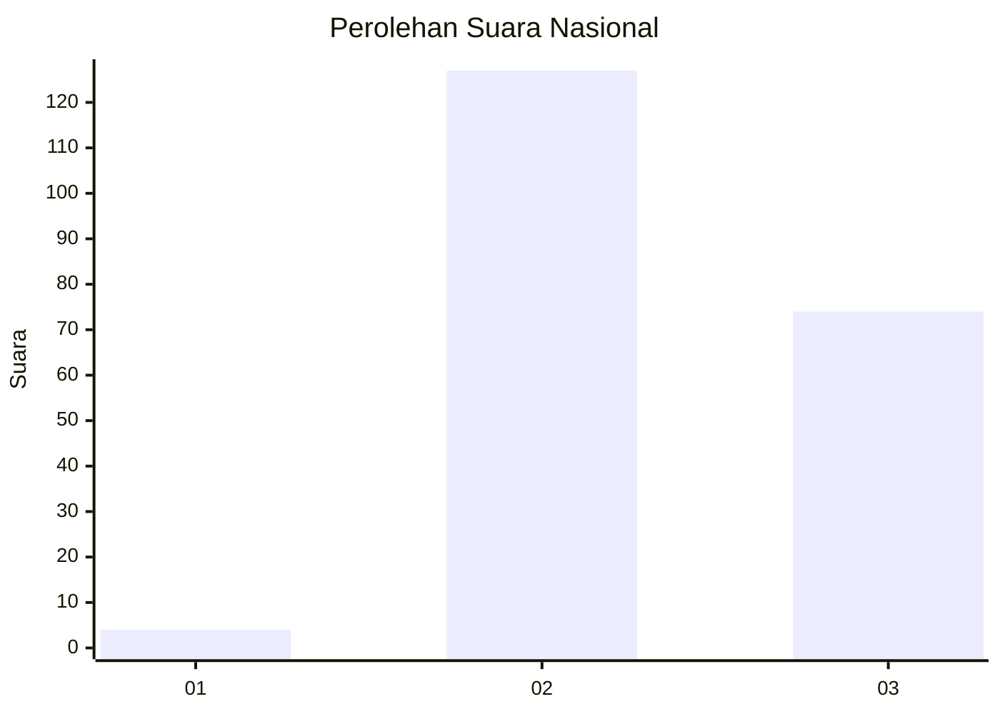
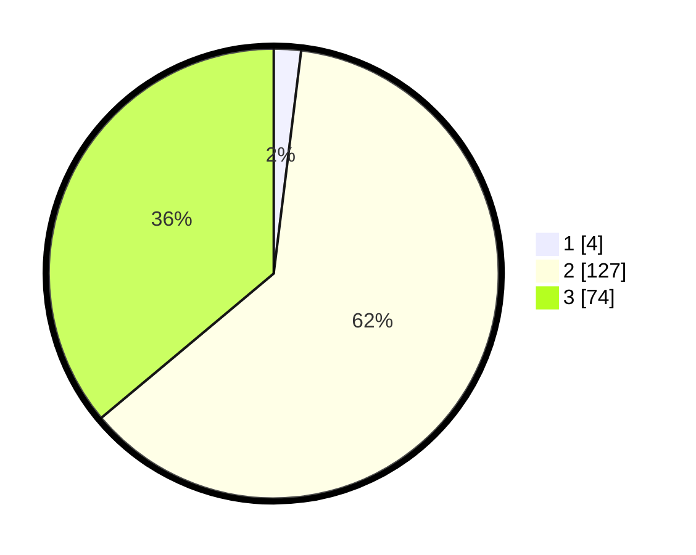

# Hasil

## Grafik

## Tabel

| No. | Nama Paslon    | Suara | Suara (raw) | Persentase |
|:--- |:-------------- | -----:| -----------:| ----------:|
| 1   | ANIES MUHAIMIN | 4     | [4][p-1]    | 1,95       |
| 2   | PRABOWO GIBRAN | 127   | [127][p-2]  | 61,95      |
| 3   | GANJAR MAHFUD  | 74    | [74][p-3]   | 36,10      |

[p-1]: https://github.com/gigit-pemilu/pemilu-2024/blob/main/pilpres/hitung-suara/sub/51-bali/sub/06-bangli/sub/04-kintamani/sub/2027-batur-tengah/sub/006-tps/sub/paslon-1.txt
[p-2]: https://github.com/gigit-pemilu/pemilu-2024/blob/main/pilpres/hitung-suara/sub/51-bali/sub/06-bangli/sub/04-kintamani/sub/2027-batur-tengah/sub/006-tps/sub/paslon-2.txt
[p-3]: https://github.com/gigit-pemilu/pemilu-2024/blob/main/pilpres/hitung-suara/sub/51-bali/sub/06-bangli/sub/04-kintamani/sub/2027-batur-tengah/sub/006-tps/sub/paslon-3.txt

## Foto C Plano

https://sirekap-obj-formc.kpu.go.id/c549/pemilu/ppwp/51/06/04/20/27/5106042027006-20240214-130547--93763842-67f4-49ab-abdb-3035ecaf273e.jpg

https://sirekap-obj-formc.kpu.go.id/c549/pemilu/ppwp/51/06/04/20/27/5106042027006-20240214-130800--7ce2f383-f04f-4223-85e3-e39ae0956ffb.jpg

https://sirekap-obj-formc.kpu.go.id/c549/pemilu/ppwp/51/06/04/20/27/5106042027006-20240214-130901--449d6b9c-2162-4965-ab84-33b2ebd4dabf.jpg

## Metadata

| Key        | Value               |
| ---------- | ------------------- |
| Time Stamp | 2024-02-25 19:00:00 |

