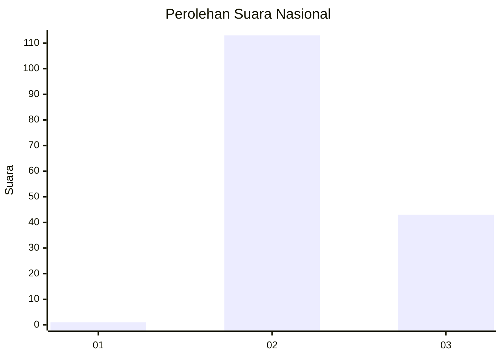
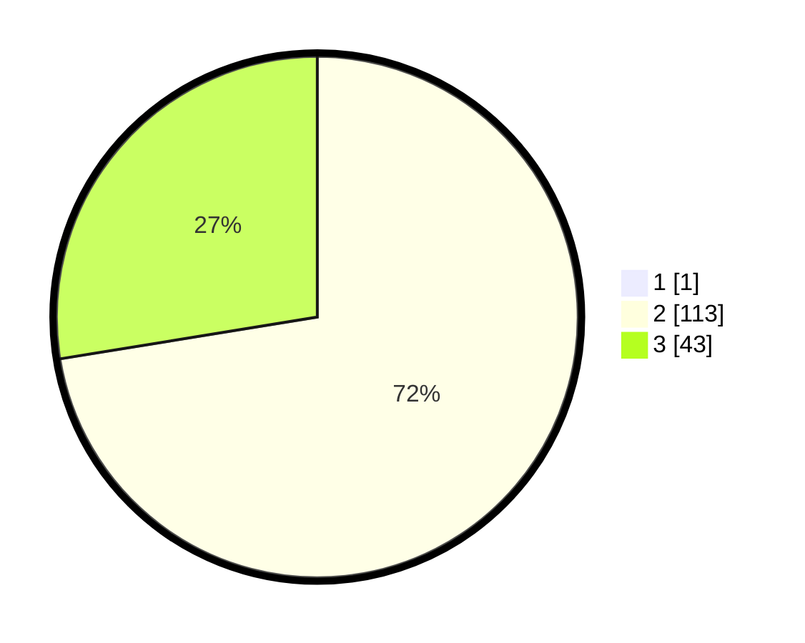

# Hasil

## Grafik

## Tabel

| No. | Nama Paslon    | Suara | Suara (raw) | Persentase |
|:--- |:-------------- | -----:| -----------:| ----------:|
| 1   | ANIES MUHAIMIN | 1     | [1][p-1]    | 0,64       |
| 2   | PRABOWO GIBRAN | 113   | [113][p-2]  | 71,97      |
| 3   | GANJAR MAHFUD  | 43    | [43][p-3]   | 27,39      |

[p-1]: https://github.com/gigit-pemilu/pemilu-2024/blob/main/pilpres/hitung-suara/sub/51-bali/sub/06-bangli/sub/04-kintamani/sub/2027-batur-tengah/sub/007-tps/sub/paslon-1.txt
[p-2]: https://github.com/gigit-pemilu/pemilu-2024/blob/main/pilpres/hitung-suara/sub/51-bali/sub/06-bangli/sub/04-kintamani/sub/2027-batur-tengah/sub/007-tps/sub/paslon-2.txt
[p-3]: https://github.com/gigit-pemilu/pemilu-2024/blob/main/pilpres/hitung-suara/sub/51-bali/sub/06-bangli/sub/04-kintamani/sub/2027-batur-tengah/sub/007-tps/sub/paslon-3.txt

## Foto C Plano

https://sirekap-obj-formc.kpu.go.id/13fe/pemilu/ppwp/51/06/04/20/27/5106042027007-20240214-132409--714c86a2-40d6-4e99-b4bc-99c604ecf7ed.jpg

https://sirekap-obj-formc.kpu.go.id/13fe/pemilu/ppwp/51/06/04/20/27/5106042027007-20240216-145553--f90b822f-fa4b-40e5-81f6-b78065b08ef3.jpg

https://sirekap-obj-formc.kpu.go.id/13fe/pemilu/ppwp/51/06/04/20/27/5106042027007-20240216-145552--bf6240f3-2767-4e08-b738-7e11ceb27f2b.jpg

## Metadata

| Key        | Value               |
| ---------- | ------------------- |
| Time Stamp | 2024-02-21 23:00:00 |

## DATA PEMILIH TETAP

Jumlah pemilih dalam DPT: **193**.
 * L: **87**.
 * P: **106**.

## DATA PENGGUNA HAK PILIH

Jumlah pengguna hak pilih dalam DPT: **161**.
 * L: **78**.
 * P: **83**.

Jumlah pengguna hak pilih dalam DPTb: **0**.
 * L: **0**.
 * P: **0**.

Jumlah pengguna hak pilih dalam DPK: **1**.
 * L: **1**.
 * P: **0**.

Jumlah pengguna hak pilih: **162**.
 * L: **79**.
 * P: **83**.

## JUMLAH SUARA SAH DAN TIDAK SAH

JUMLAH SELURUH SUARA SAH: **157**.

JUMLAH SUARA TIDAK SAH: **5**.

JUMLAH SELURUH SUARA SAH DAN SUARA TIDAK SAH: **162**.

