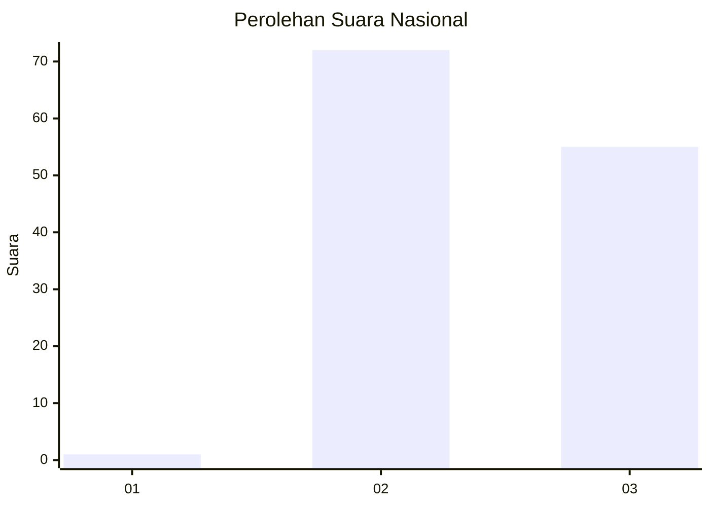
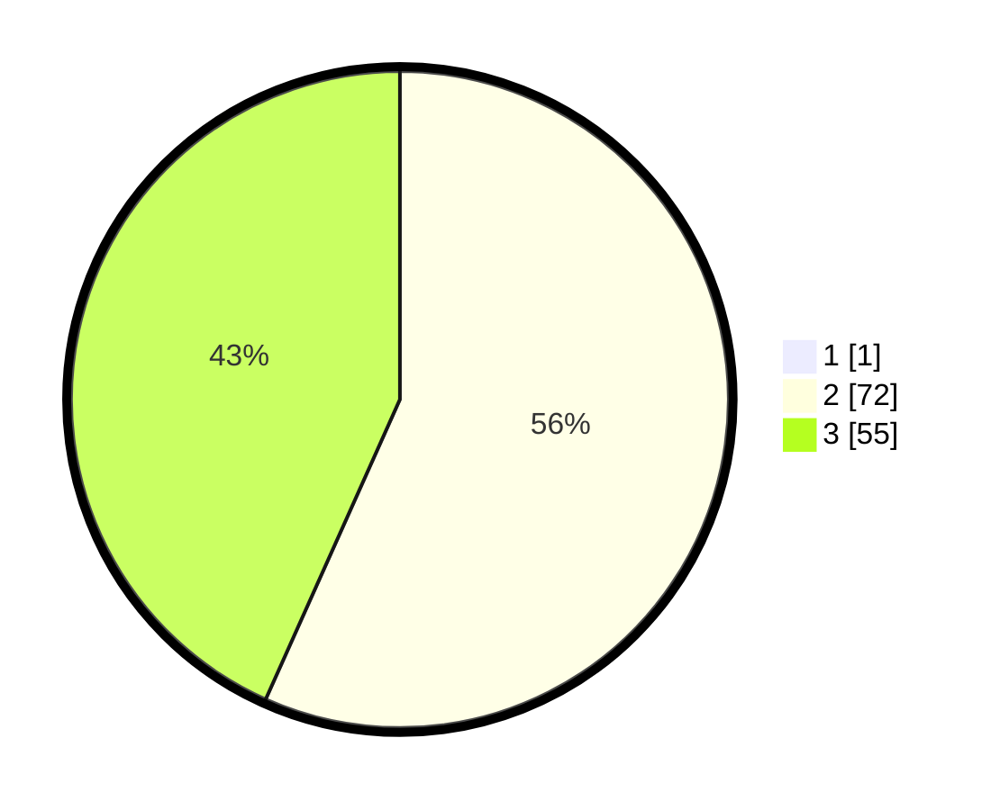

# Hasil

## Grafik

## Tabel

| No. | Nama Paslon    | Suara | Suara (raw) | Persentase |
|:--- |:-------------- | -----:| -----------:| ----------:|
| 1   | ANIES MUHAIMIN | 1     | [1][p-1]    | 0,78       |
| 2   | PRABOWO GIBRAN | 72    | [72][p-2]   | 56,25      |
| 3   | GANJAR MAHFUD  | 55    | [55][p-3]   | 42,97      |

[p-1]: https://github.com/gigit-pemilu/pemilu-2024/blob/main/pilpres/hitung-suara/sub/51-bali/sub/06-bangli/sub/04-kintamani/sub/2027-batur-tengah/sub/008-tps/sub/paslon-1.txt
[p-2]: https://github.com/gigit-pemilu/pemilu-2024/blob/main/pilpres/hitung-suara/sub/51-bali/sub/06-bangli/sub/04-kintamani/sub/2027-batur-tengah/sub/008-tps/sub/paslon-2.txt
[p-3]: https://github.com/gigit-pemilu/pemilu-2024/blob/main/pilpres/hitung-suara/sub/51-bali/sub/06-bangli/sub/04-kintamani/sub/2027-batur-tengah/sub/008-tps/sub/paslon-3.txt

## Foto C Plano

https://sirekap-obj-formc.kpu.go.id/eec5/pemilu/ppwp/51/06/04/20/27/5106042027008-20240214-195119--8dc51e38-d93c-4890-a931-44074096ccae.jpg

https://sirekap-obj-formc.kpu.go.id/eec5/pemilu/ppwp/51/06/04/20/27/5106042027008-20240214-131235--2e93dd41-f830-4113-8c0b-93e9d21a8c0f.jpg

https://sirekap-obj-formc.kpu.go.id/eec5/pemilu/ppwp/51/06/04/20/27/5106042027008-20240214-195321--098b77a2-d0fe-474c-bc12-b1089bd00820.jpg

## Metadata

| Key        | Value               |
| ---------- | ------------------- |
| Time Stamp | 2024-02-14 21:46:01 |

