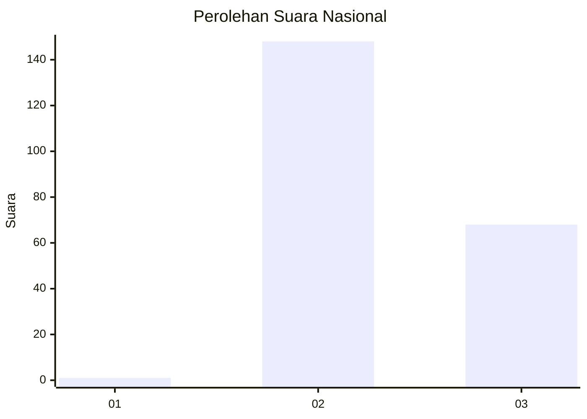
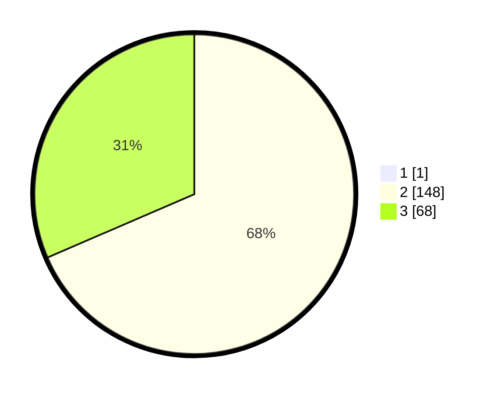

# Hasil

## Grafik

## Tabel

| No. | Nama Paslon    | Suara | Suara (raw) | Persentase |
|:--- |:-------------- | -----:| -----------:| ----------:|
| 1   | ANIES MUHAIMIN | 1     | [1][p-1]    | 0,46       |
| 2   | PRABOWO GIBRAN | 148   | [148][p-2]  | 68,20      |
| 3   | GANJAR MAHFUD  | 68    | [68][p-3]   | 31,34      |

[p-1]: https://github.com/gigit-pemilu/pemilu-2024/blob/main/pilpres/hitung-suara/sub/51-bali/sub/06-bangli/sub/04-kintamani/sub/2029-kintamani/sub/005-tps/sub/paslon-1.txt
[p-2]: https://github.com/gigit-pemilu/pemilu-2024/blob/main/pilpres/hitung-suara/sub/51-bali/sub/06-bangli/sub/04-kintamani/sub/2029-kintamani/sub/005-tps/sub/paslon-2.txt
[p-3]: https://github.com/gigit-pemilu/pemilu-2024/blob/main/pilpres/hitung-suara/sub/51-bali/sub/06-bangli/sub/04-kintamani/sub/2029-kintamani/sub/005-tps/sub/paslon-3.txt

## Foto C Plano

https://sirekap-obj-formc.kpu.go.id/436b/pemilu/ppwp/51/06/04/20/29/5106042029005-20240214-203041--4b4a8bf5-16c8-46ca-a55c-42a71660af7d.jpg

https://sirekap-obj-formc.kpu.go.id/436b/pemilu/ppwp/51/06/04/20/29/5106042029005-20240214-203111--b1f242de-ab85-4a5e-8838-18f6f7109fef.jpg

https://sirekap-obj-formc.kpu.go.id/436b/pemilu/ppwp/51/06/04/20/29/5106042029005-20240214-203130--34e58ebb-0415-4eb5-9f64-907abf40993c.jpg

## Metadata

| Key        | Value               |
| ---------- | ------------------- |
| Time Stamp | 2024-02-15 09:00:24 |

