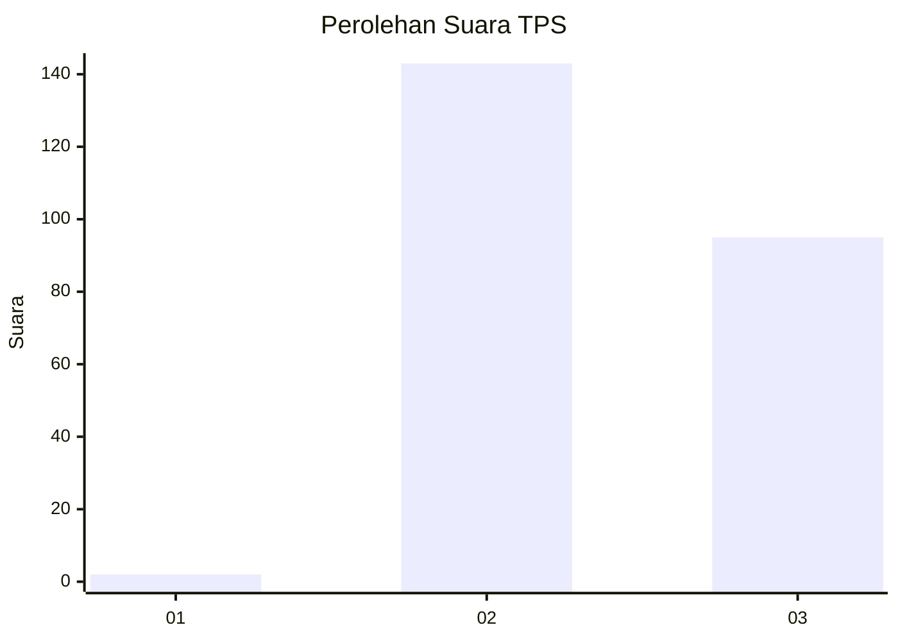
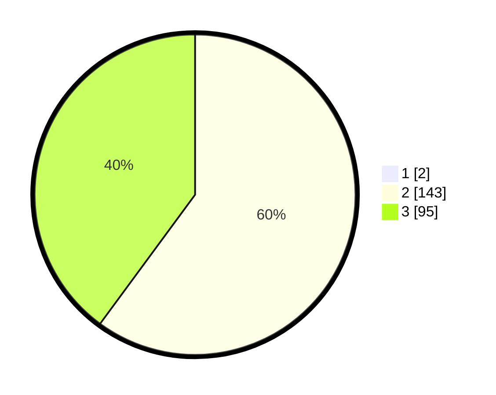

# Hasil

## Grafik

## Tabel

| No. | Nama Paslon    | Suara | Suara (raw) | Persentase |
|:--- |:-------------- | -----:| -----------:| ----------:|
| 1   | ANIES MUHAIMIN | 2     | [2][p-1]    | 0,83       |
| 2   | PRABOWO GIBRAN | 143   | [143][p-2]  | 59,58      |
| 3   | GANJAR MAHFUD  | 95    | [95][p-3]   | 39,58      |

[p-1]: https://github.com/gigit-pemilu/pemilu-2024-51-bali/blob/main/pilpres/hitung-suara/sub/51-bali/sub/06-bangli/sub/04-kintamani/sub/2029-kintamani/sub/014-tps/sub/paslon-1.txt
[p-2]: https://github.com/gigit-pemilu/pemilu-2024-51-bali/blob/main/pilpres/hitung-suara/sub/51-bali/sub/06-bangli/sub/04-kintamani/sub/2029-kintamani/sub/014-tps/sub/paslon-2.txt
[p-3]: https://github.com/gigit-pemilu/pemilu-2024-51-bali/blob/main/pilpres/hitung-suara/sub/51-bali/sub/06-bangli/sub/04-kintamani/sub/2029-kintamani/sub/014-tps/sub/paslon-3.txt

## Foto C Plano

https://sirekap-obj-formc.kpu.go.id/6bce/pemilu/ppwp/51/06/04/20/29/5106042029014-20240215-064436--a6b94139-99cc-4788-8233-3d17b7232f0c.jpg

https://sirekap-obj-formc.kpu.go.id/6bce/pemilu/ppwp/51/06/04/20/29/5106042029014-20240215-064456--62f04c4b-e896-4825-a39b-8d43fae6d238.jpg

https://sirekap-obj-formc.kpu.go.id/6bce/pemilu/ppwp/51/06/04/20/29/5106042029014-20240214-230903--2eec80e3-19f4-40b7-8616-9c285144ea89.jpg

## Metadata

| Key        | Value               |
| ---------- | ------------------- |
| Time Stamp | 2024-02-16 21:01:00 |

