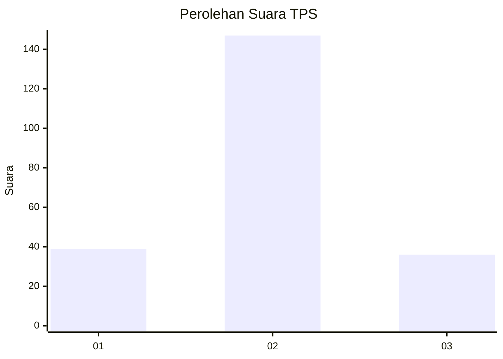
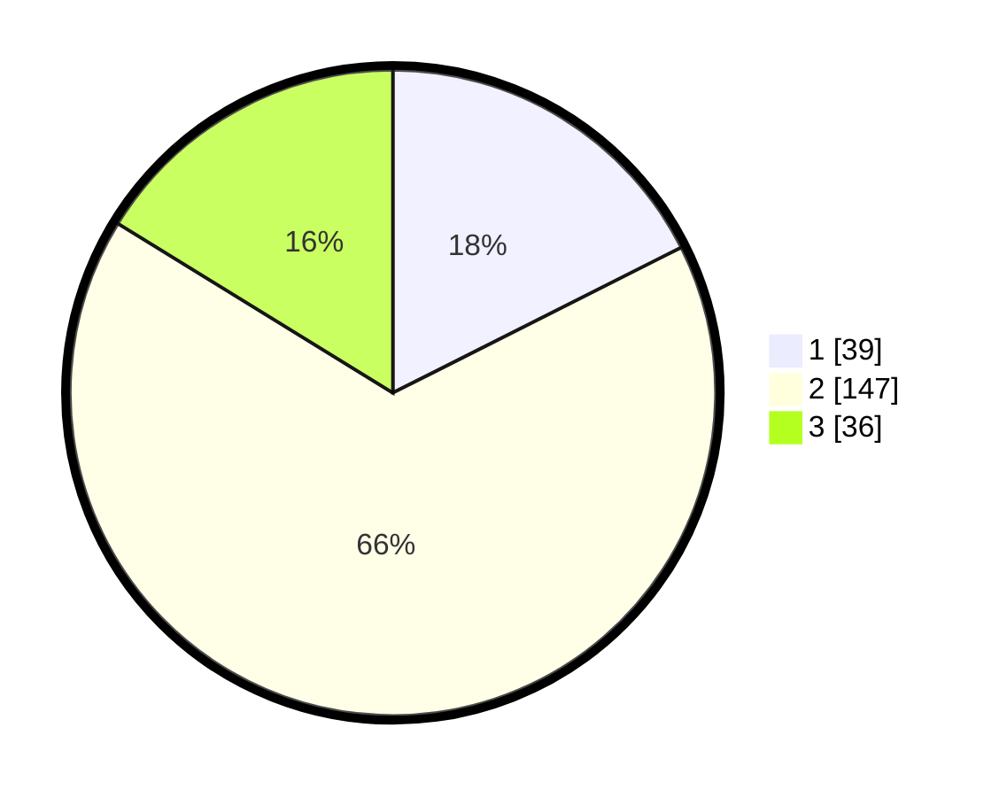

# Hasil

## Grafik

## Tabel

| No. | Nama Paslon    | Suara | Suara (raw) | Persentase |
|:--- |:-------------- | -----:| -----------:| ----------:|
| 1   | ANIES MUHAIMIN | 39    | [39][p-1]   | 17,57      |
| 2   | PRABOWO GIBRAN | 147   | [147][p-2]  | 66,22      |
| 3   | GANJAR MAHFUD  | 36    | [36][p-3]   | 16,22      |

[p-1]: https://github.com/gigit-pemilu/pemilu-2024-51-bali/blob/main/pilpres/hitung-suara/sub/51-bali/sub/06-bangli/sub/04-kintamani/sub/2029-kintamani/sub/017-tps/sub/paslon-1.txt
[p-2]: https://github.com/gigit-pemilu/pemilu-2024-51-bali/blob/main/pilpres/hitung-suara/sub/51-bali/sub/06-bangli/sub/04-kintamani/sub/2029-kintamani/sub/017-tps/sub/paslon-2.txt
[p-3]: https://github.com/gigit-pemilu/pemilu-2024-51-bali/blob/main/pilpres/hitung-suara/sub/51-bali/sub/06-bangli/sub/04-kintamani/sub/2029-kintamani/sub/017-tps/sub/paslon-3.txt

## Foto C Plano

https://sirekap-obj-formc.kpu.go.id/dca3/pemilu/ppwp/51/06/04/20/29/5106042029017-20240214-235055--4e7c784e-fc97-4110-b340-43240d6235c5.jpg

https://sirekap-obj-formc.kpu.go.id/dca3/pemilu/ppwp/51/06/04/20/29/5106042029017-20240214-234720--fc2d5a7a-5ddf-4762-90b7-7e10ef3410eb.jpg

https://sirekap-obj-formc.kpu.go.id/dca3/pemilu/ppwp/51/06/04/20/29/5106042029017-20240214-234742--ff3798ec-93eb-48b2-8b56-9281b10814d1.jpg

## Metadata

| Key        | Value               |
| ---------- | ------------------- |
| Time Stamp | 2024-02-24 22:31:28 |

