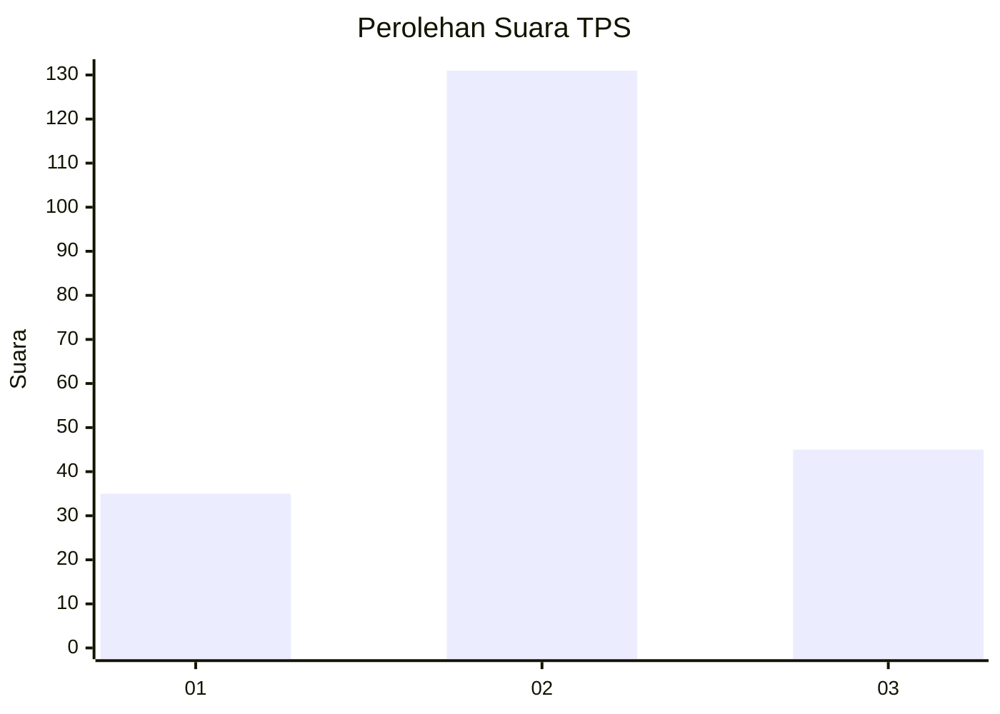
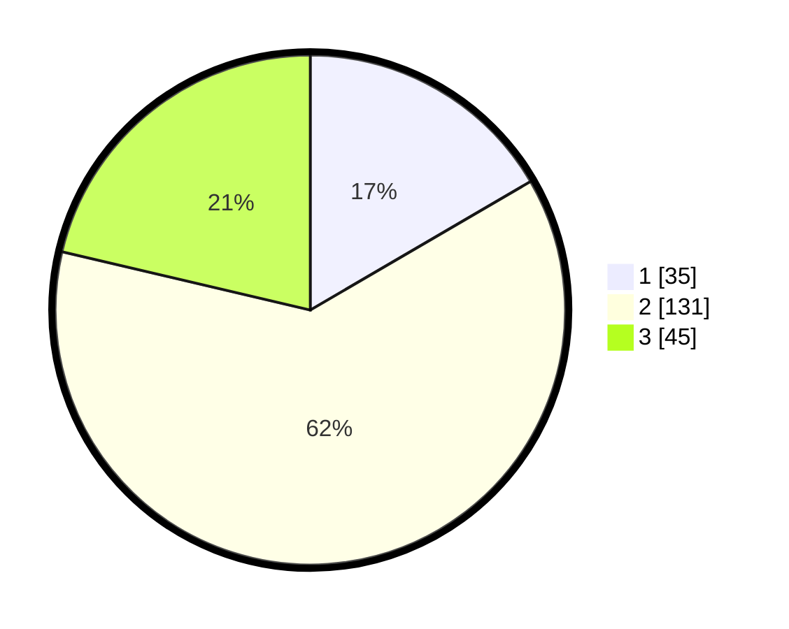

# Hasil

## Grafik

## Tabel

| No. | Nama Paslon    | Suara | Suara (raw) | Persentase |
|:--- |:-------------- | -----:| -----------:| ----------:|
| 1   | ANIES MUHAIMIN | 35    | [35][p-1]   | 16,59      |
| 2   | PRABOWO GIBRAN | 131   | [131][p-2]  | 62,09      |
| 3   | GANJAR MAHFUD  | 45    | [45][p-3]   | 21,33      |

[p-1]: https://github.com/gigit-pemilu/pemilu-2024-51-bali/blob/main/pilpres/hitung-suara/sub/51-bali/sub/06-bangli/sub/04-kintamani/sub/2029-kintamani/sub/018-tps/sub/paslon-1.txt
[p-2]: https://github.com/gigit-pemilu/pemilu-2024-51-bali/blob/main/pilpres/hitung-suara/sub/51-bali/sub/06-bangli/sub/04-kintamani/sub/2029-kintamani/sub/018-tps/sub/paslon-2.txt
[p-3]: https://github.com/gigit-pemilu/pemilu-2024-51-bali/blob/main/pilpres/hitung-suara/sub/51-bali/sub/06-bangli/sub/04-kintamani/sub/2029-kintamani/sub/018-tps/sub/paslon-3.txt

## Foto C Plano

https://sirekap-obj-formc.kpu.go.id/4930/pemilu/ppwp/51/06/04/20/29/5106042029018-20240214-204027--56a7a0f7-b5f7-4200-8ea5-947594cf5dba.jpg

https://sirekap-obj-formc.kpu.go.id/4930/pemilu/ppwp/51/06/04/20/29/5106042029018-20240214-204119--caa07911-96a1-4d98-bf5f-4ef0096f6645.jpg

https://sirekap-obj-formc.kpu.go.id/4930/pemilu/ppwp/51/06/04/20/29/5106042029018-20240214-205825--aa74ca3e-6f8e-4a3d-b951-1323c1bb629f.jpg

## Metadata

| Key        | Value               |
| ---------- | ------------------- |
| Time Stamp | 2024-02-15 05:00:24 |

## DATA PEMILIH TETAP

Jumlah pemilih dalam DPT: **268**.
 * L: **141**.
 * P: **127**.

## DATA PENGGUNA HAK PILIH

Jumlah pengguna hak pilih dalam DPT: **213**.
 * L: **112**.
 * P: **191**.

Jumlah pengguna hak pilih dalam DPTb: **0**.
 * L: **0**.
 * P: **0**.

Jumlah pengguna hak pilih dalam DPK: **1**.
 * L: **0**.
 * P: **1**.

Jumlah pengguna hak pilih: **214**.
 * L: **112**.
 * P: **102**.

## JUMLAH SUARA SAH DAN TIDAK SAH

JUMLAH SELURUH SUARA SAH: **211**.

JUMLAH SUARA TIDAK SAH: **3**.

JUMLAH SELURUH SUARA SAH DAN SUARA TIDAK SAH: **214**.

