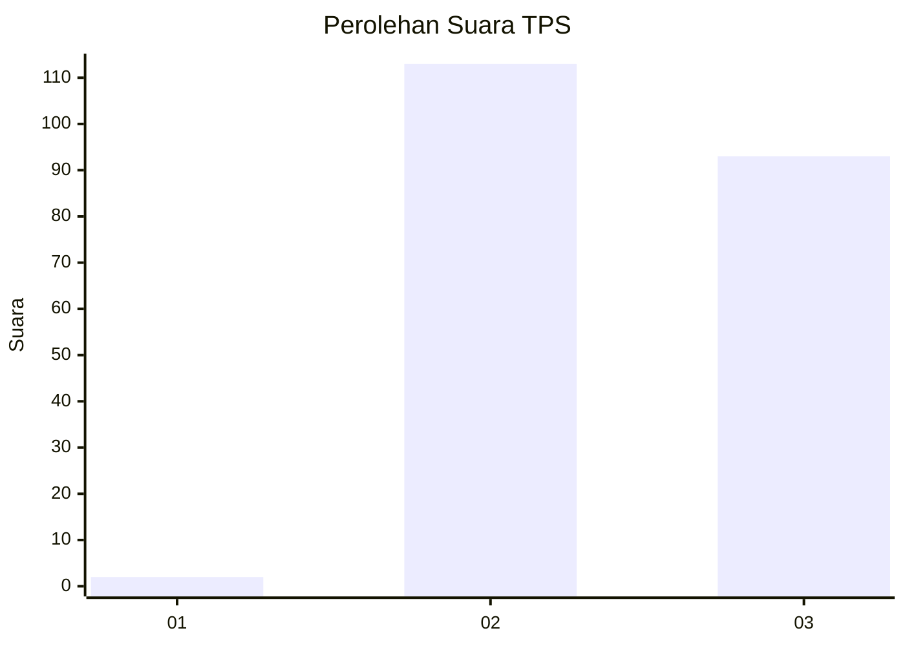
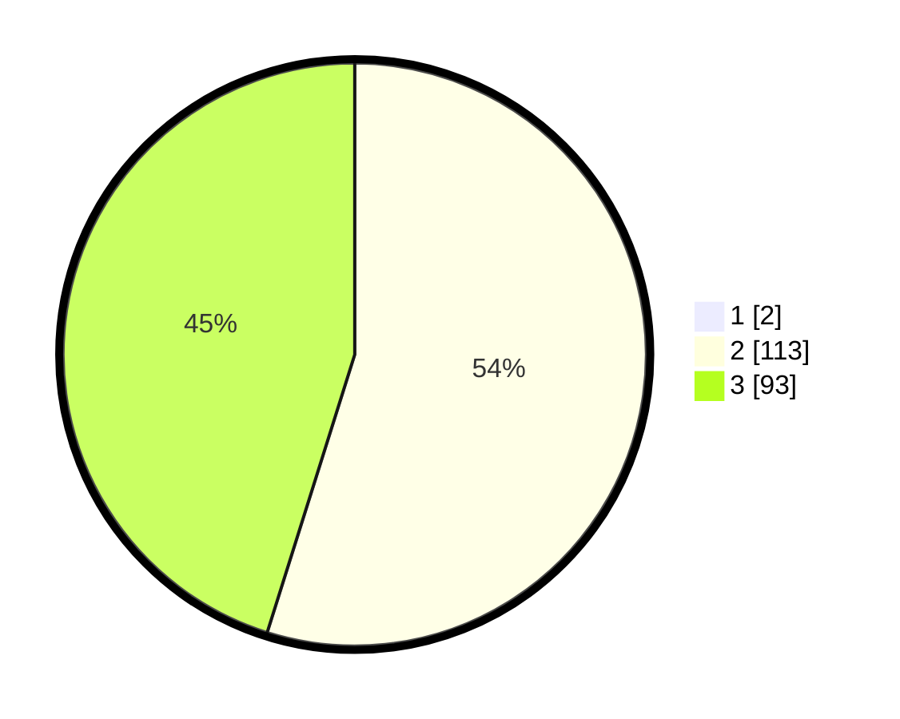

# Hasil

## Grafik

## Tabel

| No. | Nama Paslon    | Suara | Suara (raw) | Persentase |
|:--- |:-------------- | -----:| -----------:| ----------:|
| 1   | ANIES MUHAIMIN | 2     | [2][p-1]    | 0,96       |
| 2   | PRABOWO GIBRAN | 113   | [113][p-2]  | 54,33      |
| 3   | GANJAR MAHFUD  | 93    | [93][p-3]   | 44,71      |

[p-1]: https://github.com/gigit-pemilu/pemilu-2024-51-bali/blob/main/pilpres/hitung-suara/sub/51-bali/sub/06-bangli/sub/04-kintamani/sub/2029-kintamani/sub/019-tps/sub/paslon-1.txt
[p-2]: https://github.com/gigit-pemilu/pemilu-2024-51-bali/blob/main/pilpres/hitung-suara/sub/51-bali/sub/06-bangli/sub/04-kintamani/sub/2029-kintamani/sub/019-tps/sub/paslon-2.txt
[p-3]: https://github.com/gigit-pemilu/pemilu-2024-51-bali/blob/main/pilpres/hitung-suara/sub/51-bali/sub/06-bangli/sub/04-kintamani/sub/2029-kintamani/sub/019-tps/sub/paslon-3.txt

## Foto C Plano

https://sirekap-obj-formc.kpu.go.id/28ad/pemilu/ppwp/51/06/04/20/29/5106042029019-20240214-132322--b2f4fc64-0ce0-4519-be76-119efa7442a9.jpg

https://sirekap-obj-formc.kpu.go.id/28ad/pemilu/ppwp/51/06/04/20/29/5106042029019-20240214-132351--d29adfb5-4ead-4b59-86f9-115afe1ecfa4.jpg

https://sirekap-obj-formc.kpu.go.id/28ad/pemilu/ppwp/51/06/04/20/29/5106042029019-20240214-132507--f821aa21-f9b9-4e52-8602-6ca7a012e959.jpg

## Metadata

| Key        | Value               |
| ---------- | ------------------- |
| Time Stamp | 2024-02-14 21:46:01 |

## DATA PEMILIH TETAP

Jumlah pemilih dalam DPT: **240**.
 * L: **121**.
 * P: **119**.

## DATA PENGGUNA HAK PILIH

Jumlah pengguna hak pilih dalam DPT: **211**.
 * L: **112**.
 * P: **99**.

Jumlah pengguna hak pilih dalam DPTb: **1**.
 * L: **0**.
 * P: **1**.

Jumlah pengguna hak pilih dalam DPK: **7**.
 * L: **1**.
 * P: **6**.

Jumlah pengguna hak pilih: **219**.
 * L: **113**.
 * P: **106**.

## JUMLAH SUARA SAH DAN TIDAK SAH

JUMLAH SELURUH SUARA SAH: **208**.

JUMLAH SUARA TIDAK SAH: **11**.

JUMLAH SELURUH SUARA SAH DAN SUARA TIDAK SAH: **219**.

