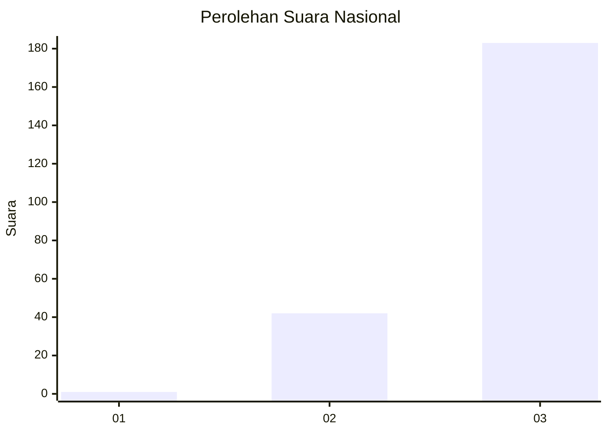
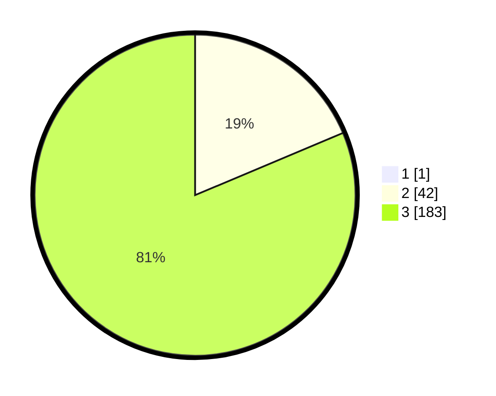

# Hasil

## Grafik

## Tabel

| No. | Nama Paslon    | Suara | Suara (raw) | Persentase |
|:--- |:-------------- | -----:| -----------:| ----------:|
| 1   | ANIES MUHAIMIN | 1     | [1][p-1]    | 0,44       |
| 2   | PRABOWO GIBRAN | 42    | [42][p-2]   | 18,58      |
| 3   | GANJAR MAHFUD  | 183   | [183][p-3]  | 80,97      |

[p-1]: https://github.com/gigit-pemilu/pemilu-2024/blob/main/pilpres/hitung-suara/sub/51-bali/sub/06-bangli/sub/04-kintamani/sub/2030-serai/sub/002-tps/sub/paslon-1.txt
[p-2]: https://github.com/gigit-pemilu/pemilu-2024/blob/main/pilpres/hitung-suara/sub/51-bali/sub/06-bangli/sub/04-kintamani/sub/2030-serai/sub/002-tps/sub/paslon-2.txt
[p-3]: https://github.com/gigit-pemilu/pemilu-2024/blob/main/pilpres/hitung-suara/sub/51-bali/sub/06-bangli/sub/04-kintamani/sub/2030-serai/sub/002-tps/sub/paslon-3.txt

## Foto C Plano

https://sirekap-obj-formc.kpu.go.id/4326/pemilu/ppwp/51/06/04/20/30/5106042030002-20240214-203407--8724781a-639c-45a1-aaf2-097528308e05.jpg

https://sirekap-obj-formc.kpu.go.id/4326/pemilu/ppwp/51/06/04/20/30/5106042030002-20240214-203604--d518ec7c-1f38-46a1-9776-a3643941f572.jpg

https://sirekap-obj-formc.kpu.go.id/4326/pemilu/ppwp/51/06/04/20/30/5106042030002-20240214-203801--293e932e-6b9c-4d8a-aa9b-da4ea1a2fc27.jpg

## Metadata

| Key        | Value               |
| ---------- | ------------------- |
| Time Stamp | 2024-02-24 22:31:28 |

