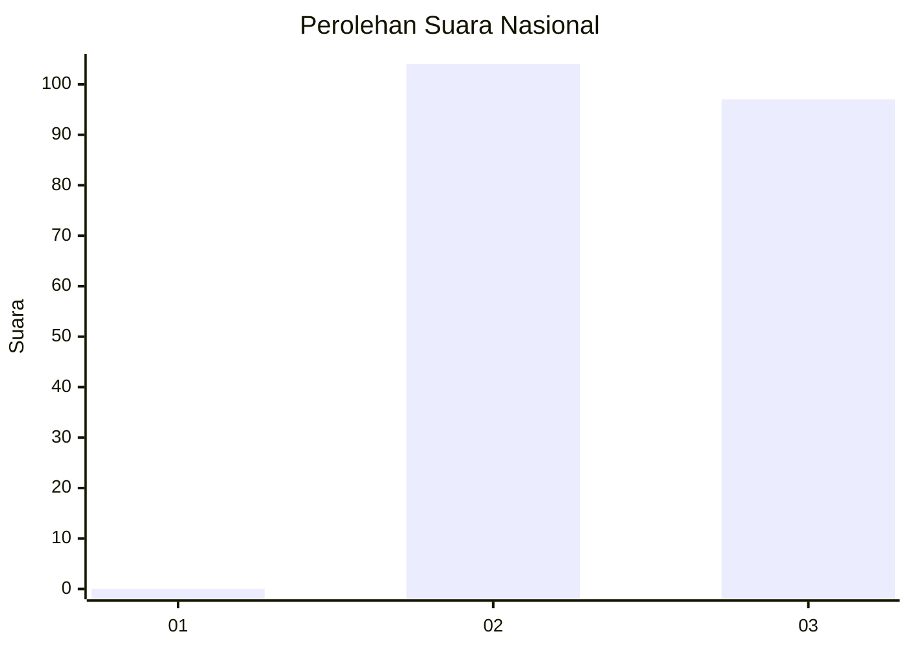
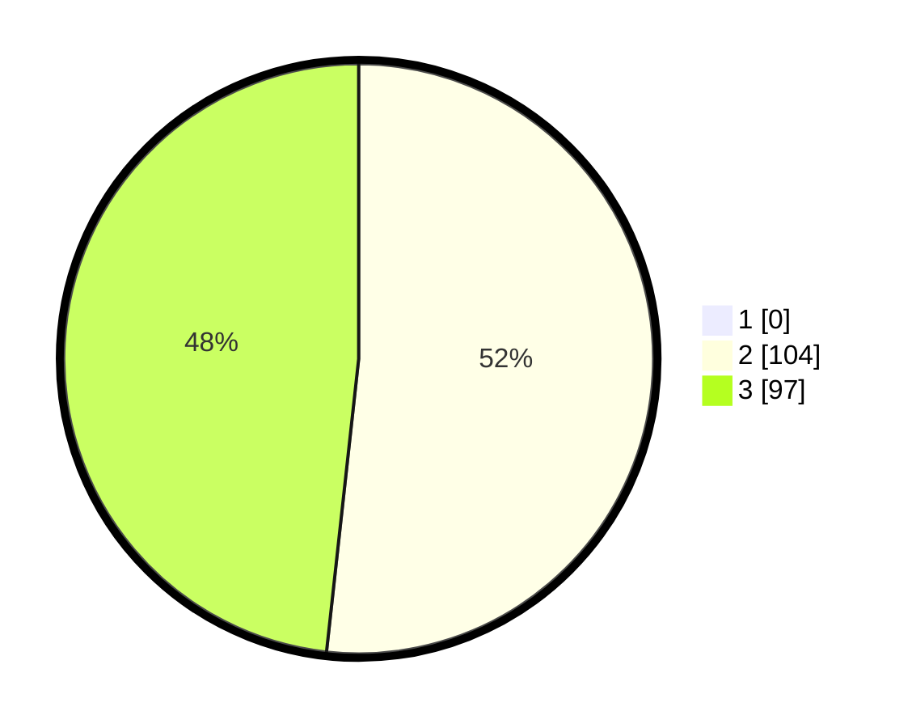

# Hasil

## Grafik

## Tabel

| No. | Nama Paslon    | Suara | Suara (raw) | Persentase |
|:--- |:-------------- | -----:| -----------:| ----------:|
| 1   | ANIES MUHAIMIN | 0     | [0][p-1]    | 0,00       |
| 2   | PRABOWO GIBRAN | 104   | [104][p-2]  | 51,74      |
| 3   | GANJAR MAHFUD  | 97    | [97][p-3]   | 48,26      |

[p-1]: https://github.com/gigit-pemilu/pemilu-2024/blob/main/pilpres/hitung-suara/sub/51-bali/sub/06-bangli/sub/04-kintamani/sub/2035-batukaang/sub/002-tps/sub/paslon-1.txt
[p-2]: https://github.com/gigit-pemilu/pemilu-2024/blob/main/pilpres/hitung-suara/sub/51-bali/sub/06-bangli/sub/04-kintamani/sub/2035-batukaang/sub/002-tps/sub/paslon-2.txt
[p-3]: https://github.com/gigit-pemilu/pemilu-2024/blob/main/pilpres/hitung-suara/sub/51-bali/sub/06-bangli/sub/04-kintamani/sub/2035-batukaang/sub/002-tps/sub/paslon-3.txt

## Foto C Plano

https://sirekap-obj-formc.kpu.go.id/5ef9/pemilu/ppwp/51/06/04/20/35/5106042035002-20240214-194249--be606d9b-6144-47b4-8305-875b5d25b7cb.jpg

https://sirekap-obj-formc.kpu.go.id/5ef9/pemilu/ppwp/51/06/04/20/35/5106042035002-20240214-194317--e2ac0f1d-9a39-44d1-a6ec-897f8af2413f.jpg

https://sirekap-obj-formc.kpu.go.id/5ef9/pemilu/ppwp/51/06/04/20/35/5106042035002-20240214-194329--1c07ff45-cc90-4e77-ab80-cfa045ea2421.jpg

## Metadata

| Key        | Value               |
| ---------- | ------------------- |
| Time Stamp | 2024-02-19 21:00:00 |

## DATA PEMILIH TETAP

Jumlah pemilih dalam DPT: **240**.
 * L: **126**.
 * P: **114**.

## DATA PENGGUNA HAK PILIH

Jumlah pengguna hak pilih dalam DPT: **202**.
 * L: **104**.
 * P: **98**.

Jumlah pengguna hak pilih dalam DPTb: **0**.
 * L: **0**.
 * P: **0**.

Jumlah pengguna hak pilih dalam DPK: **0**.
 * L: **0**.
 * P: **0**.

Jumlah pengguna hak pilih: **202**.
 * L: **104**.
 * P: **98**.

## JUMLAH SUARA SAH DAN TIDAK SAH

JUMLAH SELURUH SUARA SAH: **201**.

JUMLAH SUARA TIDAK SAH: **1**.

JUMLAH SELURUH SUARA SAH DAN SUARA TIDAK SAH: **202**.

