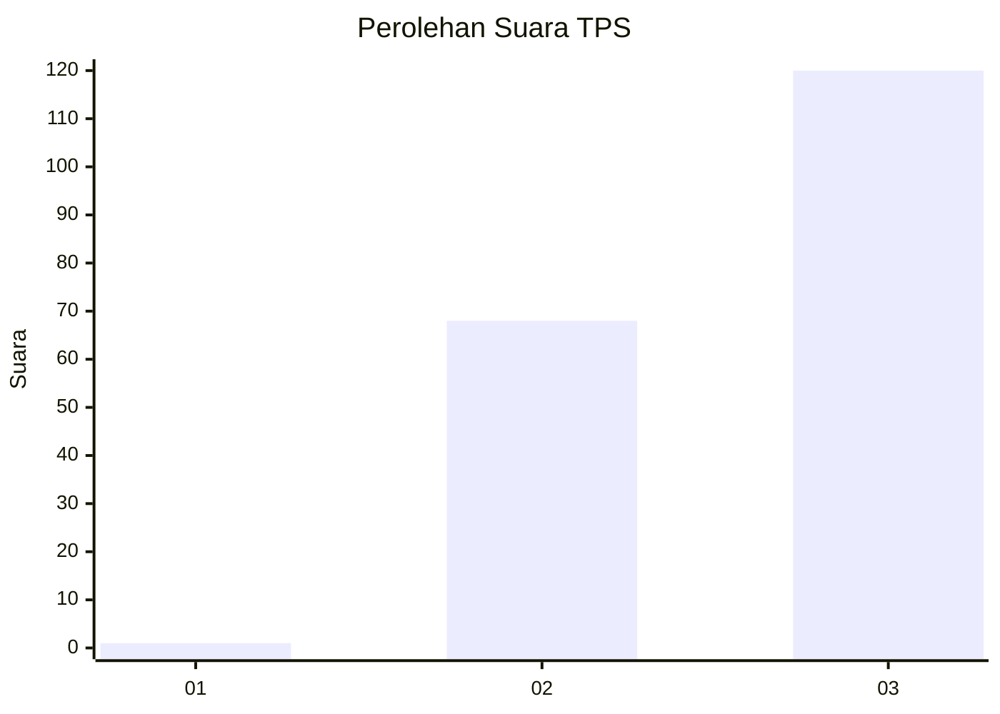
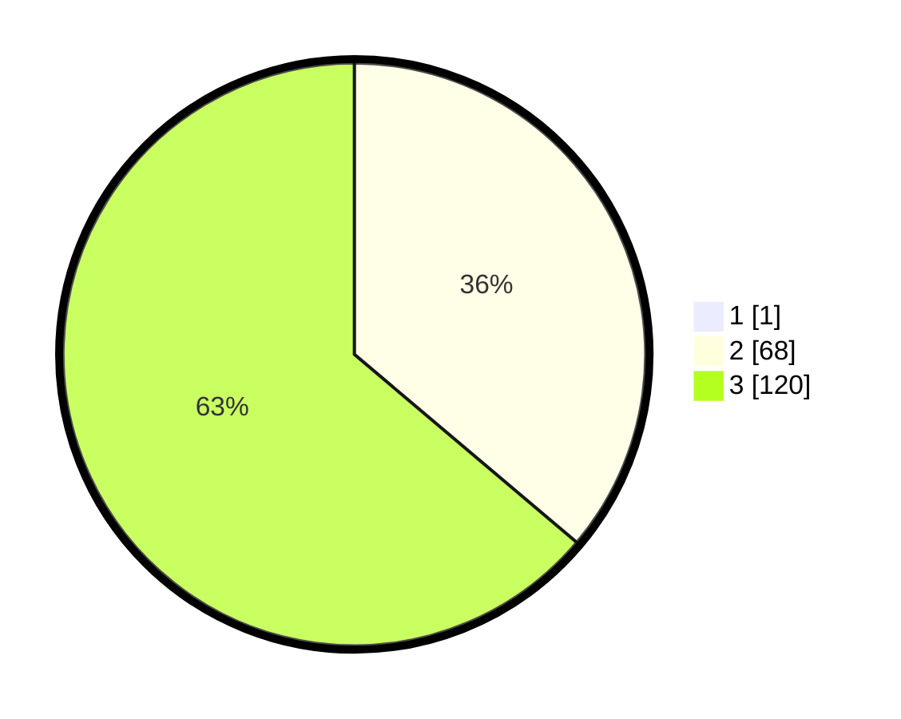

# Hasil

## Grafik

## Tabel

| No. | Nama Paslon    | Suara | Suara (raw) | Persentase |
|:--- |:-------------- | -----:| -----------:| ----------:|
| 1   | ANIES MUHAIMIN | 1     | [1][p-1]    | 0,53       |
| 2   | PRABOWO GIBRAN | 68    | [68][p-2]   | 35,98      |
| 3   | GANJAR MAHFUD  | 120   | [120][p-3]  | 63,49      |

[p-1]: https://github.com/gigit-pemilu/pemilu-2024-51-bali/blob/main/pilpres/hitung-suara/sub/51-bali/sub/06-bangli/sub/04-kintamani/sub/2037-catur/sub/001-tps/sub/paslon-1.txt
[p-2]: https://github.com/gigit-pemilu/pemilu-2024-51-bali/blob/main/pilpres/hitung-suara/sub/51-bali/sub/06-bangli/sub/04-kintamani/sub/2037-catur/sub/001-tps/sub/paslon-2.txt
[p-3]: https://github.com/gigit-pemilu/pemilu-2024-51-bali/blob/main/pilpres/hitung-suara/sub/51-bali/sub/06-bangli/sub/04-kintamani/sub/2037-catur/sub/001-tps/sub/paslon-3.txt

## Foto C Plano

https://sirekap-obj-formc.kpu.go.id/9f9a/pemilu/ppwp/51/06/04/20/37/5106042037001-20240318-113407--b59b381a-dfe8-4ebe-b24b-d1280dcf6431.jpg

https://sirekap-obj-formc.kpu.go.id/9f9a/pemilu/ppwp/51/06/04/20/37/5106042037001-20240214-202205--e2f891c7-4a31-4663-91c4-5a18a0bdc069.jpg

https://sirekap-obj-formc.kpu.go.id/9f9a/pemilu/ppwp/51/06/04/20/37/5106042037001-20240318-113431--067c6f92-bc1b-4d14-a5f5-780196d5189f.jpg

## Metadata

| Key        | Value               |
| ---------- | ------------------- |
| Time Stamp | 2024-03-18 12:00:00 |

