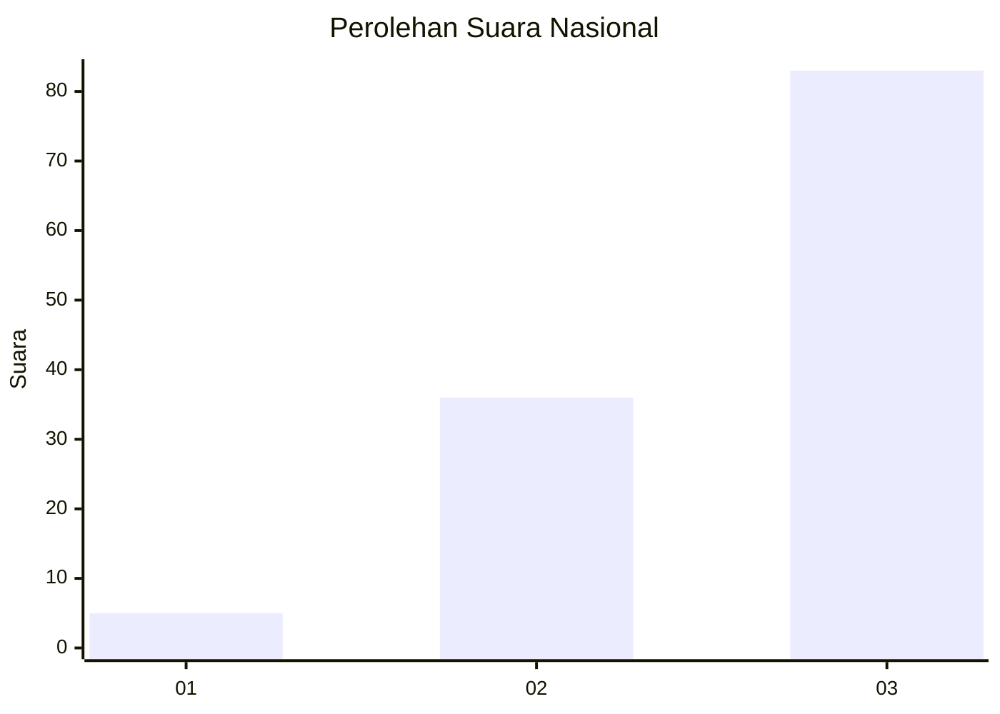
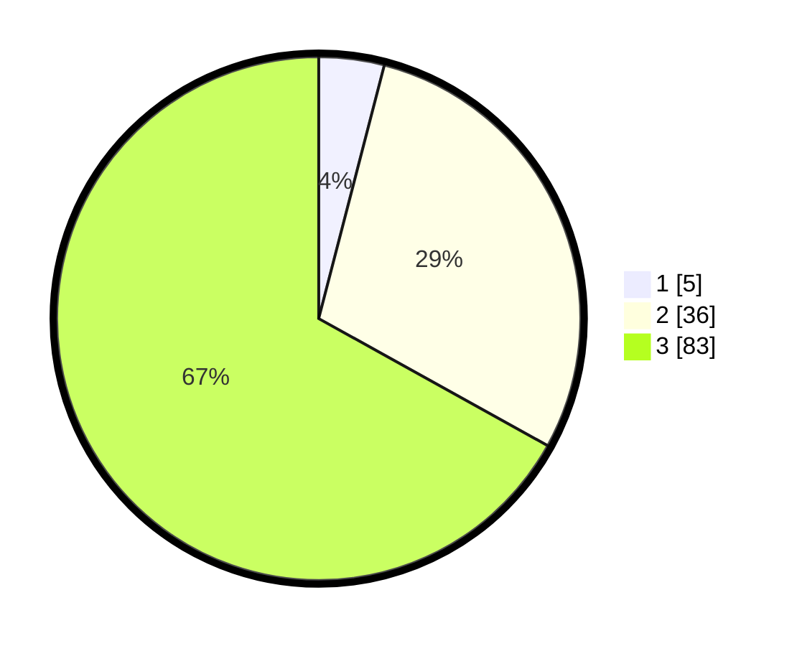

# Hasil

## Grafik

## Tabel

| No. | Nama Paslon    | Suara | Suara (raw) | Persentase |
|:--- |:-------------- | -----:| -----------:| ----------:|
| 1   | ANIES MUHAIMIN | 5     | [5][p-1]    | 4,03       |
| 2   | PRABOWO GIBRAN | 36    | [36][p-2]   | 29,03      |
| 3   | GANJAR MAHFUD  | 83    | [83][p-3]   | 66,94      |

[p-1]: https://github.com/gigit-pemilu/pemilu-2024/blob/main/pilpres/hitung-suara/sub/51-bali/sub/06-bangli/sub/04-kintamani/sub/2038-pengejaran/sub/002-tps/sub/paslon-1.txt
[p-2]: https://github.com/gigit-pemilu/pemilu-2024/blob/main/pilpres/hitung-suara/sub/51-bali/sub/06-bangli/sub/04-kintamani/sub/2038-pengejaran/sub/002-tps/sub/paslon-2.txt
[p-3]: https://github.com/gigit-pemilu/pemilu-2024/blob/main/pilpres/hitung-suara/sub/51-bali/sub/06-bangli/sub/04-kintamani/sub/2038-pengejaran/sub/002-tps/sub/paslon-3.txt

## Foto C Plano

https://sirekap-obj-formc.kpu.go.id/33ad/pemilu/ppwp/51/06/04/20/38/5106042038002-20240214-232337--390371e7-4bfa-4472-bf0d-566466415b55.jpg

https://sirekap-obj-formc.kpu.go.id/33ad/pemilu/ppwp/51/06/04/20/38/5106042038002-20240214-232553--51aaeadf-ac9a-4f2d-875f-1254adae642f.jpg

https://sirekap-obj-formc.kpu.go.id/33ad/pemilu/ppwp/51/06/04/20/38/5106042038002-20240214-232842--f4bf1fb3-c3e9-4a05-ad6f-e25494e226b9.jpg

## Metadata

| Key        | Value               |
| ---------- | ------------------- |
| Time Stamp | 2024-02-24 22:31:28 |

