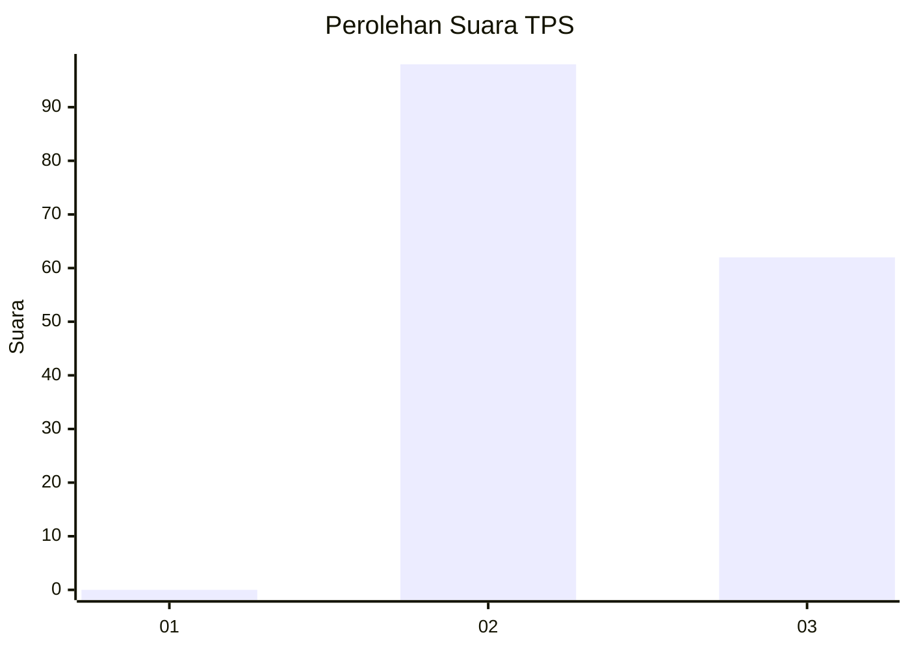
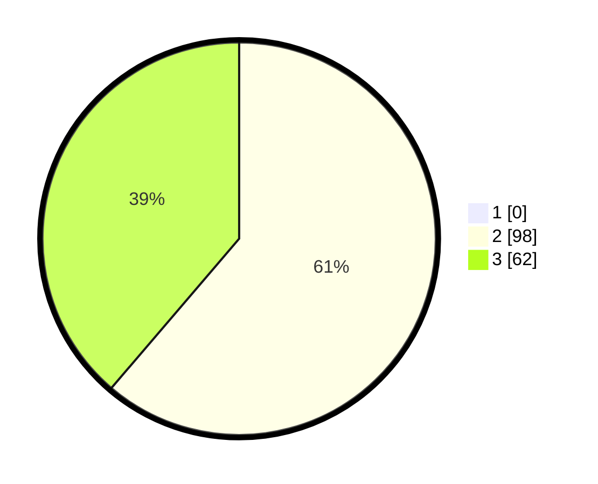

# Hasil

## Grafik

## Tabel

| No. | Nama Paslon    | Suara | Suara (raw) | Persentase |
|:--- |:-------------- | -----:| -----------:| ----------:|
| 1   | ANIES MUHAIMIN | 0     | [0][p-1]    | 0,00       |
| 2   | PRABOWO GIBRAN | 98    | [98][p-2]   | 61,25      |
| 3   | GANJAR MAHFUD  | 62    | [62][p-3]   | 38,75      |

[p-1]: https://github.com/gigit-pemilu/pemilu-2024-51-bali/blob/main/pilpres/hitung-suara/sub/51-bali/sub/06-bangli/sub/04-kintamani/sub/2039-selulung/sub/001-tps/sub/paslon-1.txt
[p-2]: https://github.com/gigit-pemilu/pemilu-2024-51-bali/blob/main/pilpres/hitung-suara/sub/51-bali/sub/06-bangli/sub/04-kintamani/sub/2039-selulung/sub/001-tps/sub/paslon-2.txt
[p-3]: https://github.com/gigit-pemilu/pemilu-2024-51-bali/blob/main/pilpres/hitung-suara/sub/51-bali/sub/06-bangli/sub/04-kintamani/sub/2039-selulung/sub/001-tps/sub/paslon-3.txt

## Foto C Plano

https://sirekap-obj-formc.kpu.go.id/5d1d/pemilu/ppwp/51/06/04/20/39/5106042039001-20240214-200647--c733e6bf-b9bd-4d1a-be14-caa5e4282a52.jpg

https://sirekap-obj-formc.kpu.go.id/5d1d/pemilu/ppwp/51/06/04/20/39/5106042039001-20240214-201222--229e3193-ca1e-4db0-a1a1-474f7830e086.jpg

https://sirekap-obj-formc.kpu.go.id/5d1d/pemilu/ppwp/51/06/04/20/39/5106042039001-20240214-201411--3a9e4621-7ccc-4353-9779-436ee2733a7e.jpg

## Metadata

| Key        | Value               |
| ---------- | ------------------- |
| Time Stamp | 2024-02-24 22:31:28 |

