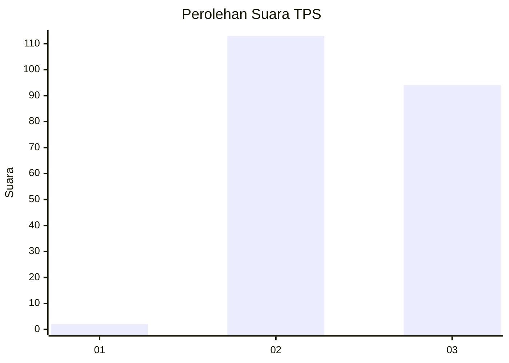
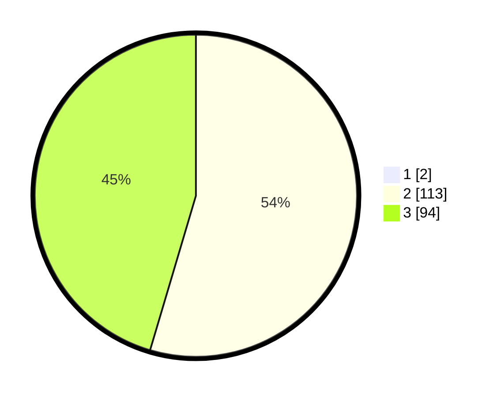

# Hasil

## Grafik

## Tabel

| No. | Nama Paslon    | Suara | Suara (raw) | Persentase |
|:--- |:-------------- | -----:| -----------:| ----------:|
| 1   | ANIES MUHAIMIN | 2     | [2][p-1]    | 0,96       |
| 2   | PRABOWO GIBRAN | 113   | [113][p-2]  | 54,07      |
| 3   | GANJAR MAHFUD  | 94    | [94][p-3]   | 44,98      |

[p-1]: https://github.com/gigit-pemilu/pemilu-2024-51-bali/blob/main/pilpres/hitung-suara/sub/51-bali/sub/06-bangli/sub/04-kintamani/sub/2039-selulung/sub/002-tps/sub/paslon-1.txt
[p-2]: https://github.com/gigit-pemilu/pemilu-2024-51-bali/blob/main/pilpres/hitung-suara/sub/51-bali/sub/06-bangli/sub/04-kintamani/sub/2039-selulung/sub/002-tps/sub/paslon-2.txt
[p-3]: https://github.com/gigit-pemilu/pemilu-2024-51-bali/blob/main/pilpres/hitung-suara/sub/51-bali/sub/06-bangli/sub/04-kintamani/sub/2039-selulung/sub/002-tps/sub/paslon-3.txt

## Foto C Plano

https://sirekap-obj-formc.kpu.go.id/1d1a/pemilu/ppwp/51/06/04/20/39/5106042039002-20240214-204145--557d146b-3766-44d0-a7d3-de3df46dd985.jpg

https://sirekap-obj-formc.kpu.go.id/1d1a/pemilu/ppwp/51/06/04/20/39/5106042039002-20240214-204314--f3d1e028-0168-47e3-ae7e-fa958ff4fb3e.jpg

https://sirekap-obj-formc.kpu.go.id/1d1a/pemilu/ppwp/51/06/04/20/39/5106042039002-20240214-204506--41f005a4-2738-43f9-ab44-1869e5013135.jpg

## Metadata

| Key        | Value               |
| ---------- | ------------------- |
| Time Stamp | 2024-02-24 22:31:28 |

