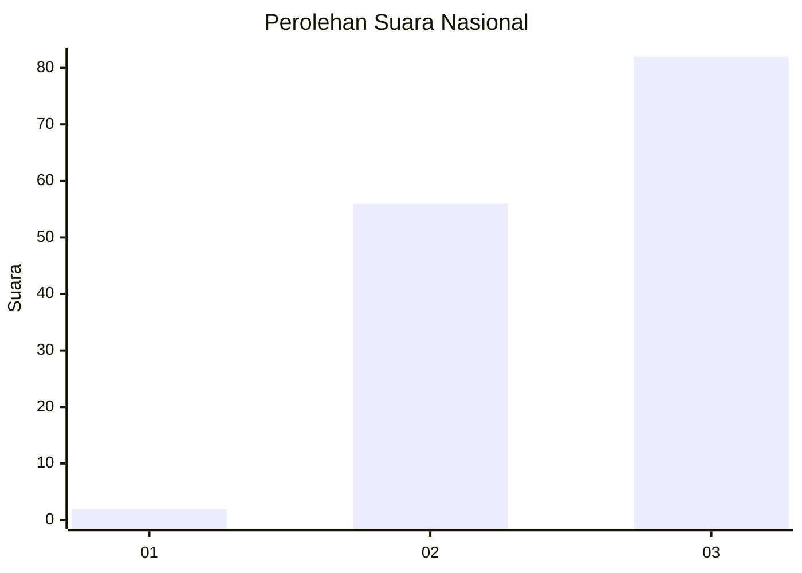
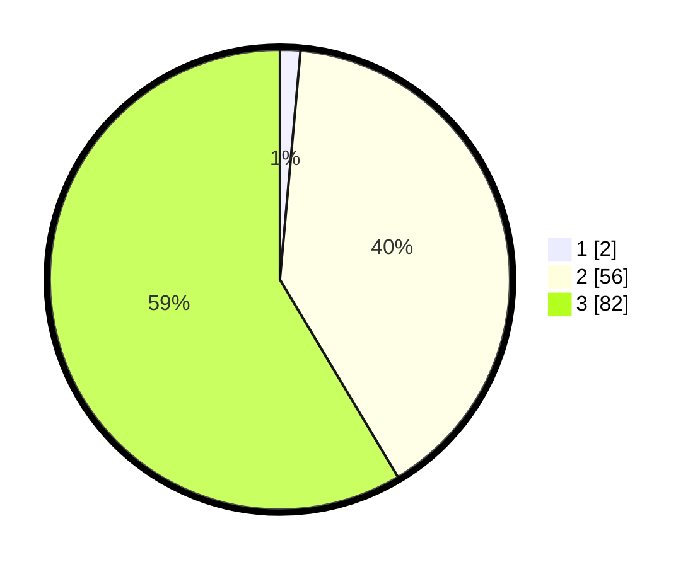

# Hasil

## Grafik

## Tabel

| No. | Nama Paslon    | Suara | Suara (raw) | Persentase |
|:--- |:-------------- | -----:| -----------:| ----------:|
| 1   | ANIES MUHAIMIN | 2     | [2][p-1]    | 1,43       |
| 2   | PRABOWO GIBRAN | 56    | [56][p-2]   | 40,00      |
| 3   | GANJAR MAHFUD  | 82    | [82][p-3]   | 58,57      |

[p-1]: https://github.com/gigit-pemilu/pemilu-2024/blob/main/pilpres/hitung-suara/sub/51-bali/sub/06-bangli/sub/04-kintamani/sub/2039-selulung/sub/008-tps/sub/paslon-1.txt
[p-2]: https://github.com/gigit-pemilu/pemilu-2024/blob/main/pilpres/hitung-suara/sub/51-bali/sub/06-bangli/sub/04-kintamani/sub/2039-selulung/sub/008-tps/sub/paslon-2.txt
[p-3]: https://github.com/gigit-pemilu/pemilu-2024/blob/main/pilpres/hitung-suara/sub/51-bali/sub/06-bangli/sub/04-kintamani/sub/2039-selulung/sub/008-tps/sub/paslon-3.txt

## Foto C Plano

https://sirekap-obj-formc.kpu.go.id/4d63/pemilu/ppwp/51/06/04/20/39/5106042039008-20240214-132835--153dfda6-8b84-4f03-a8d3-d36a8a872a44.jpg

https://sirekap-obj-formc.kpu.go.id/4d63/pemilu/ppwp/51/06/04/20/39/5106042039008-20240214-132940--23e69a7a-d6b6-4fb8-a0f0-f9e13bb74e0f.jpg

https://sirekap-obj-formc.kpu.go.id/4d63/pemilu/ppwp/51/06/04/20/39/5106042039008-20240214-141136--e2a07f52-022b-4234-af62-24af2cc046ed.jpg

## Metadata

| Key        | Value               |
| ---------- | ------------------- |
| Time Stamp | 2024-02-25 11:00:00 |

## DATA PEMILIH TETAP

Jumlah pemilih dalam DPT: **174**.
 * L: **88**.
 * P: **86**.

## DATA PENGGUNA HAK PILIH

Jumlah pengguna hak pilih dalam DPT: **148**.
 * L: **76**.
 * P: **72**.

Jumlah pengguna hak pilih dalam DPTb: **0**.
 * L: **0**.
 * P: **0**.

Jumlah pengguna hak pilih dalam DPK: **0**.
 * L: **0**.
 * P: **0**.

Jumlah pengguna hak pilih: **148**.
 * L: **76**.
 * P: **72**.

## JUMLAH SUARA SAH DAN TIDAK SAH

JUMLAH SELURUH SUARA SAH: **140**.

JUMLAH SUARA TIDAK SAH: **8**.

JUMLAH SELURUH SUARA SAH DAN SUARA TIDAK SAH: **148**.

