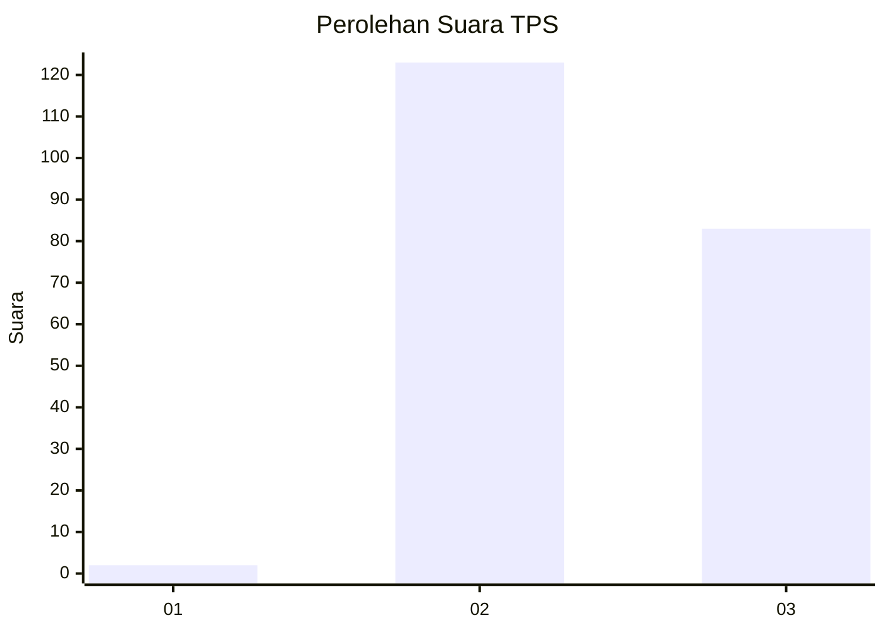
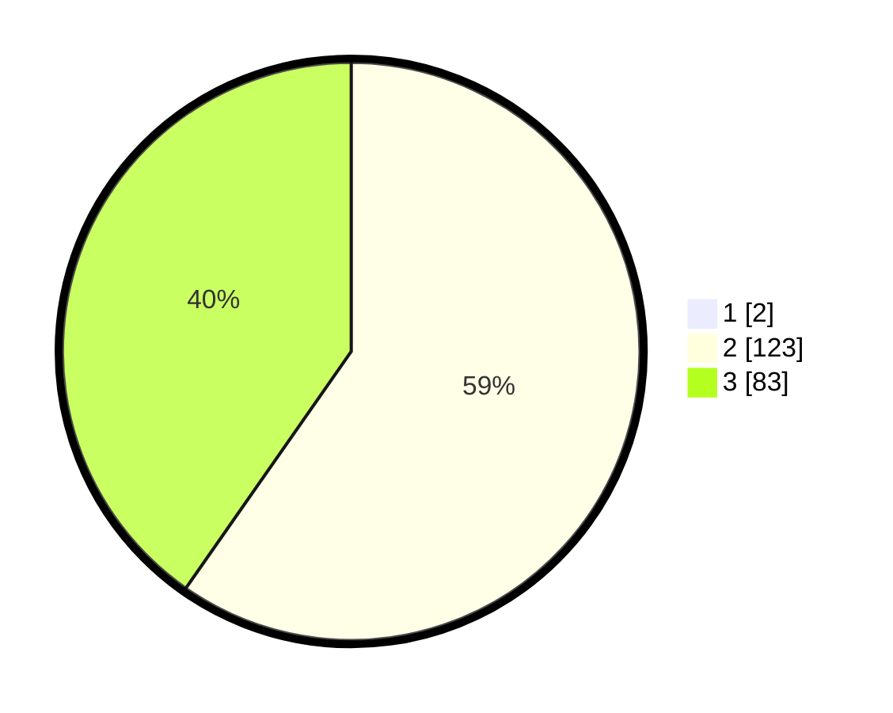

# Hasil

## Grafik

## Tabel

| No. | Nama Paslon    | Suara | Suara (raw) | Persentase |
|:--- |:-------------- | -----:| -----------:| ----------:|
| 1   | ANIES MUHAIMIN | 2     | [2][p-1]    | 0,96       |
| 2   | PRABOWO GIBRAN | 123   | [123][p-2]  | 59,13      |
| 3   | GANJAR MAHFUD  | 83    | [83][p-3]   | 39,90      |

[p-1]: https://github.com/gigit-pemilu/pemilu-2024-51-bali/blob/main/pilpres/hitung-suara/sub/51-bali/sub/06-bangli/sub/04-kintamani/sub/2040-satra/sub/006-tps/sub/paslon-1.txt
[p-2]: https://github.com/gigit-pemilu/pemilu-2024-51-bali/blob/main/pilpres/hitung-suara/sub/51-bali/sub/06-bangli/sub/04-kintamani/sub/2040-satra/sub/006-tps/sub/paslon-2.txt
[p-3]: https://github.com/gigit-pemilu/pemilu-2024-51-bali/blob/main/pilpres/hitung-suara/sub/51-bali/sub/06-bangli/sub/04-kintamani/sub/2040-satra/sub/006-tps/sub/paslon-3.txt

## Foto C Plano

https://sirekap-obj-formc.kpu.go.id/a987/pemilu/ppwp/51/06/04/20/40/5106042040006-20240318-130556--2917ac26-2af1-407b-a1e0-32d18615f857.jpg

https://sirekap-obj-formc.kpu.go.id/a987/pemilu/ppwp/51/06/04/20/40/5106042040006-20240214-214528--929d8c45-8f3e-483a-b751-cad9f8186e3b.jpg

https://sirekap-obj-formc.kpu.go.id/a987/pemilu/ppwp/51/06/04/20/40/5106042040006-20240318-130607--7a17e5ea-4f21-4896-affe-1b06ae36592e.jpg

## Metadata

| Key        | Value               |
| ---------- | ------------------- |
| Time Stamp | 2024-03-18 13:30:00 |

