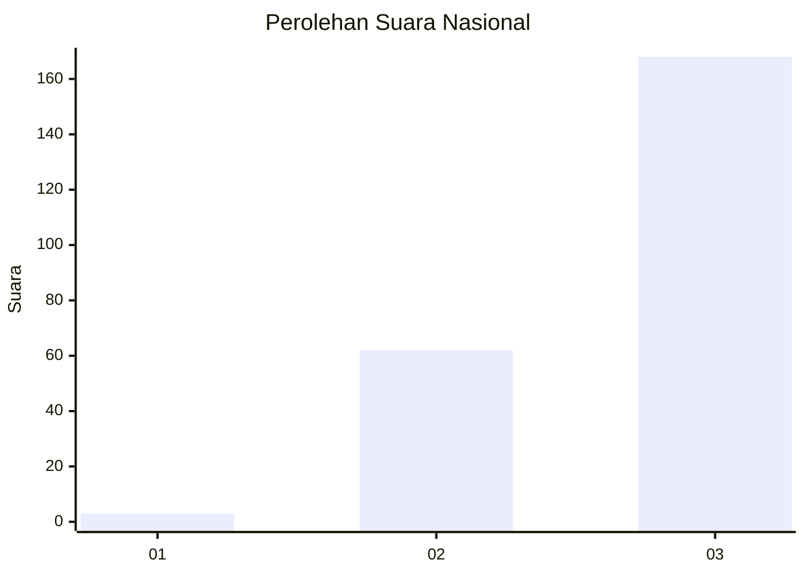
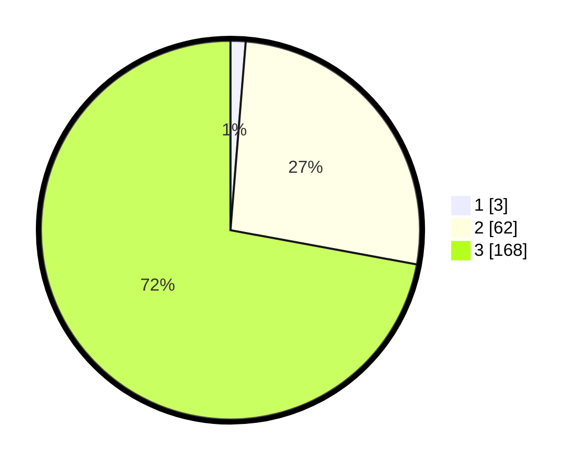

# Hasil

## Grafik

## Tabel

| No. | Nama Paslon    | Suara | Suara (raw) | Persentase |
|:--- |:-------------- | -----:| -----------:| ----------:|
| 1   | ANIES MUHAIMIN | 3     | [3][p-1]    | 1,29       |
| 2   | PRABOWO GIBRAN | 62    | [62][p-2]   | 26,61      |
| 3   | GANJAR MAHFUD  | 168   | [168][p-3]  | 72,10      |

[p-1]: https://github.com/gigit-pemilu/pemilu-2024/blob/main/pilpres/hitung-suara/sub/51-bali/sub/06-bangli/sub/04-kintamani/sub/2040-satra/sub/013-tps/sub/paslon-1.txt
[p-2]: https://github.com/gigit-pemilu/pemilu-2024/blob/main/pilpres/hitung-suara/sub/51-bali/sub/06-bangli/sub/04-kintamani/sub/2040-satra/sub/013-tps/sub/paslon-2.txt
[p-3]: https://github.com/gigit-pemilu/pemilu-2024/blob/main/pilpres/hitung-suara/sub/51-bali/sub/06-bangli/sub/04-kintamani/sub/2040-satra/sub/013-tps/sub/paslon-3.txt

## Foto C Plano

https://sirekap-obj-formc.kpu.go.id/a510/pemilu/ppwp/51/06/04/20/40/5106042040013-20240215-000818--a367c40f-9e6b-4c4e-8fa2-13ce270adaae.jpg

https://sirekap-obj-formc.kpu.go.id/a510/pemilu/ppwp/51/06/04/20/40/5106042040013-20240215-000832--de8bbae6-6f51-4f32-a4ec-1d6c621dde9c.jpg

https://sirekap-obj-formc.kpu.go.id/a510/pemilu/ppwp/51/06/04/20/40/5106042040013-20240215-000832--ff71e75a-796f-4a00-96bd-09ef88727c70.jpg

## Metadata

| Key        | Value               |
| ---------- | ------------------- |
| Time Stamp | 2024-02-24 22:31:28 |

