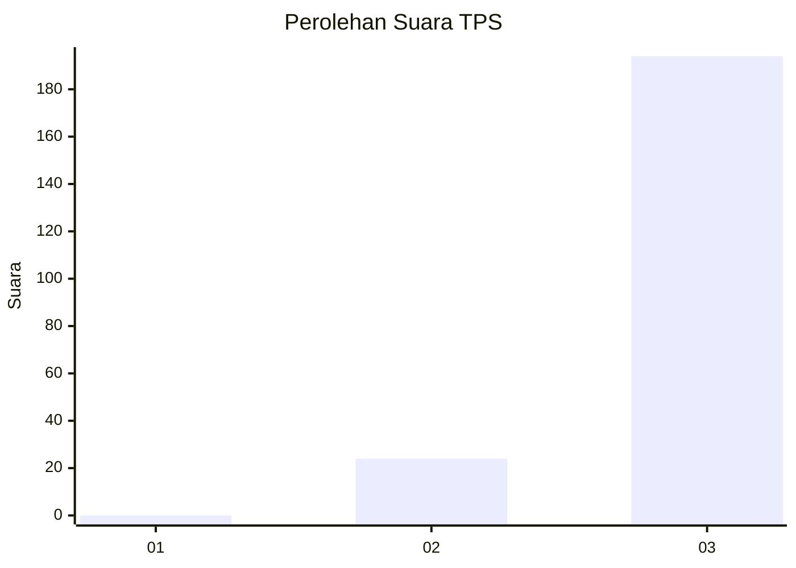
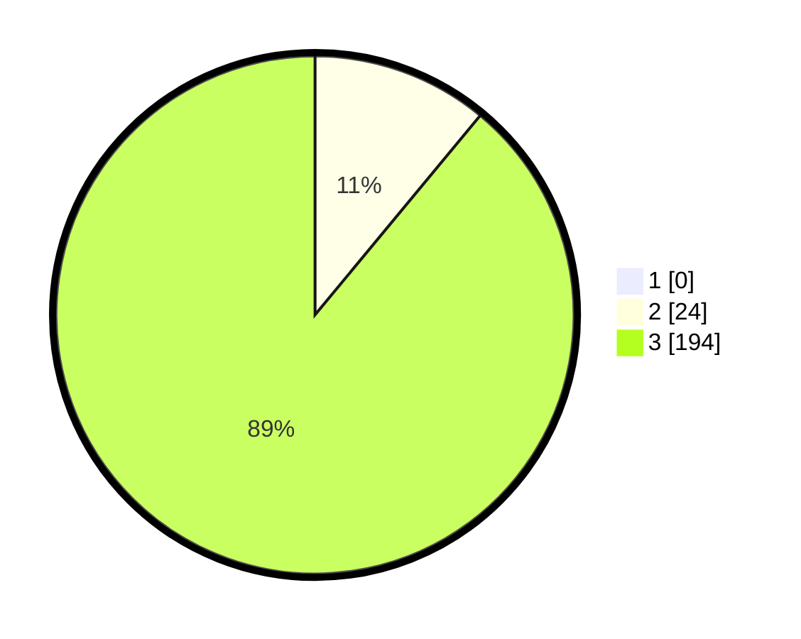

# Hasil

## Grafik

## Tabel

| No. | Nama Paslon    | Suara | Suara (raw) | Persentase |
|:--- |:-------------- | -----:| -----------:| ----------:|
| 1   | ANIES MUHAIMIN | 0     | [0][p-1]    | 0,00       |
| 2   | PRABOWO GIBRAN | 24    | [24][p-2]   | 11,01      |
| 3   | GANJAR MAHFUD  | 194   | [194][p-3]  | 88,99      |

[p-1]: https://github.com/gigit-pemilu/pemilu-2024-51-bali/blob/main/pilpres/hitung-suara/sub/51-bali/sub/06-bangli/sub/04-kintamani/sub/2041-dausa/sub/008-tps/sub/paslon-1.txt
[p-2]: https://github.com/gigit-pemilu/pemilu-2024-51-bali/blob/main/pilpres/hitung-suara/sub/51-bali/sub/06-bangli/sub/04-kintamani/sub/2041-dausa/sub/008-tps/sub/paslon-2.txt
[p-3]: https://github.com/gigit-pemilu/pemilu-2024-51-bali/blob/main/pilpres/hitung-suara/sub/51-bali/sub/06-bangli/sub/04-kintamani/sub/2041-dausa/sub/008-tps/sub/paslon-3.txt

## Foto C Plano

https://sirekap-obj-formc.kpu.go.id/a83f/pemilu/ppwp/51/06/04/20/41/5106042041008-20240214-212738--f7cc04e1-5a08-48b5-a9b1-91bcef6c075f.jpg

https://sirekap-obj-formc.kpu.go.id/a83f/pemilu/ppwp/51/06/04/20/41/5106042041008-20240214-202046--b1148ef8-878e-49f5-b12c-f8dcd266357e.jpg

https://sirekap-obj-formc.kpu.go.id/a83f/pemilu/ppwp/51/06/04/20/41/5106042041008-20240214-202223--596ca8b0-6e10-4aeb-b1e4-c0ca2a12bc55.jpg

## Metadata

| Key        | Value               |
| ---------- | ------------------- |
| Time Stamp | 2024-02-16 08:30:27 |

## DATA PEMILIH TETAP

Jumlah pemilih dalam DPT: **275**.
 * L: **143**.
 * P: **132**.

## DATA PENGGUNA HAK PILIH

Jumlah pengguna hak pilih dalam DPT: **275**.
 * L: **143**.
 * P: **132**.

Jumlah pengguna hak pilih dalam DPTb: **218**.
 * L: **113**.
 * P: **105**.

Jumlah pengguna hak pilih dalam DPK: **2**.
 * L: **2**.
 * P: **0**.

Jumlah pengguna hak pilih: **2**.
 * L: **0**.
 * P: **2**.

## JUMLAH SUARA SAH DAN TIDAK SAH

JUMLAH SELURUH SUARA SAH: **218**.

JUMLAH SUARA TIDAK SAH: **4**.

JUMLAH SELURUH SUARA SAH DAN SUARA TIDAK SAH: **222**.

