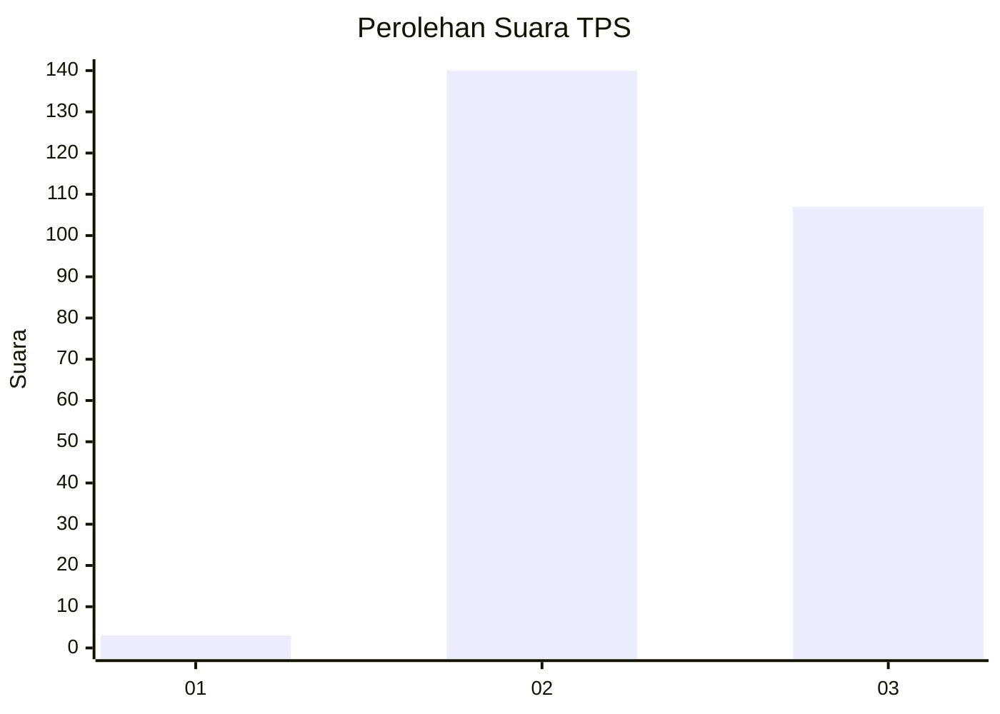
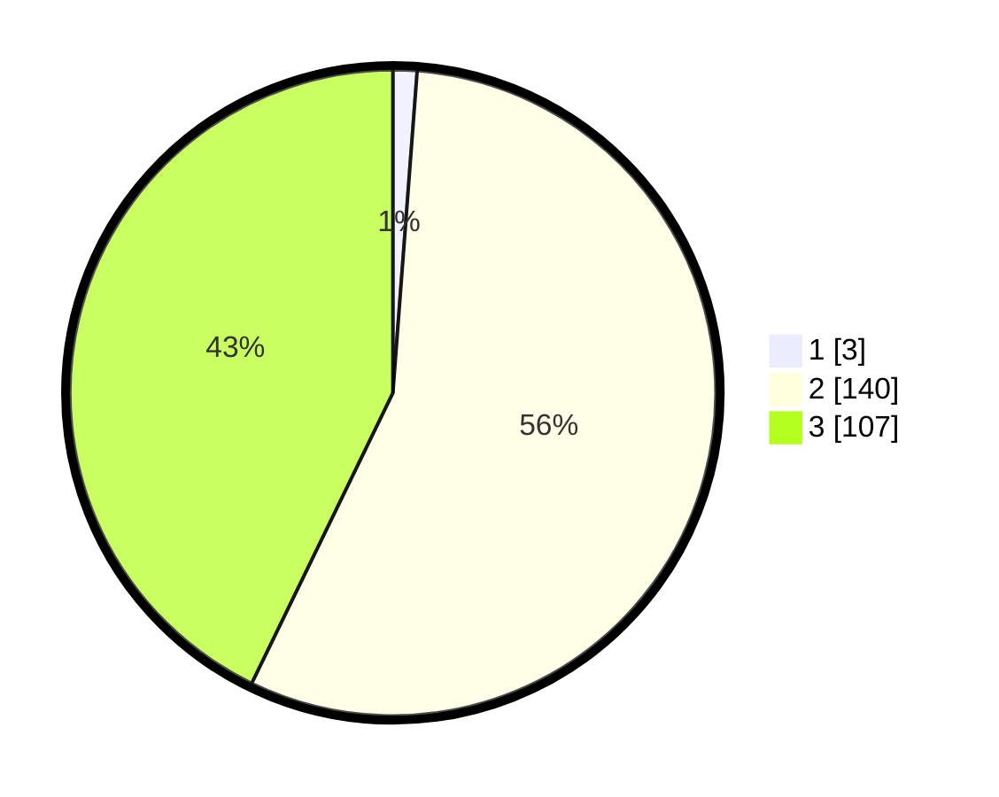

# Hasil

## Grafik

## Tabel

| No. | Nama Paslon    | Suara | Suara (raw) | Persentase |
|:--- |:-------------- | -----:| -----------:| ----------:|
| 1   | ANIES MUHAIMIN | 3     | [3][p-1]    | 1,20       |
| 2   | PRABOWO GIBRAN | 140   | [140][p-2]  | 56,00      |
| 3   | GANJAR MAHFUD  | 107   | [107][p-3]  | 42,80      |

[p-1]: https://github.com/gigit-pemilu/pemilu-2024-51-bali/blob/main/pilpres/hitung-suara/sub/51-bali/sub/06-bangli/sub/04-kintamani/sub/2043-sukawana/sub/009-tps/sub/paslon-1.txt
[p-2]: https://github.com/gigit-pemilu/pemilu-2024-51-bali/blob/main/pilpres/hitung-suara/sub/51-bali/sub/06-bangli/sub/04-kintamani/sub/2043-sukawana/sub/009-tps/sub/paslon-2.txt
[p-3]: https://github.com/gigit-pemilu/pemilu-2024-51-bali/blob/main/pilpres/hitung-suara/sub/51-bali/sub/06-bangli/sub/04-kintamani/sub/2043-sukawana/sub/009-tps/sub/paslon-3.txt

## Foto C Plano

https://sirekap-obj-formc.kpu.go.id/03ed/pemilu/ppwp/51/06/04/20/43/5106042043009-20240214-212324--bca4aa7c-1933-4da6-8d6e-3f8fe35b420a.jpg

https://sirekap-obj-formc.kpu.go.id/03ed/pemilu/ppwp/51/06/04/20/43/5106042043009-20240214-212326--49de0a1d-2271-4d4a-bb13-beaa3a870c10.jpg

https://sirekap-obj-formc.kpu.go.id/03ed/pemilu/ppwp/51/06/04/20/43/5106042043009-20240214-212321--9a07ece4-2949-44ee-9b42-048c539884a8.jpg

## Metadata

| Key        | Value               |
| ---------- | ------------------- |
| Time Stamp | 2024-02-15 15:00:29 |

