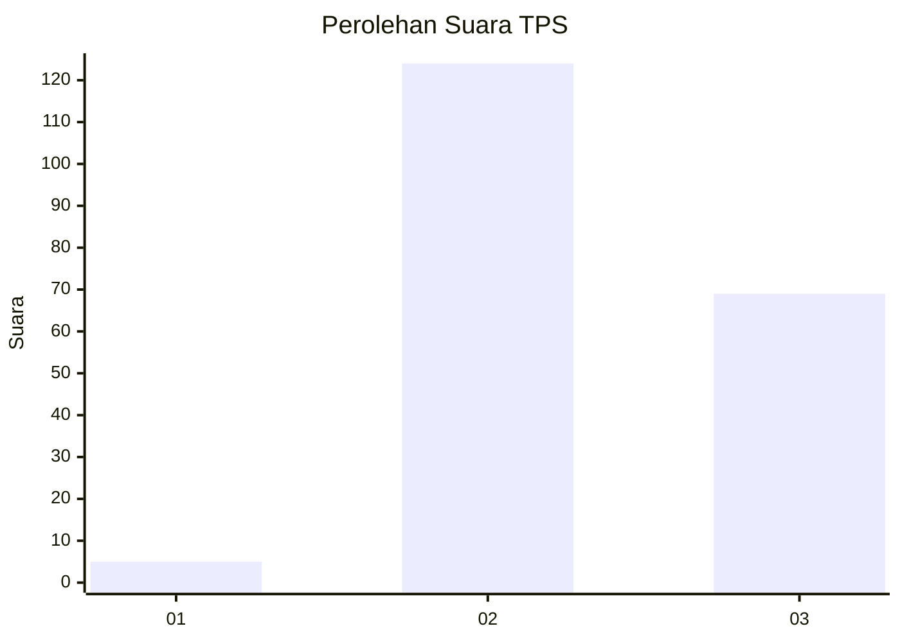
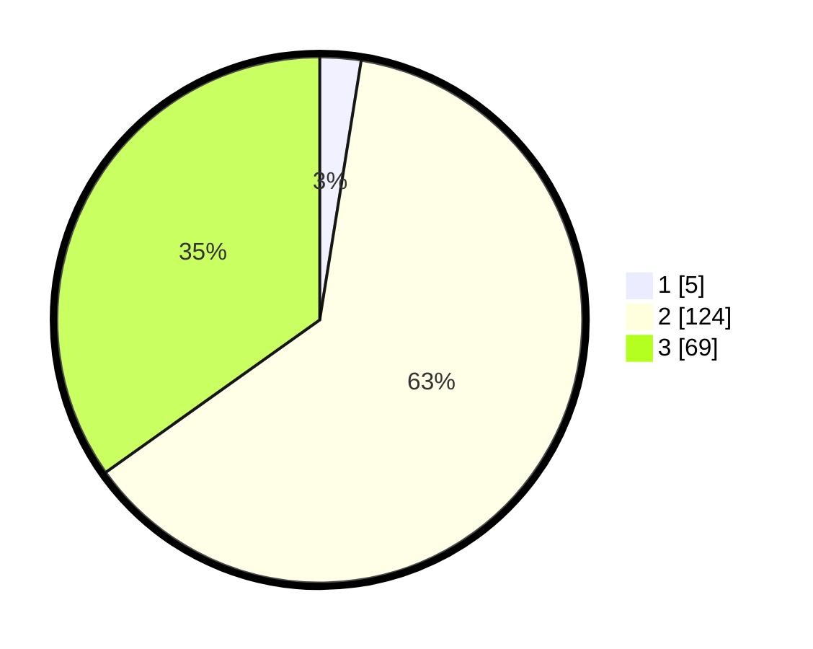

# Hasil

## Grafik

## Tabel

| No. | Nama Paslon    | Suara | Suara (raw) | Persentase |
|:--- |:-------------- | -----:| -----------:| ----------:|
| 1   | ANIES MUHAIMIN | 5     | [5][p-1]    | 2,53       |
| 2   | PRABOWO GIBRAN | 124   | [124][p-2]  | 62,63      |
| 3   | GANJAR MAHFUD  | 69    | [69][p-3]   | 34,85      |

[p-1]: https://github.com/gigit-pemilu/pemilu-2024-51-bali/blob/main/pilpres/hitung-suara/sub/51-bali/sub/06-bangli/sub/04-kintamani/sub/2043-sukawana/sub/010-tps/sub/paslon-1.txt
[p-2]: https://github.com/gigit-pemilu/pemilu-2024-51-bali/blob/main/pilpres/hitung-suara/sub/51-bali/sub/06-bangli/sub/04-kintamani/sub/2043-sukawana/sub/010-tps/sub/paslon-2.txt
[p-3]: https://github.com/gigit-pemilu/pemilu-2024-51-bali/blob/main/pilpres/hitung-suara/sub/51-bali/sub/06-bangli/sub/04-kintamani/sub/2043-sukawana/sub/010-tps/sub/paslon-3.txt

## Foto C Plano

https://sirekap-obj-formc.kpu.go.id/b302/pemilu/ppwp/51/06/04/20/43/5106042043010-20240217-080443--0eac0c86-c586-494c-bf0c-056b37577a7a.jpg

https://sirekap-obj-formc.kpu.go.id/b302/pemilu/ppwp/51/06/04/20/43/5106042043010-20240214-204510--a9572b70-0592-4889-8a05-c58bdc72cafc.jpg

https://sirekap-obj-formc.kpu.go.id/b302/pemilu/ppwp/51/06/04/20/43/5106042043010-20240214-204541--53612e7b-dcce-4fe6-a5ce-9d9992bbac94.jpg

## Metadata

| Key        | Value               |
| ---------- | ------------------- |
| Time Stamp | 2024-02-17 08:30:03 |

## DATA PEMILIH TETAP

Jumlah pemilih dalam DPT: **241**.
 * L: **121**.
 * P: **120**.

## DATA PENGGUNA HAK PILIH

Jumlah pengguna hak pilih dalam DPT: **241**.
 * L: **121**.
 * P: **120**.

Jumlah pengguna hak pilih dalam DPTb: **0**.
 * L: **0**.
 * P: **0**.

Jumlah pengguna hak pilih dalam DPK: **2**.
 * L: **0**.
 * P: **2**.

Jumlah pengguna hak pilih: **243**.
 * L: **121**.
 * P: **122**.

## JUMLAH SUARA SAH DAN TIDAK SAH

JUMLAH SELURUH SUARA SAH: **198**.

JUMLAH SUARA TIDAK SAH: **3**.

JUMLAH SELURUH SUARA SAH DAN SUARA TIDAK SAH: **201**.

