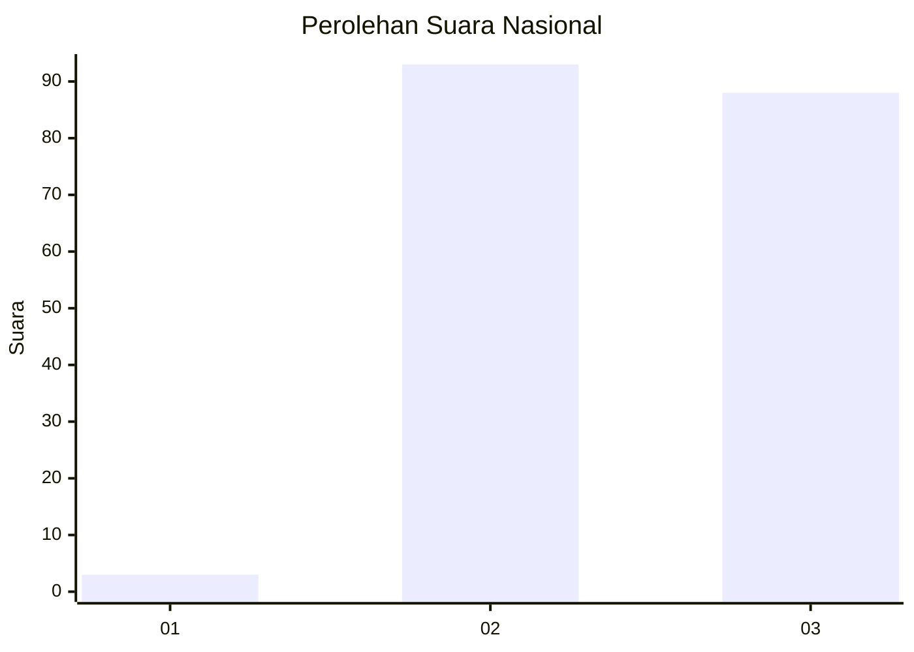
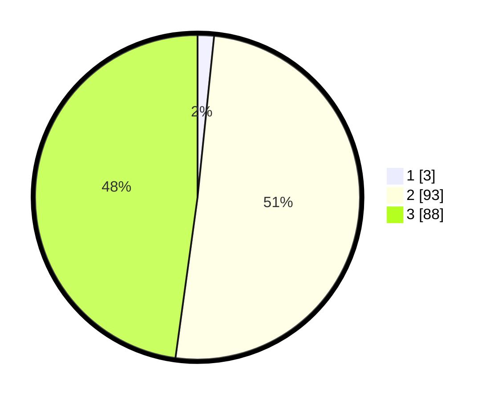

# Hasil

## Grafik

## Tabel

| No. | Nama Paslon    | Suara | Suara (raw) | Persentase |
|:--- |:-------------- | -----:| -----------:| ----------:|
| 1   | ANIES MUHAIMIN | 3     | [3][p-1]    | 1,63       |
| 2   | PRABOWO GIBRAN | 93    | [93][p-2]   | 50,54      |
| 3   | GANJAR MAHFUD  | 88    | [88][p-3]   | 47,83      |

[p-1]: https://github.com/gigit-pemilu/pemilu-2024/blob/main/pilpres/hitung-suara/sub/51-bali/sub/06-bangli/sub/04-kintamani/sub/2044-kutuh/sub/001-tps/sub/paslon-1.txt
[p-2]: https://github.com/gigit-pemilu/pemilu-2024/blob/main/pilpres/hitung-suara/sub/51-bali/sub/06-bangli/sub/04-kintamani/sub/2044-kutuh/sub/001-tps/sub/paslon-2.txt
[p-3]: https://github.com/gigit-pemilu/pemilu-2024/blob/main/pilpres/hitung-suara/sub/51-bali/sub/06-bangli/sub/04-kintamani/sub/2044-kutuh/sub/001-tps/sub/paslon-3.txt

## Foto C Plano

https://sirekap-obj-formc.kpu.go.id/4af9/pemilu/ppwp/51/06/04/20/44/5106042044001-20240214-225156--5336f21b-7e66-44ca-ae6d-f29008961f84.jpg

https://sirekap-obj-formc.kpu.go.id/4af9/pemilu/ppwp/51/06/04/20/44/5106042044001-20240214-225300--ec538687-f3df-4679-987f-d8e8dd372640.jpg

https://sirekap-obj-formc.kpu.go.id/4af9/pemilu/ppwp/51/06/04/20/44/5106042044001-20240214-225346--4ed074ef-0eb0-413b-a82a-ef4faf0c6b39.jpg

## Metadata

| Key        | Value               |
| ---------- | ------------------- |
| Time Stamp | 2024-02-24 22:31:28 |

