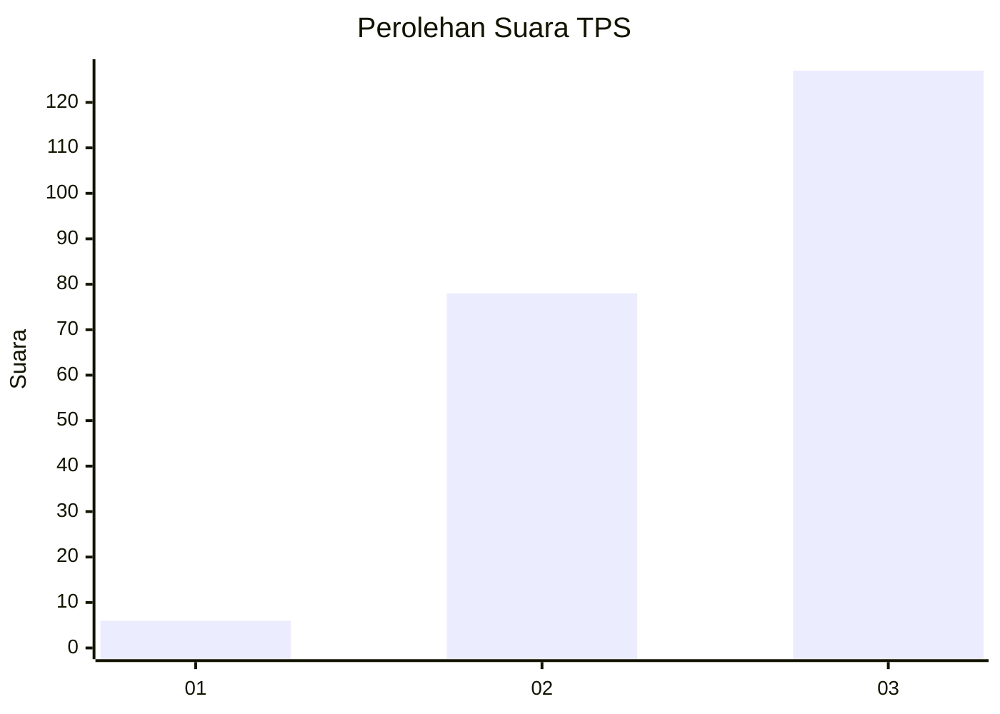
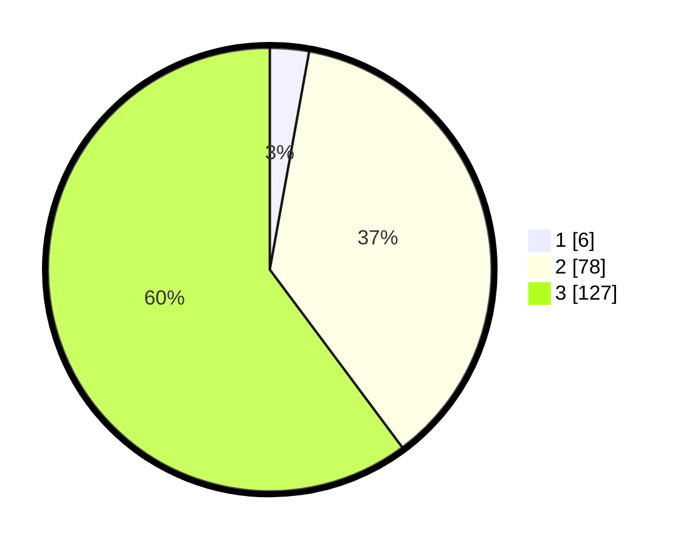

# Hasil

## Grafik

## Tabel

| No. | Nama Paslon    | Suara | Suara (raw) | Persentase |
|:--- |:-------------- | -----:| -----------:| ----------:|
| 1   | ANIES MUHAIMIN | 6     | [6][p-1]    | 2,84       |
| 2   | PRABOWO GIBRAN | 78    | [78][p-2]   | 36,97      |
| 3   | GANJAR MAHFUD  | 127   | [127][p-3]  | 60,19      |

[p-1]: https://github.com/gigit-pemilu/pemilu-2024-51-bali/blob/main/pilpres/hitung-suara/sub/51-bali/sub/06-bangli/sub/04-kintamani/sub/2044-kutuh/sub/002-tps/sub/paslon-1.txt
[p-2]: https://github.com/gigit-pemilu/pemilu-2024-51-bali/blob/main/pilpres/hitung-suara/sub/51-bali/sub/06-bangli/sub/04-kintamani/sub/2044-kutuh/sub/002-tps/sub/paslon-2.txt
[p-3]: https://github.com/gigit-pemilu/pemilu-2024-51-bali/blob/main/pilpres/hitung-suara/sub/51-bali/sub/06-bangli/sub/04-kintamani/sub/2044-kutuh/sub/002-tps/sub/paslon-3.txt

## Foto C Plano

https://sirekap-obj-formc.kpu.go.id/8293/pemilu/ppwp/51/06/04/20/44/5106042044002-20240214-221038--ab2d1c65-09a9-49fd-902e-a9be8e12e3fe.jpg

https://sirekap-obj-formc.kpu.go.id/8293/pemilu/ppwp/51/06/04/20/44/5106042044002-20240214-221123--d0dca4d3-3462-43db-b9dc-7d4a5daffac3.jpg

https://sirekap-obj-formc.kpu.go.id/8293/pemilu/ppwp/51/06/04/20/44/5106042044002-20240214-221247--a1658fca-3894-41ef-9fe6-7197cd398e1e.jpg

## Metadata

| Key        | Value               |
| ---------- | ------------------- |
| Time Stamp | 2024-02-24 22:31:28 |

